# Heat capacity @ 25K - meV/atom - Cv_25

## ARFS Top features

### ARFS selected descriptors

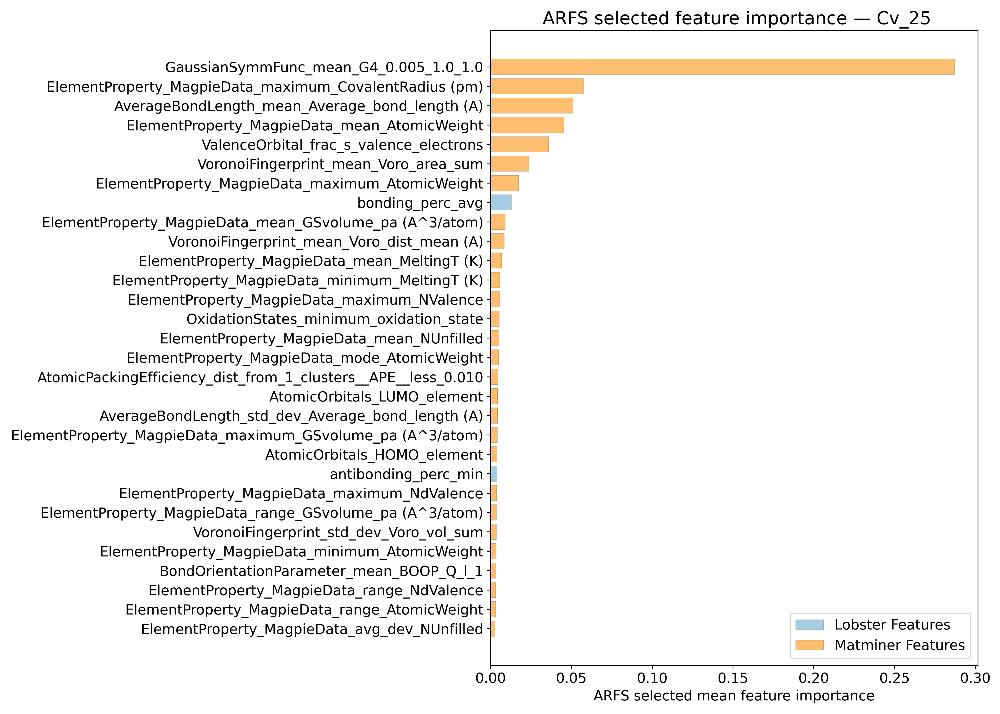

---

## Correlation analysis

### Distance correlation

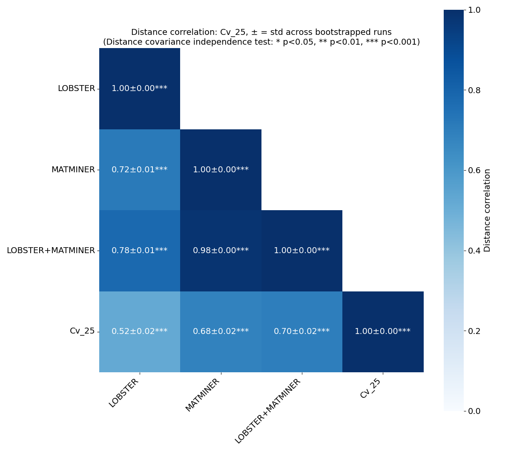

### Dependency graphs

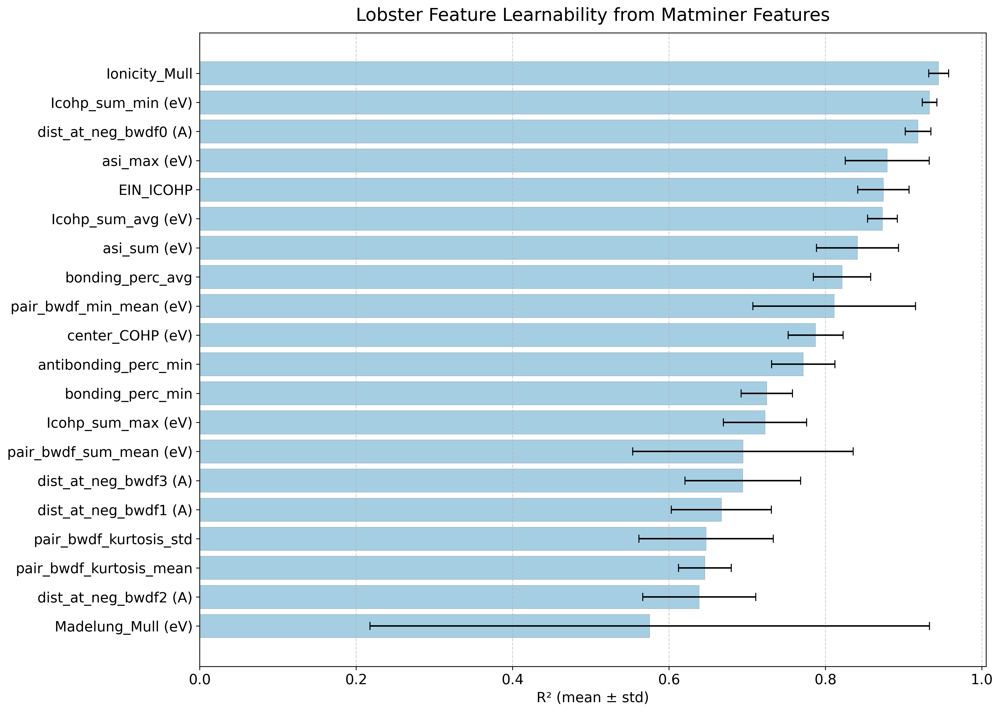

### Feature learnability

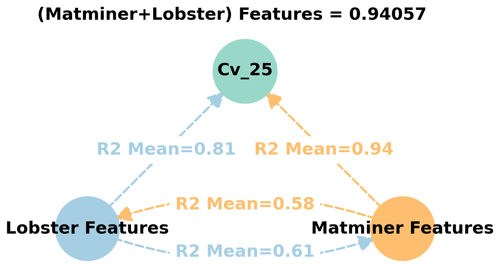

---

## Model performance

### 5-Fold CV Metrics overview

**RF - MATMINER**

|      |   train_rmse |   test_rmse |   train_errors |   test_errors |   train_r2 |   test_r2 |
|:-----|-------------:|------------:|---------------:|--------------:|-----------:|----------:|
| mean |      0.00254 | 0.00684     |        0.00168 |   0.00466     |     0.992  | 0.94062   |
| min  |      0.0024  | 0.006       |        0.0016  |   0.0043      |     0.9917 | 0.924     |
| max  |      0.0026  | 0.0073      |        0.0017  |   0.0051      |     0.9923 | 0.9561    |
| std  |      8e-05   | 0.000440908 |        4e-05   |   0.000272764 |     0.0002 | 0.0106304 |

**RF - MATMINER+LOBSTER**

|      |   train_rmse |   test_rmse |   train_errors |   test_errors |    train_r2 |    test_r2 |
|:-----|-------------:|------------:|---------------:|--------------:|------------:|-----------:|
| mean |       0.0025 | 0.0068      |        0.00168 |   0.00462     | 0.99204     | 0.94168    |
| min  |       0.0025 | 0.0059      |        0.0016  |   0.0042      | 0.9918      | 0.93       |
| max  |       0.0025 | 0.0072      |        0.0017  |   0.005       | 0.9922      | 0.9577     |
| std  |       0      | 0.000460435 |        4e-05   |   0.000271293 | 0.000162481 | 0.00922115 |

**MODNet - MATMINER**

|      |   train_rmse |   test_rmse |   train_errors |   test_errors |   train_r2 |    test_r2 |
|:-----|-------------:|------------:|---------------:|--------------:|-----------:|-----------:|
| mean |  0.00438     | 0.00552     |    0.00298     |    0.00376    | 0.9757     | 0.96168    |
| min  |  0.0039      | 0.005       |    0.0027      |    0.0036     | 0.9709     | 0.9525     |
| max  |  0.0048      | 0.0058      |    0.0033      |    0.0039     | 0.9813     | 0.9671     |
| std  |  0.000305941 | 0.000278568 |    0.000203961 |    0.00010198 | 0.00358664 | 0.00508268 |

**MODNet - MATMINER+LOBSTER**

|      |   train_rmse |   test_rmse |   train_errors |   test_errors |   train_r2 |    test_r2 |
|:-----|-------------:|------------:|---------------:|--------------:|-----------:|-----------:|
| mean |  0.00414     | 0.00564     |    0.00292     |       0.00386 | 0.97822    | 0.95962    |
| min  |  0.0038      | 0.0049      |    0.0026      |       0.0034  | 0.9665     | 0.9501     |
| max  |  0.0052      | 0.0065      |    0.0037      |       0.0044  | 0.9823     | 0.9705     |
| std  |  0.000535164 | 0.000535164 |    0.000396989 |       0.00032 | 0.00589827 | 0.00840795 |

### Paired 5x2 CV F-test

**RF F-tests metrics comparsion**
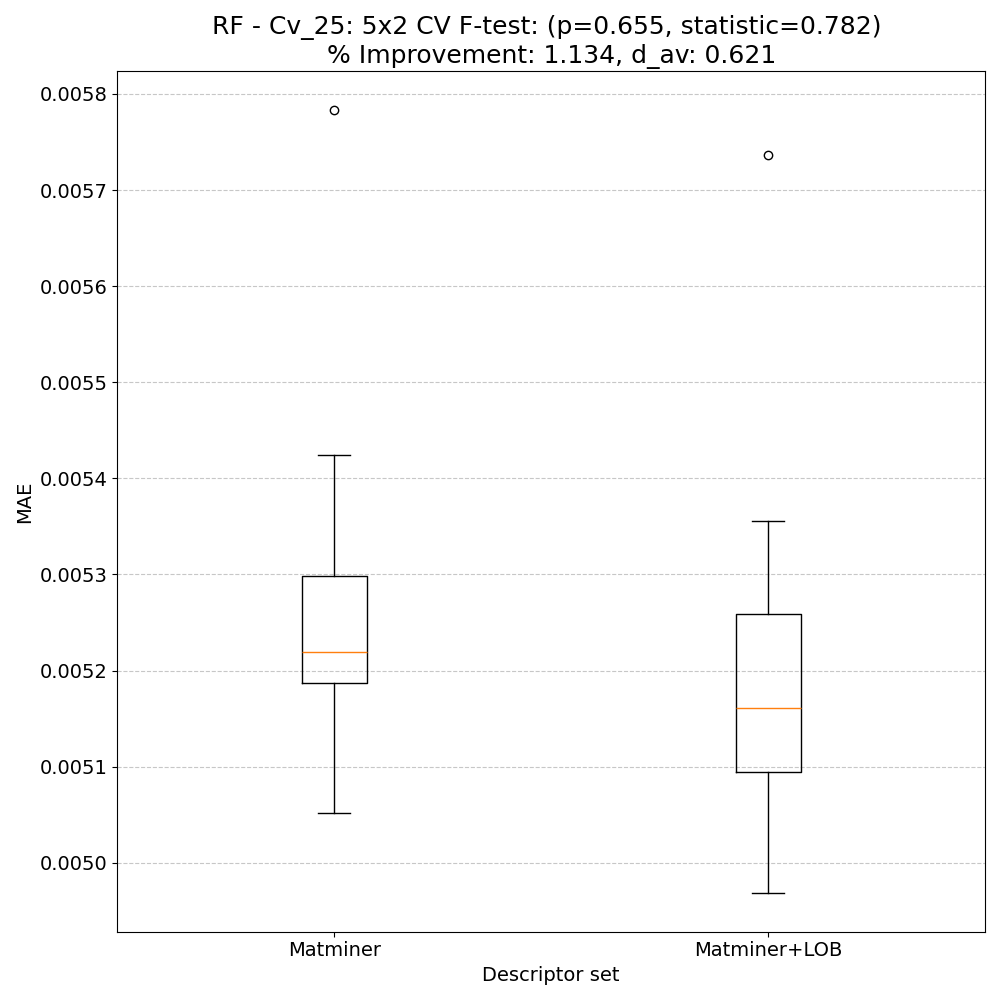

**MODNet F-tests metrics comparsion**
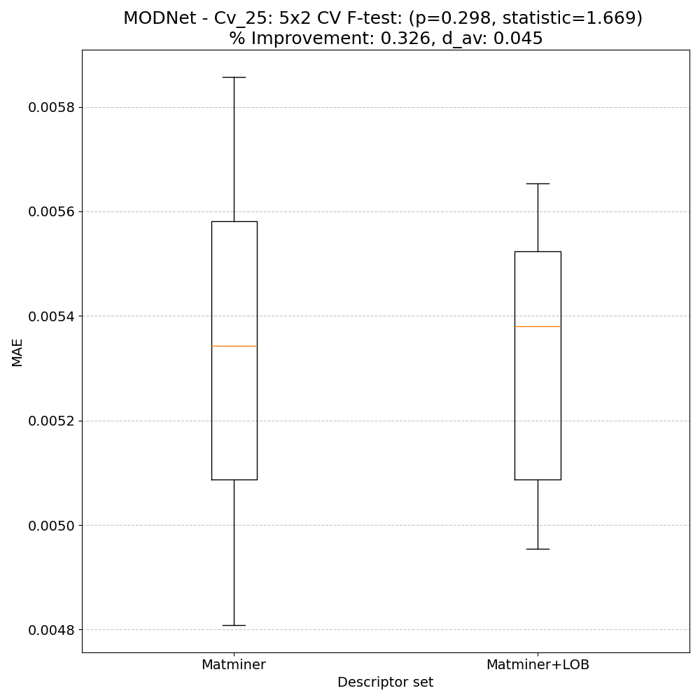

**Summary**
|        |   F-statistic |   p-value |     d_av |   % Relative MAE improvement | Improved folds   |
|:-------|--------------:|----------:|---------:|-----------------------------:|:-----------------|
| RF     |      0.781919 |  0.654714 | 0.620784 |                      1.13402 | 7/10             |
| MODNet |      1.66871  |  0.297752 | 0.044932 |                      0.3262  | 5/10             |

---

## Model Explainer

### PFI
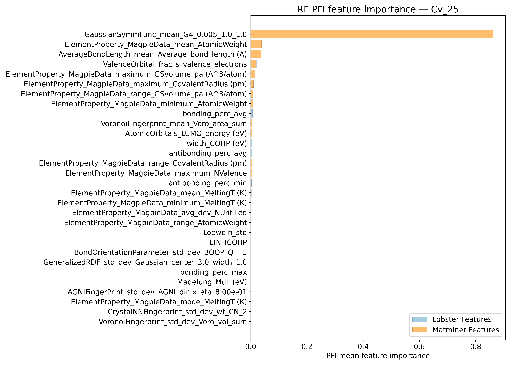
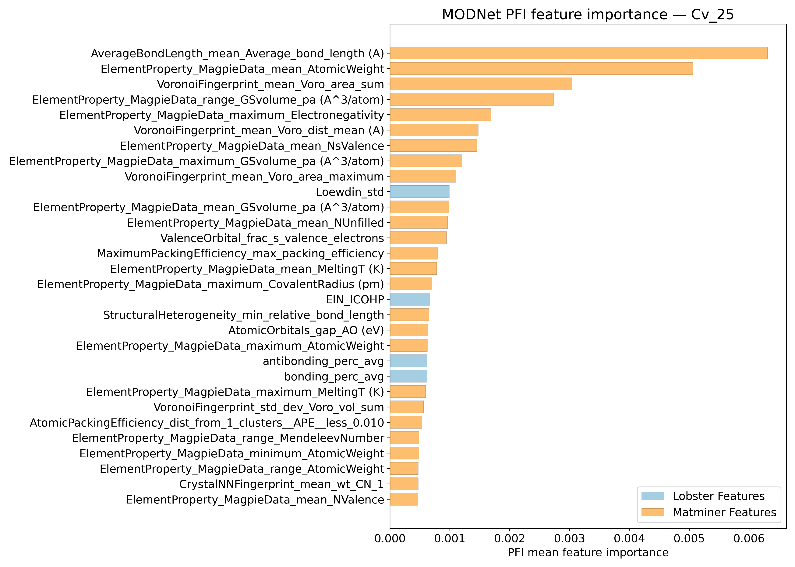

### SHAP
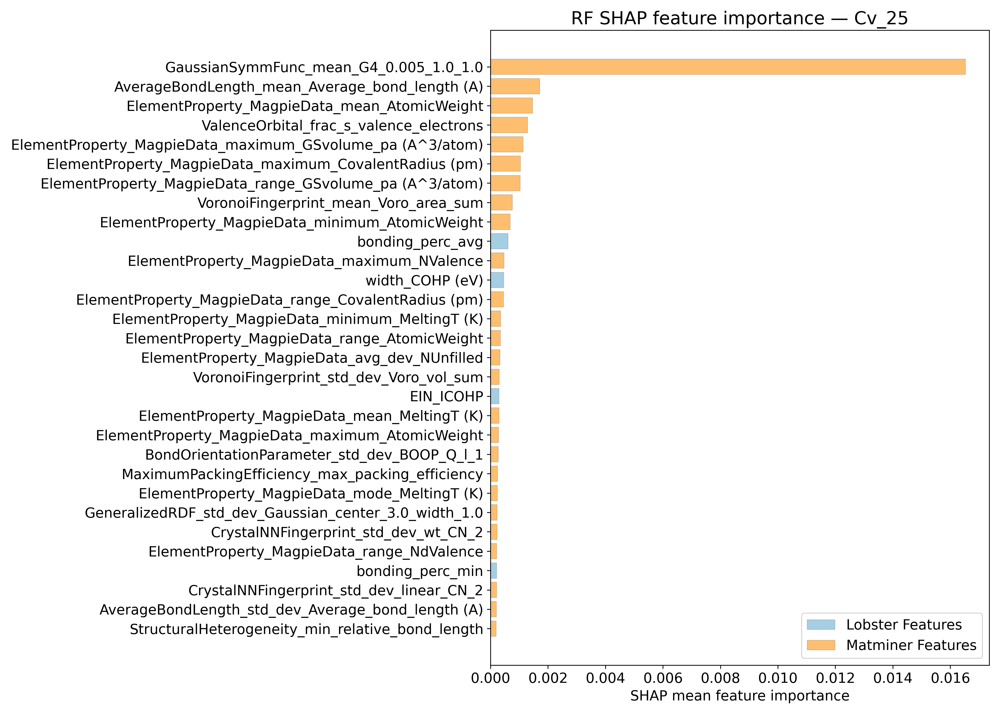
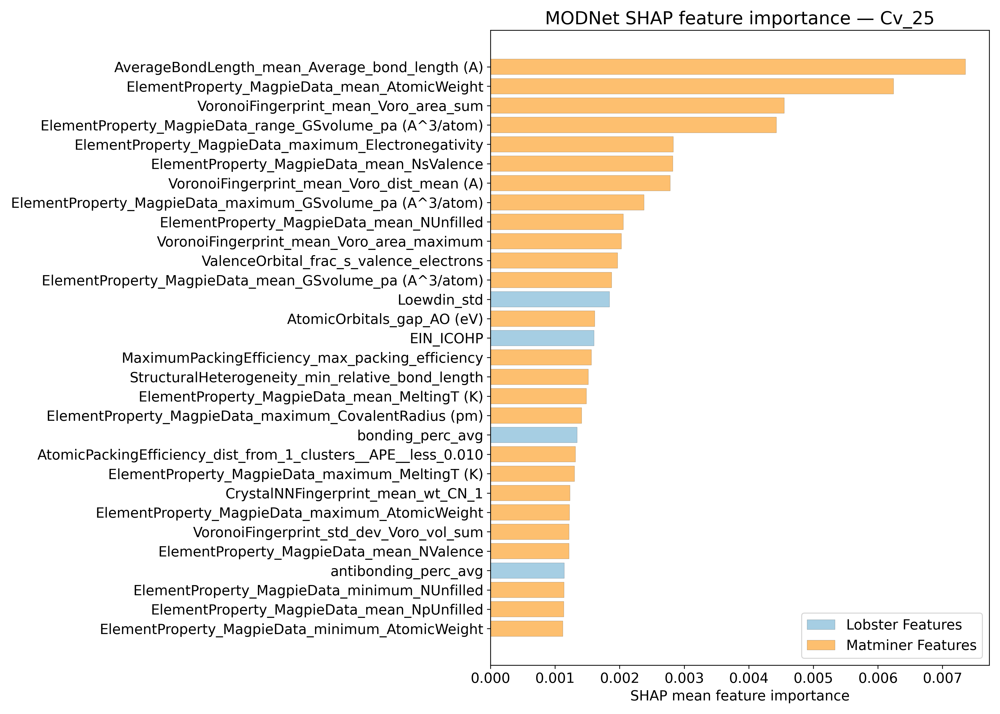

---

## Misc

### ARFS n-iter convergence checks

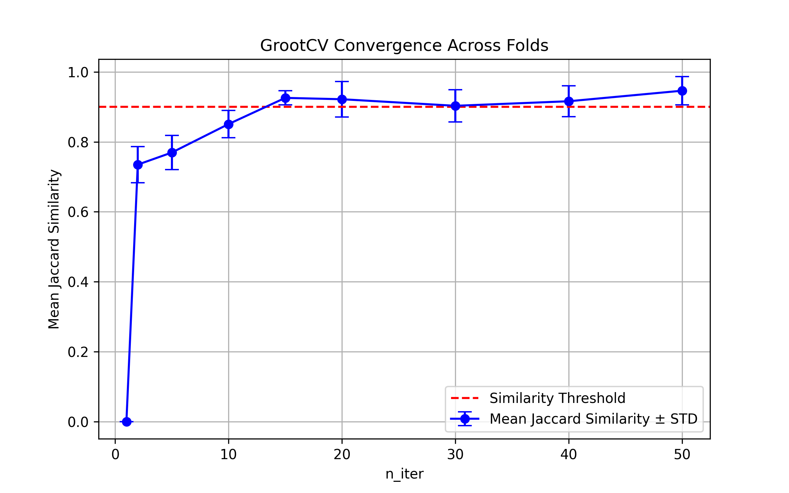

