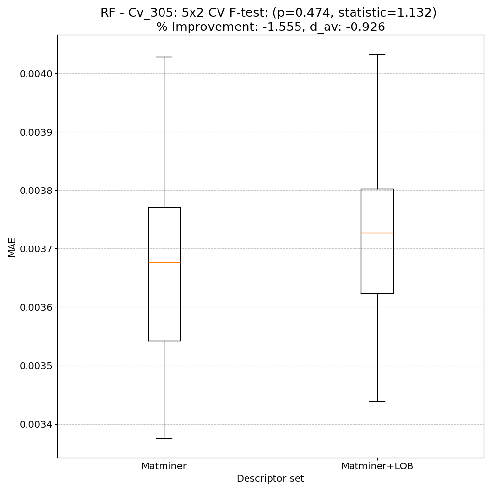
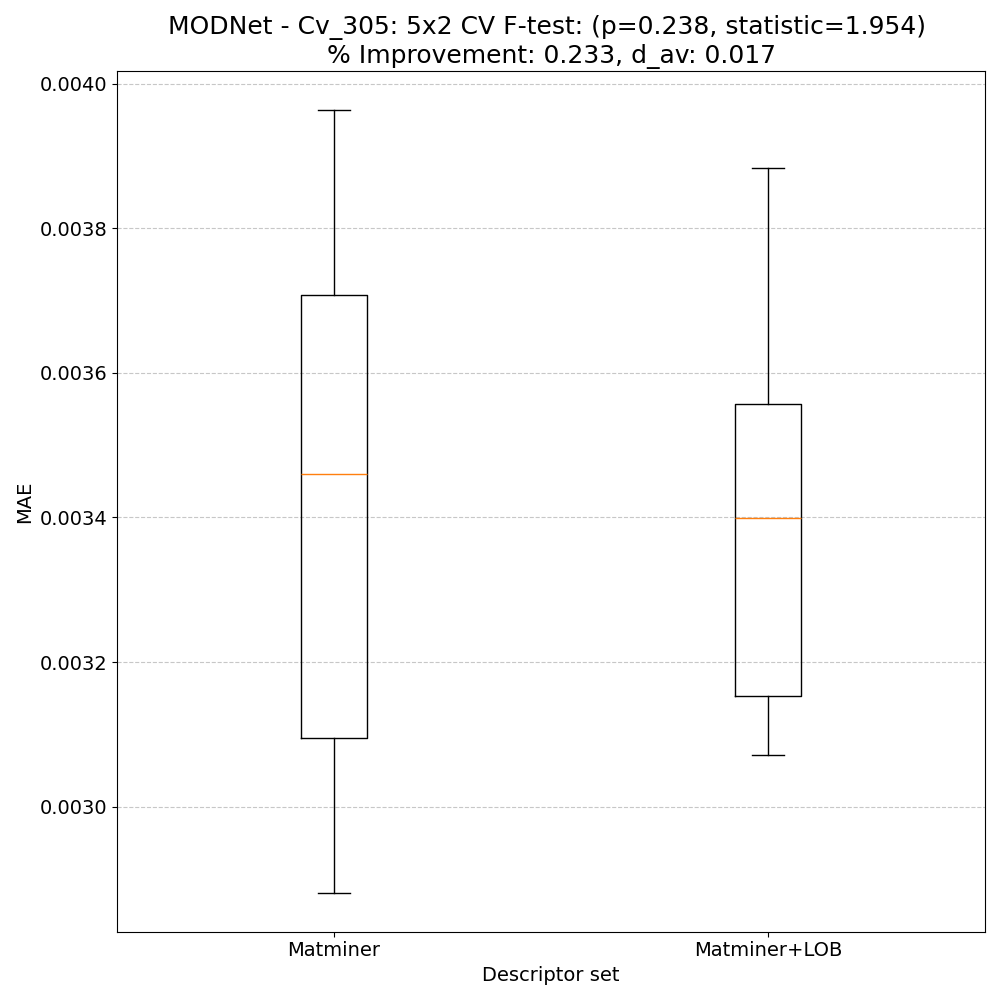

# Heat capacity @ 305K - meV/atom - Cv_305

## ARFS Top features

### ARFS selected descriptors

---

## Correlation analysis

### Distance correlation

### Dependency graphs

### Feature learnability

---

## Model performance

### 5-Fold CV Metrics overview

**RF - MATMINER**

|      |   train_rmse |   test_rmse |   train_errors |   test_errors |    train_r2 |    test_r2 |
|:-----|-------------:|------------:|---------------:|--------------:|------------:|-----------:|
| mean |  0.0019      |  0.00516    |         0.0011 |   0.00298     | 0.99594     | 0.96972    |
| min  |  0.0018      |  0.0042     |         0.0011 |   0.0026      | 0.9954      | 0.9523     |
| max  |  0.002       |  0.0072     |         0.0011 |   0.0035      | 0.9962      | 0.9773     |
| std  |  6.32456e-05 |  0.00108554 |         0      |   0.000318748 | 0.000293939 | 0.00955707 |

**RF - MATMINER+LOBSTER**

|      |   train_rmse |   test_rmse |   train_errors |   test_errors |    train_r2 |    test_r2 |
|:-----|-------------:|------------:|---------------:|--------------:|------------:|-----------:|
| mean |  0.00194     |  0.00526    |        0.00112 |   0.003       | 0.99578     | 0.96848    |
| min  |  0.0019      |  0.0044     |        0.0011  |   0.0027      | 0.9952      | 0.9502     |
| max  |  0.002       |  0.0074     |        0.0012  |   0.0035      | 0.9961      | 0.9766     |
| std  |  4.89898e-05 |  0.00113066 |        4e-05   |   0.000296648 | 0.000318748 | 0.00994111 |

**MODNet - MATMINER**

|      |   train_rmse |   test_rmse |   train_errors |   test_errors |   train_r2 |    test_r2 |
|:-----|-------------:|------------:|---------------:|--------------:|-----------:|-----------:|
| mean |  0.00294     | 0.00372     |    0.00198     |   0.0024      |  0.99018   | 0.98406    |
| min  |  0.0025      | 0.0034      |    0.0017      |   0.0022      |  0.9881    | 0.9811     |
| max  |  0.0033      | 0.004       |    0.0022      |   0.0026      |  0.993     | 0.9861     |
| std  |  0.000338231 | 0.000213542 |    0.000172047 |   0.000126491 |  0.0020721 | 0.00201653 |

**MODNet - MATMINER+LOBSTER**

|      |   train_rmse |   test_rmse |   train_errors |   test_errors |   train_r2 |    test_r2 |
|:-----|-------------:|------------:|---------------:|--------------:|-----------:|-----------:|
| mean |  0.00312     |     0.00398 |     0.00206    |   0.00256     | 0.9891     | 0.98162    |
| min  |  0.0029      |     0.0033  |     0.0019     |   0.0022      | 0.9875     | 0.9746     |
| max  |  0.0034      |     0.0046  |     0.0022     |   0.0029      | 0.9907     | 0.9872     |
| std  |  0.000172047 |     0.00056 |     0.00010198 |   0.000257682 | 0.00110454 | 0.00505189 |

### Paired 5x2 CV F-test

**RF F-tests metrics comparsion**

**MODNet F-tests metrics comparsion**

**Summary**
|        |   F-statistic |   p-value |       d_av |   % Relative MAE improvement | Improved folds   |
|:-------|--------------:|----------:|-----------:|-----------------------------:|:-----------------|
| RF     |       1.13175 |  0.473816 | -0.92587   |                    -1.5551   | 2/10             |
| MODNet |       1.95433 |  0.238009 |  0.0170066 |                     0.232865 | 4/10             |

---

## Model Explainer

### PFI

### SHAP

---

## Misc

### ARFS n-iter convergence checks

