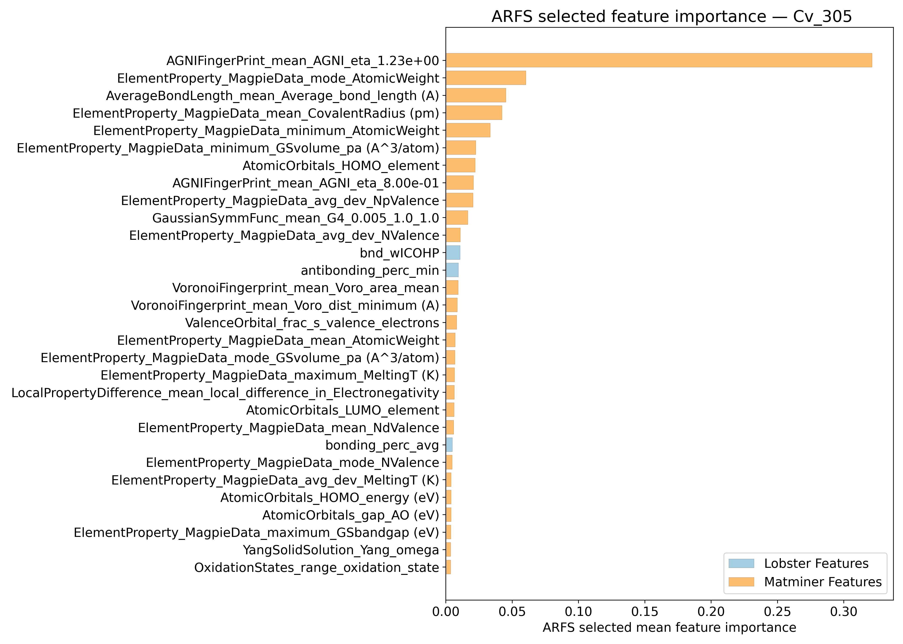
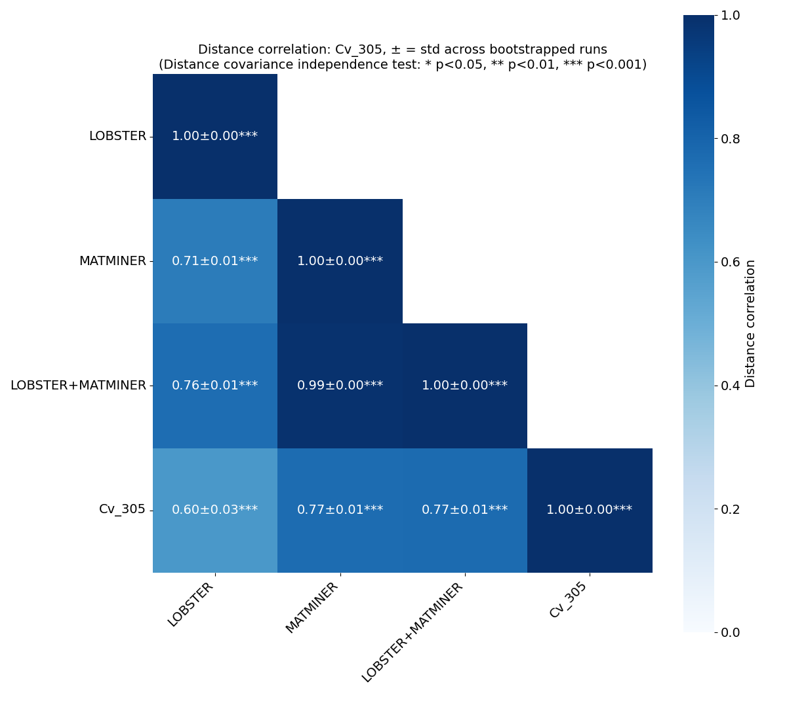
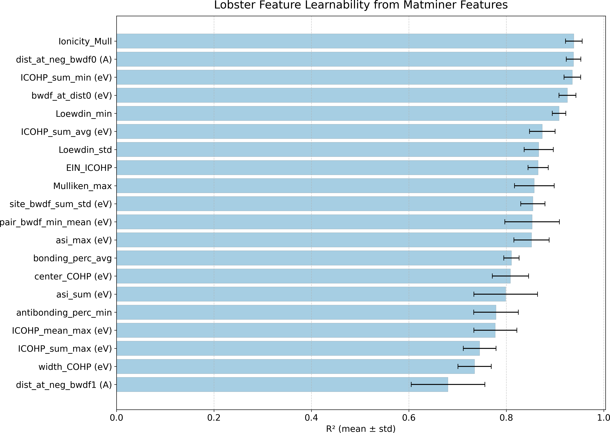
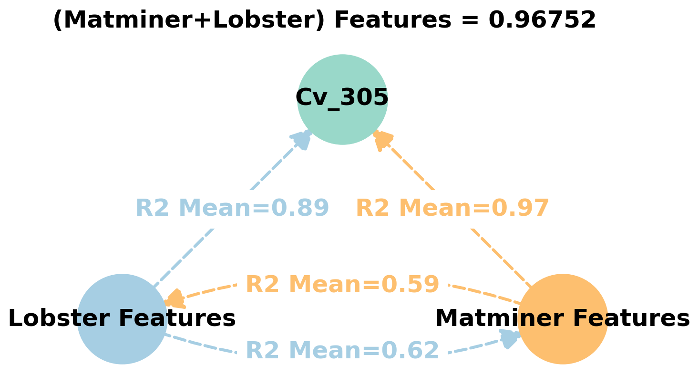
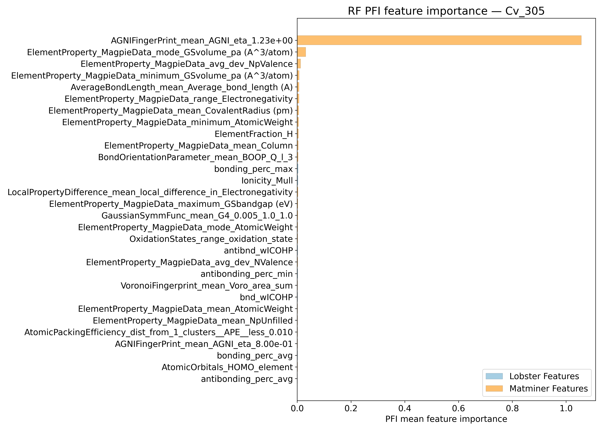
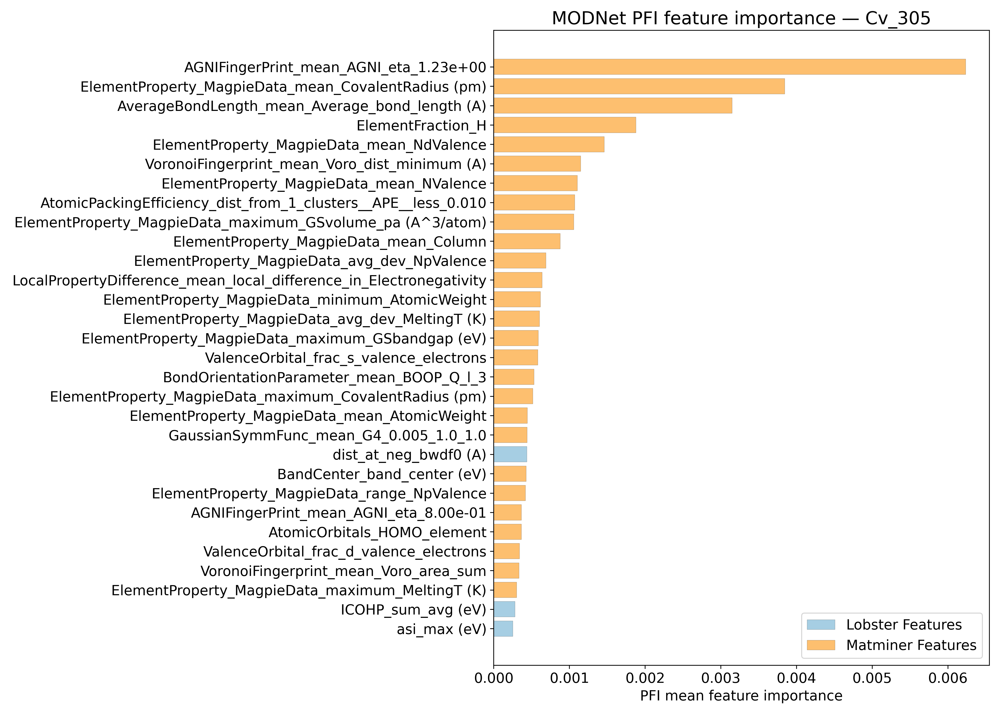
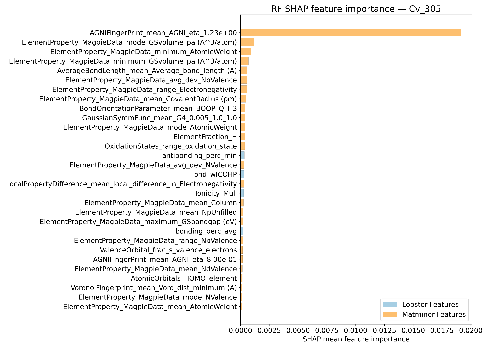
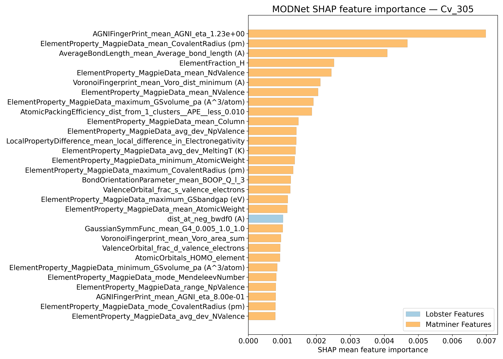
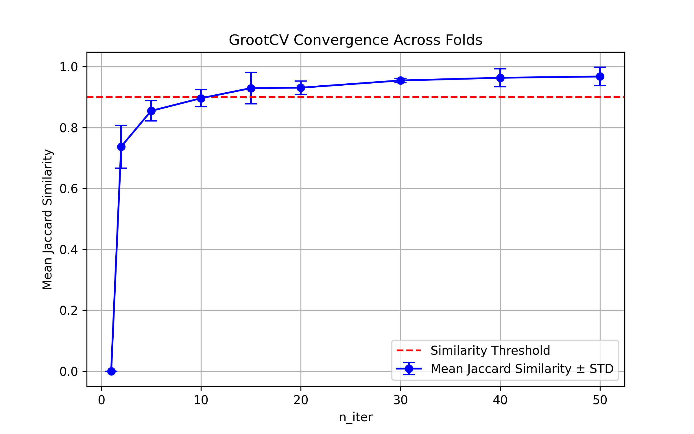

# Heat capacity @ 305K - Cv_305

## ARFS Top features

### ARFS selected descriptors

---

## Correlation analysis

### Distance correlation

### Dependency graphs

### Feature learnability

---

## Model performance

### Metrics overview

RF - MATMINER

|      |   train_rmse |   test_rmse |   train_errors |   test_errors |    train_r2 |    test_r2 |
|:-----|-------------:|------------:|---------------:|--------------:|------------:|-----------:|
| mean |  0.0019      |  0.00514    |         0.0011 |   0.00298     | 0.99592     | 0.96994    |
| min  |  0.0018      |  0.0042     |         0.0011 |   0.0026      | 0.9953      | 0.9518     |
| max  |  0.002       |  0.0072     |         0.0011 |   0.0035      | 0.9962      | 0.9783     |
| std  |  6.32456e-05 |  0.00110018 |         0      |   0.000318748 | 0.000318748 | 0.00981134 |

RF - MATMINER+LOBSTER

|      |   train_rmse |   test_rmse |   train_errors |   test_errors |    train_r2 |    test_r2 |
|:-----|-------------:|------------:|---------------:|--------------:|------------:|-----------:|
| mean |  0.0019      |  0.00524    |         0.0011 |   0.003       | 0.9959      | 0.96896    |
| min  |  0.0018      |  0.0043     |         0.0011 |   0.0027      | 0.9954      | 0.9513     |
| max  |  0.002       |  0.0073     |         0.0011 |   0.0035      | 0.9963      | 0.9772     |
| std  |  6.32456e-05 |  0.00110018 |         0      |   0.000296648 | 0.000289828 | 0.00961428 |

MODNet - MATMINER

|      |   train_rmse |   test_rmse |   train_errors |   test_errors |   train_r2 |    test_r2 |
|:-----|-------------:|------------:|---------------:|--------------:|-----------:|-----------:|
| mean |   0.0028     | 0.00376     |    0.0019      |   0.00246     |  0.99128   | 0.98384    |
| min  |   0.0023     | 0.0032      |    0.0016      |   0.0022      |  0.9887    | 0.9799     |
| max  |   0.0032     | 0.0043      |    0.0022      |   0.0029      |  0.9939    | 0.9875     |
| std  |   0.00034641 | 0.000412795 |    0.000219089 |   0.000241661 |  0.0019984 | 0.00250088 |

MODNet - MATMINER+LOBSTER

|      |   train_rmse |   test_rmse |   train_errors |   test_errors |   train_r2 |    test_r2 |
|:-----|-------------:|------------:|---------------:|--------------:|-----------:|-----------:|
| mean |  0.00288     | 0.00388     |      0.00196   |   0.00244     | 0.99048    | 0.98272    |
| min  |  0.0025      | 0.0033      |      0.0017    |   0.0022      | 0.9869     | 0.9739     |
| max  |  0.0034      | 0.0047      |      0.0023    |   0.0028      | 0.9932     | 0.986      |
| std  |  0.000365513 | 0.000507543 |      0.0002498 |   0.000205913 | 0.00243754 | 0.00450972 |

---

## Model Explainer

### PFI

### SHAP

---

## Misc

### ARFS n-iter convergence checks

