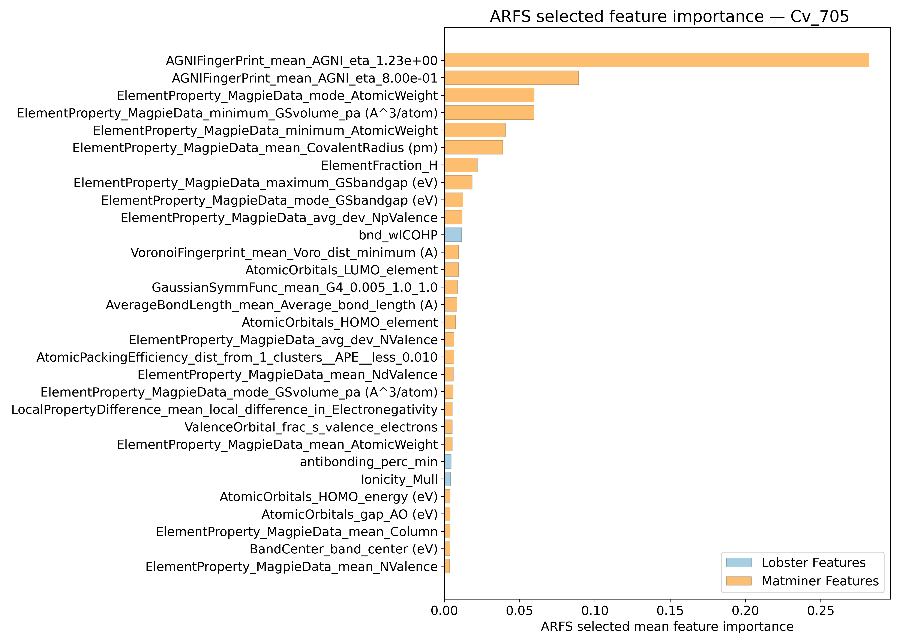
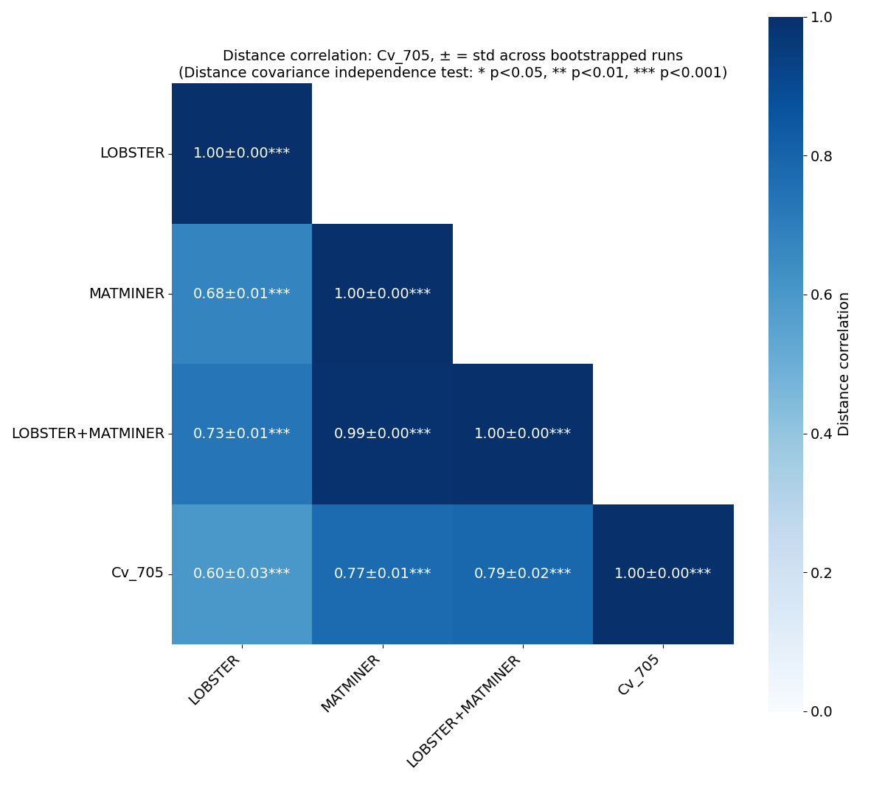
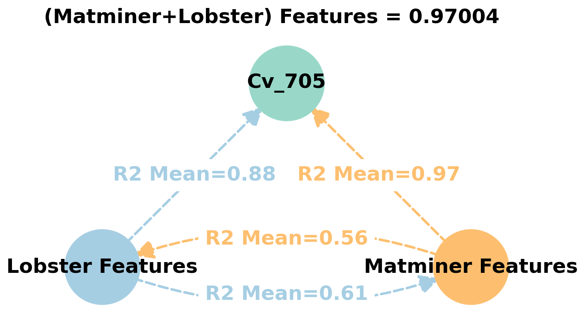
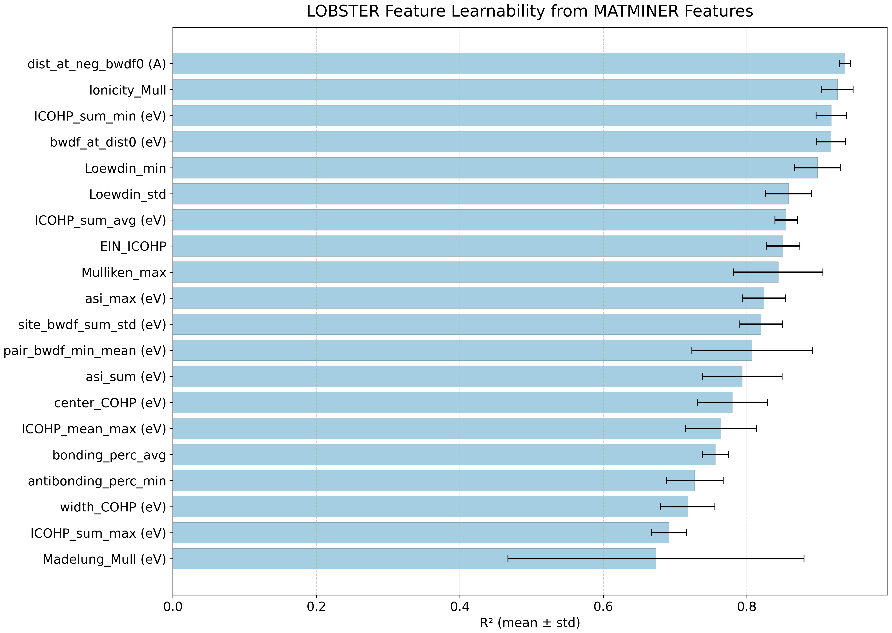
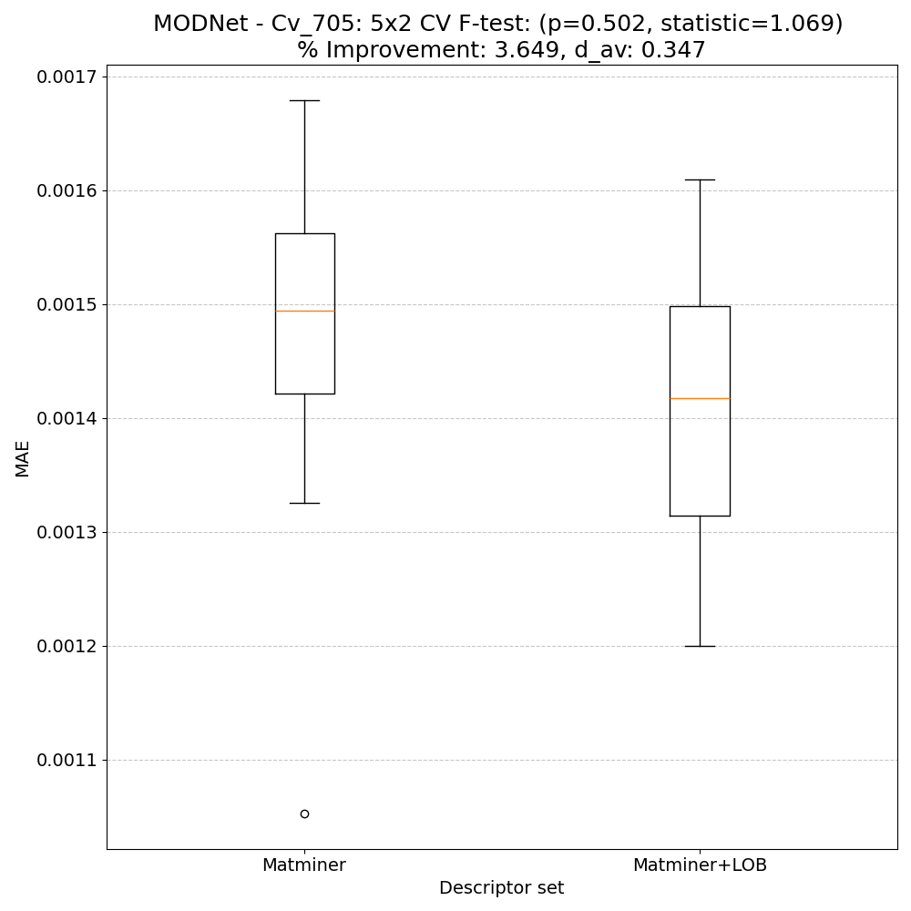
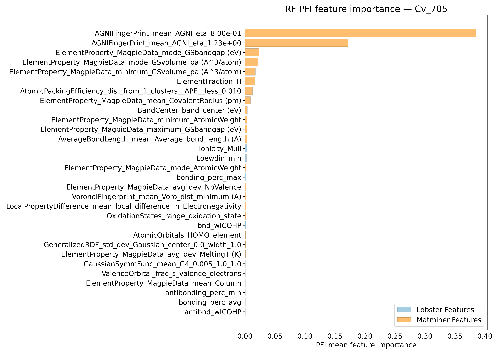
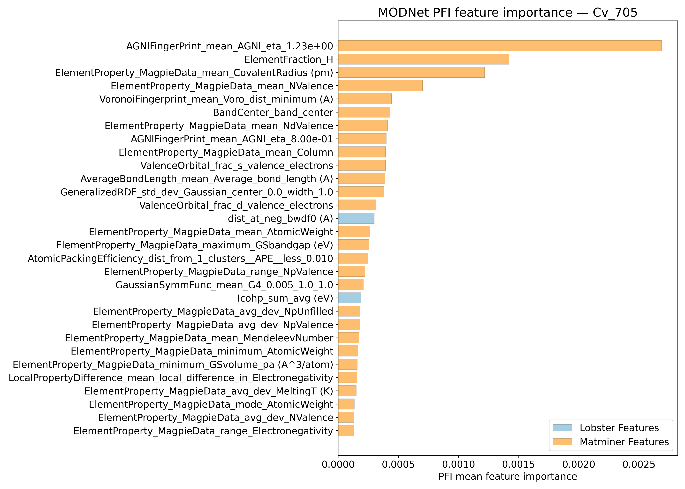
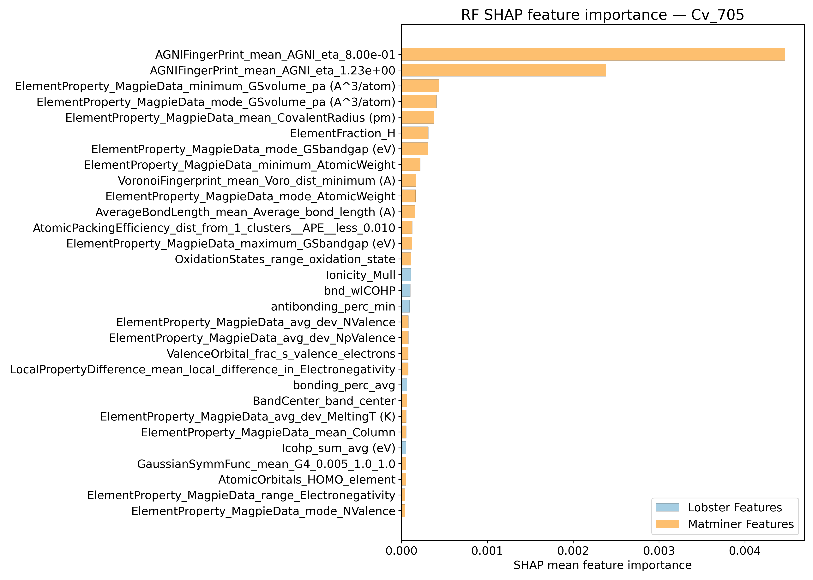
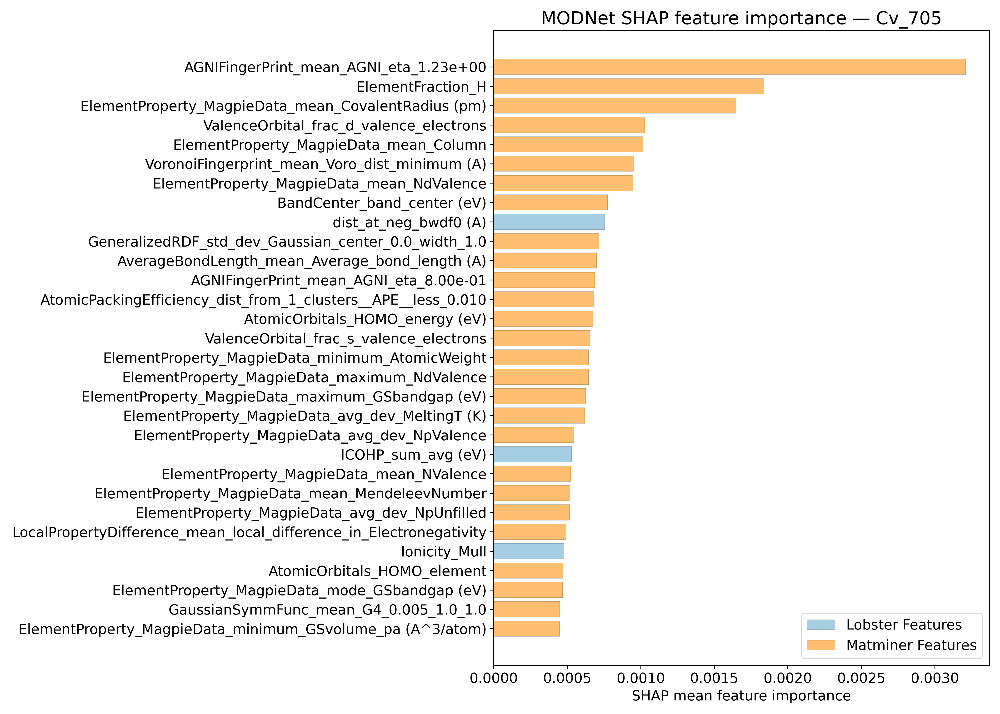
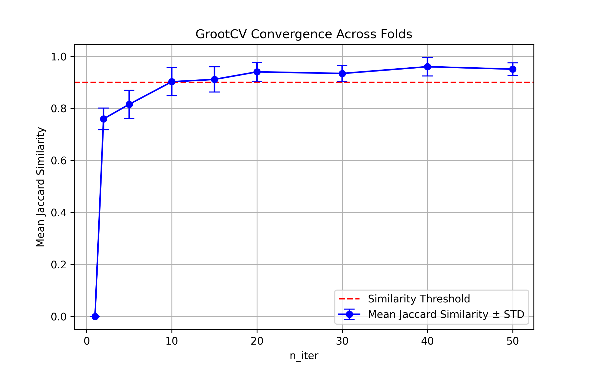

# Heat capacity @ 705K - meV/atom - Cv_705

## ARFS Top features

### ARFS selected descriptors

---

## Correlation analysis

### Distance correlation

### Dependency graphs

### Feature learnability

---

## Model performance

### 5-Fold CV Metrics overview

**RF - MATMINER**

|      |   train_rmse |   test_rmse |   train_errors |   test_errors |    train_r2 |   test_r2 |
|:-----|-------------:|------------:|---------------:|--------------:|------------:|----------:|
| mean |  0.0007      |  0.00206    |         0.0003 |   0.00094     | 0.99582     | 0.95912   |
| min  |  0.0006      |  0.0012     |         0.0003 |   0.0007      | 0.9945      | 0.8895    |
| max  |  0.0008      |  0.004      |         0.0003 |   0.0015      | 0.9969      | 0.9854    |
| std  |  6.32456e-05 |  0.00103073 |         0      |   0.000293939 | 0.000767854 | 0.0365099 |

**RF - MATMINER+LOBSTER**

|      |   train_rmse |   test_rmse |   train_errors |   test_errors |    train_r2 |   test_r2 |
|:-----|-------------:|------------:|---------------:|--------------:|------------:|----------:|
| mean |  0.0007      | 0.002       |         0.0003 |       0.00096 | 0.99588     | 0.96228   |
| min  |  0.0006      | 0.0012      |         0.0003 |       0.0007  | 0.9953      | 0.9052    |
| max  |  0.0008      | 0.0037      |         0.0003 |       0.0015  | 0.997       | 0.9848    |
| std  |  6.32456e-05 | 0.000918695 |         0      |       0.00028 | 0.000604649 | 0.0303504 |

**MODNet - MATMINER**

|      |   train_rmse |   test_rmse |   train_errors |   test_errors |   train_r2 |    test_r2 |
|:-----|-------------:|------------:|---------------:|--------------:|-----------:|-----------:|
| mean |  0.00142     | 0.00166     |        0.00088 |       0.00094 | 0.98272    | 0.97552    |
| min  |  0.0013      | 0.0012      |        0.0008  |       0.0008  | 0.9756     | 0.9595     |
| max  |  0.0017      | 0.0021      |        0.0009  |       0.0011  | 0.9857     | 0.9858     |
| std  |  0.000146969 | 0.000349857 |        4e-05   |       0.00012 | 0.00367445 | 0.00918682 |

**MODNet - MATMINER+LOBSTER**

|      |   train_rmse |   test_rmse |   train_errors |   test_errors |   train_r2 |   test_r2 |
|:-----|-------------:|------------:|---------------:|--------------:|-----------:|----------:|
| mean |  0.00154     | 0.00184     |     0.00094    |   0.00102     | 0.97948    | 0.9703    |
| min  |  0.0013      | 0.0013      |     0.0008     |   0.0007      | 0.9724     | 0.955     |
| max  |  0.0018      | 0.0024      |     0.0011     |   0.0013      | 0.9866     | 0.9837    |
| std  |  0.000185472 | 0.000449889 |     0.00010198 |   0.000203961 | 0.00535291 | 0.0124337 |

### Paired 5x2 CV F-test

**RF F-tests metrics comparsion**

**MODNet F-tests metrics comparsion**

**Summary**
|        |   F-statistic |   p-value |      d_av |   % Relative MAE improvement | Improved folds   |
|:-------|--------------:|----------:|----------:|-----------------------------:|:-----------------|
| RF     |       1.07046 |  0.501189 | -0.862487 |                     -1.15515 | 3/10             |
| MODNet |       1.06879 |  0.50196  |  0.34654  |                      3.64866 | 8/10             |

---

## Model Explainer

### PFI

### SHAP

---

## Misc

### ARFS n-iter convergence checks

