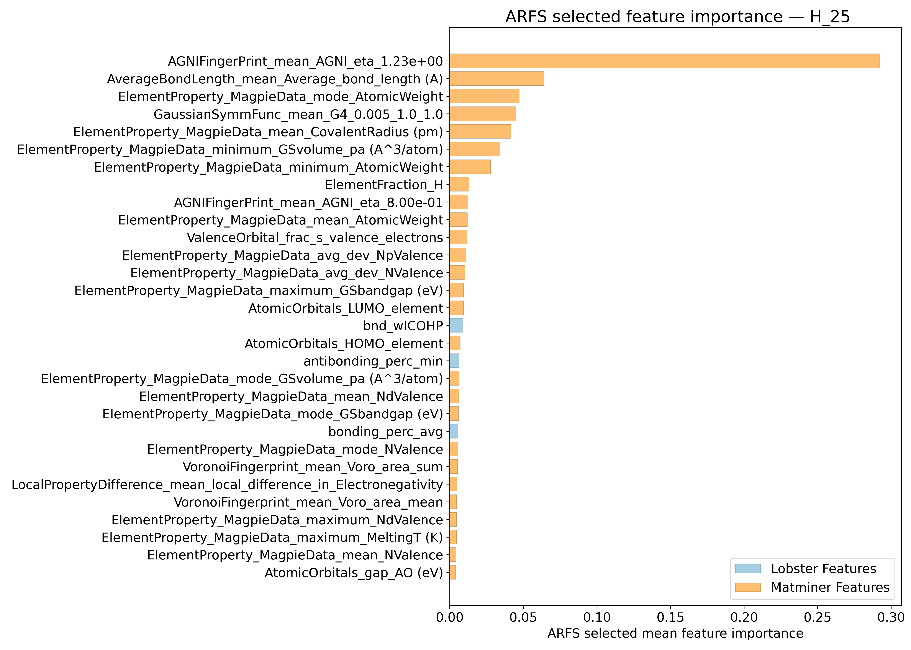
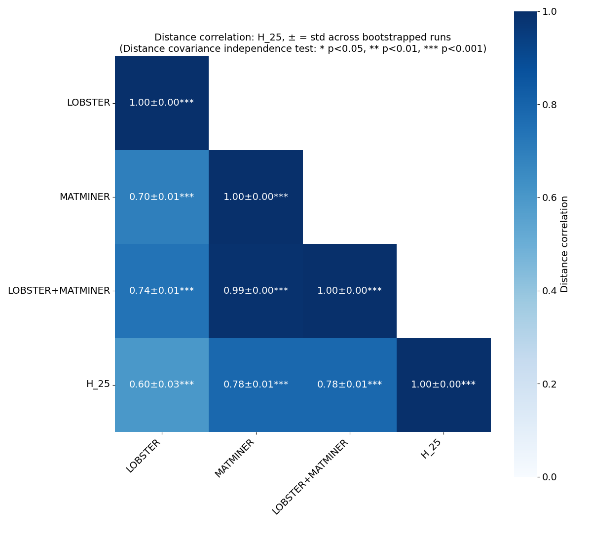
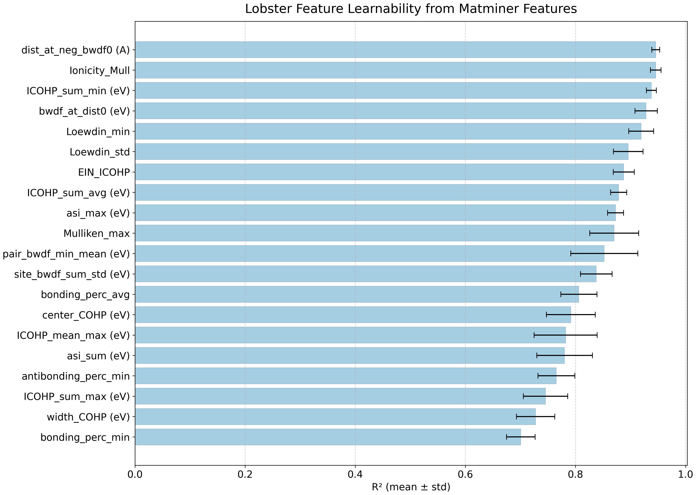
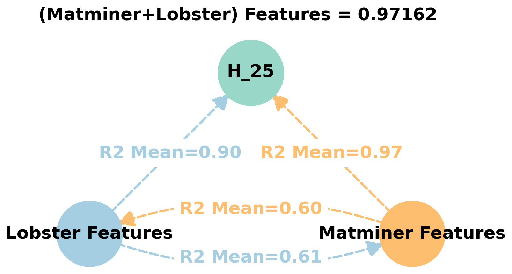
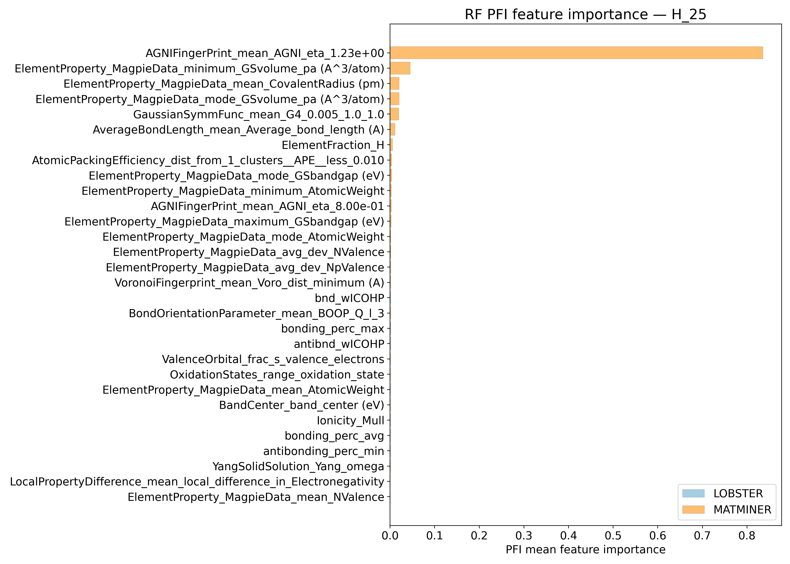
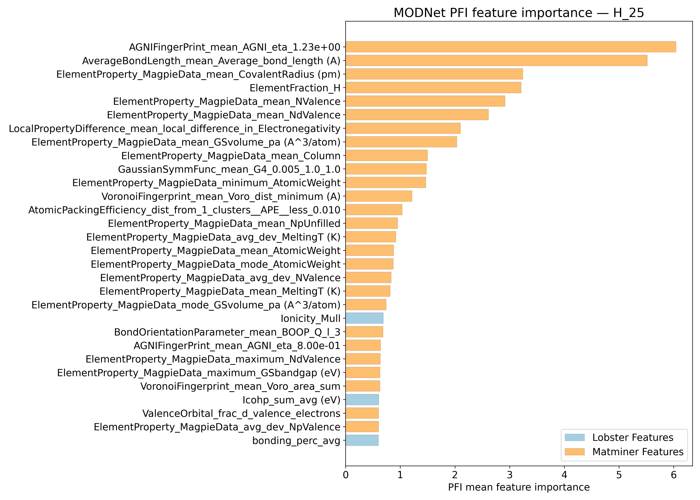
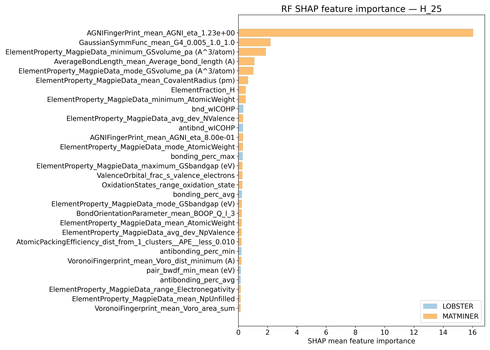
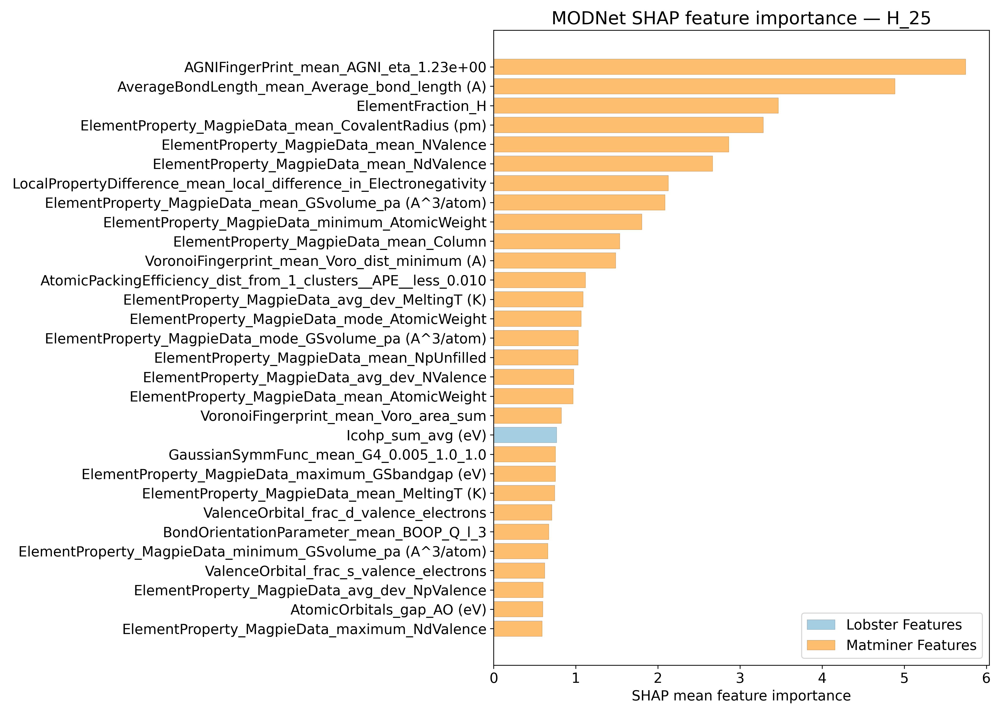
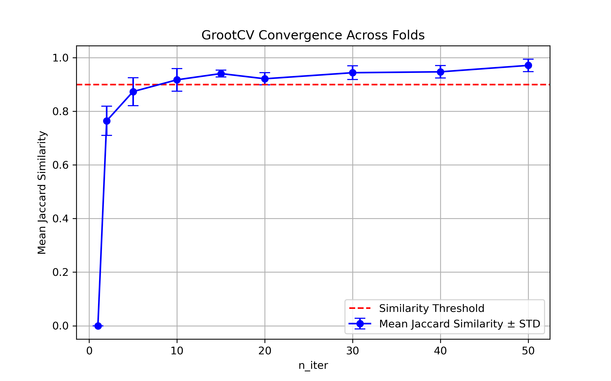

# Helmholtz energy @ 25K - H_25

## ARFS Top features

### ARFS selected descriptors

---

## Correlation analysis

### Distance correlation

### Dependency graphs

### Feature learnability

---

## Model performance

### Metrics overview

RF - MATMINER

|      |   train_rmse |   test_rmse |   train_errors |   test_errors |    train_r2 |    test_r2 |
|:-----|-------------:|------------:|---------------:|--------------:|------------:|-----------:|
| mean |    1.76816   |    4.75894  |       1.0646   |      2.91382  | 0.99598     | 0.97032    |
| min  |    1.6669    |    4.0907   |       1.0486   |      2.6102   | 0.9956      | 0.9541     |
| max  |    1.8436    |    6.5941   |       1.0835   |      3.496    | 0.9965      | 0.9782     |
| std  |    0.0665052 |    0.950688 |       0.013068 |      0.312506 | 0.000299333 | 0.00875155 |

RF - MATMINER+LOBSTER

|      |   train_rmse |   test_rmse |   train_errors |   test_errors |    train_r2 |    test_r2 |
|:-----|-------------:|------------:|---------------:|--------------:|------------:|-----------:|
| mean |    1.7724    |    4.74388  |      1.06688   |      2.9038   | 0.99594     | 0.97048    |
| min  |    1.6536    |    4.0674   |      1.0387    |      2.5472   | 0.9955      | 0.9547     |
| max  |    1.8557    |    6.5511   |      1.0826    |      3.5282   | 0.9965      | 0.9786     |
| std  |    0.0773593 |    0.950227 |      0.0155267 |      0.336682 | 0.000344093 | 0.00879077 |

MODNet - MATMINER

|      |   train_rmse |   test_rmse |   train_errors |   test_errors |    train_r2 |    test_r2 |
|:-----|-------------:|------------:|---------------:|--------------:|------------:|-----------:|
| mean |    0.96458   |    2.73528  |      0.53458   |      1.50598  | 0.9988      | 0.98976    |
| min  |    0.8752    |    1.8616   |      0.5141    |      1.3009   | 0.9983      | 0.9808     |
| max  |    1.1185    |    3.7183   |      0.5638    |      1.7715   | 0.999       | 0.9949     |
| std  |    0.0870001 |    0.677896 |      0.0174883 |      0.179698 | 0.000260768 | 0.00501023 |

MODNet - MATMINER+LOBSTER

|      |   train_rmse |   test_rmse |   train_errors |   test_errors |    train_r2 |    test_r2 |
|:-----|-------------:|------------:|---------------:|--------------:|------------:|-----------:|
| mean |    1.0046    |    2.66286  |      0.56532   |      1.51762  | 0.9987      | 0.99026    |
| min  |    0.8832    |    1.9784   |      0.5266    |      1.2762   | 0.9985      | 0.9819     |
| max  |    1.0744    |    3.6067   |      0.6568    |      1.7643   | 0.999       | 0.9945     |
| std  |    0.0745716 |    0.613766 |      0.0485157 |      0.183489 | 0.000209762 | 0.00467401 |

---

## Model Explainer

### PFI

### SHAP

---

## Misc

### ARFS n-iter convergence checks

