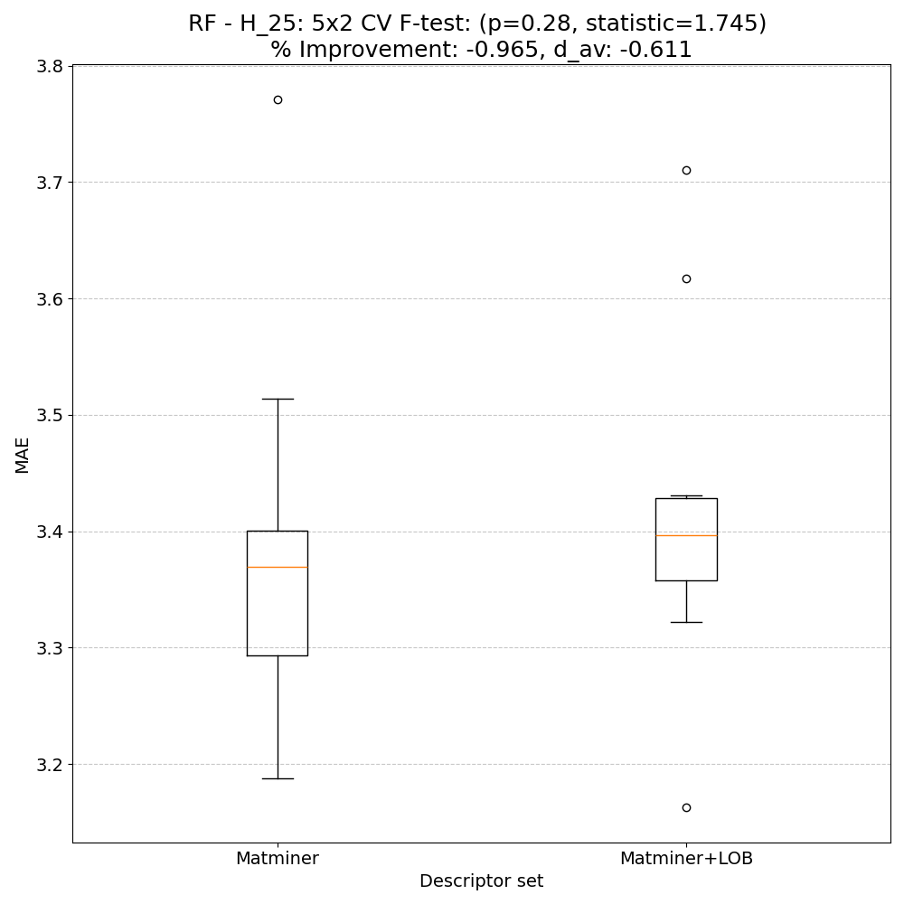
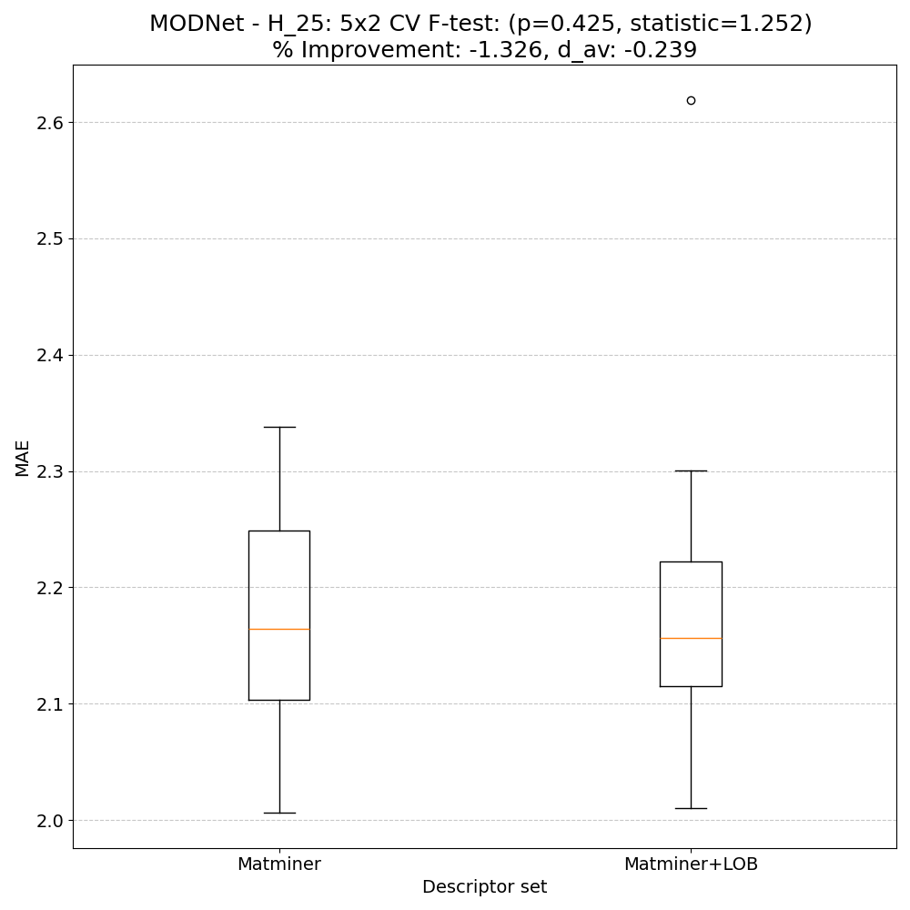

# Helmholtz energy @ 25K - meV/atom - H_25

## ARFS Top features

### ARFS selected descriptors

---

## Correlation analysis

### Distance correlation

### Dependency graphs

### Feature learnability

---

## Model performance

### 5-Fold CV Metrics overview

**RF - MATMINER**

|      |   train_rmse |   test_rmse |   train_errors |   test_errors |    train_r2 |   test_r2 |
|:-----|-------------:|------------:|---------------:|--------------:|------------:|----------:|
| mean |    1.77708   |    4.75148  |       1.07046  |      2.91236  | 0.99592     | 0.97048   |
| min  |    1.6821    |    4.0754   |       1.0454   |      2.6023   | 0.9953      | 0.9562    |
| max  |    1.8965    |    6.4472   |       1.091    |      3.429    | 0.9964      | 0.9778    |
| std  |    0.0749397 |    0.892747 |       0.016584 |      0.286805 | 0.000354401 | 0.0080086 |

**RF - MATMINER+LOBSTER**

|      |   train_rmse |   test_rmse |   train_errors |   test_errors |    train_r2 |    test_r2 |
|:-----|-------------:|------------:|---------------:|--------------:|------------:|-----------:|
| mean |    1.77896   |    4.74592  |      1.07348   |      2.93166  | 0.99592     | 0.97042    |
| min  |    1.6681    |    4.0322   |      1.051     |      2.5816   | 0.9954      | 0.954      |
| max  |    1.8796    |    6.6022   |      1.0921    |      3.5257   | 0.9965      | 0.9787     |
| std  |    0.0835833 |    0.983811 |      0.0175756 |      0.325418 | 0.000365513 | 0.00923589 |

**MODNet - MATMINER**

|      |   train_rmse |   test_rmse |   train_errors |   test_errors |    train_r2 |    test_r2 |
|:-----|-------------:|------------:|---------------:|--------------:|------------:|-----------:|
| mean |      1.00462 |    2.79296  |      0.55522   |      1.50746  | 0.99866     | 0.98928    |
| min  |      0.8252  |    1.9187   |      0.4934    |      1.2858   | 0.9982      | 0.98       |
| max  |      1.1584  |    3.7937   |      0.5995    |      1.786    | 0.9991      | 0.9946     |
| std  |      0.10715 |    0.722653 |      0.0345719 |      0.193421 | 0.000287054 | 0.00538494 |

**MODNet - MATMINER+LOBSTER**

|      |   train_rmse |   test_rmse |   train_errors |   test_errors |    train_r2 |    test_r2 |
|:-----|-------------:|------------:|---------------:|--------------:|------------:|-----------:|
| mean |    0.9519    |    2.69644  |      0.54838   |      1.50492  | 0.99884     | 0.99       |
| min  |    0.8868    |    1.877    |      0.538     |      1.2041   | 0.9985      | 0.9816     |
| max  |    1.0502    |    3.6385   |      0.5663    |      1.7663   | 0.999       | 0.995      |
| std  |    0.0596633 |    0.671187 |      0.0105446 |      0.207836 | 0.000185472 | 0.00491976 |

### Paired 5x2 CV F-test

**RF F-tests metrics comparsion**

**MODNet F-tests metrics comparsion**

**Summary**
|        |   F-statistic |   p-value |      d_av |   % Relative MAE improvement | Improved folds   |
|:-------|--------------:|----------:|----------:|-----------------------------:|:-----------------|
| RF     |       1.74501 |  0.280017 | -0.61095  |                     -0.96483 | 3/10             |
| MODNet |       1.25192 |  0.42507  | -0.238524 |                     -1.32572 | 4/10             |

---

## Model Explainer

### PFI

### SHAP

---

## Misc

### ARFS n-iter convergence checks

