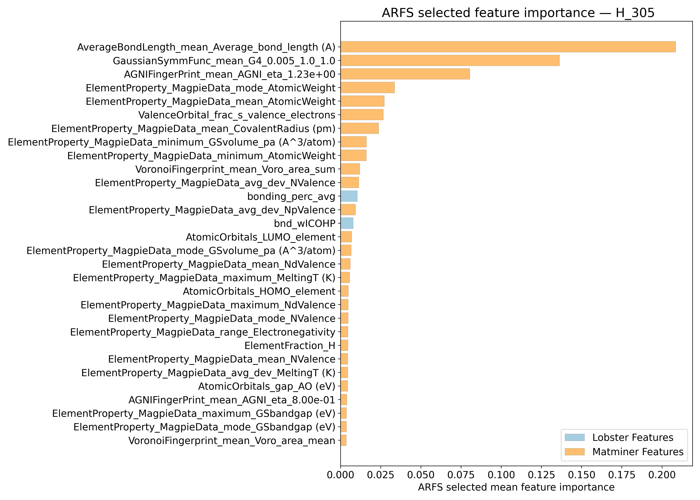
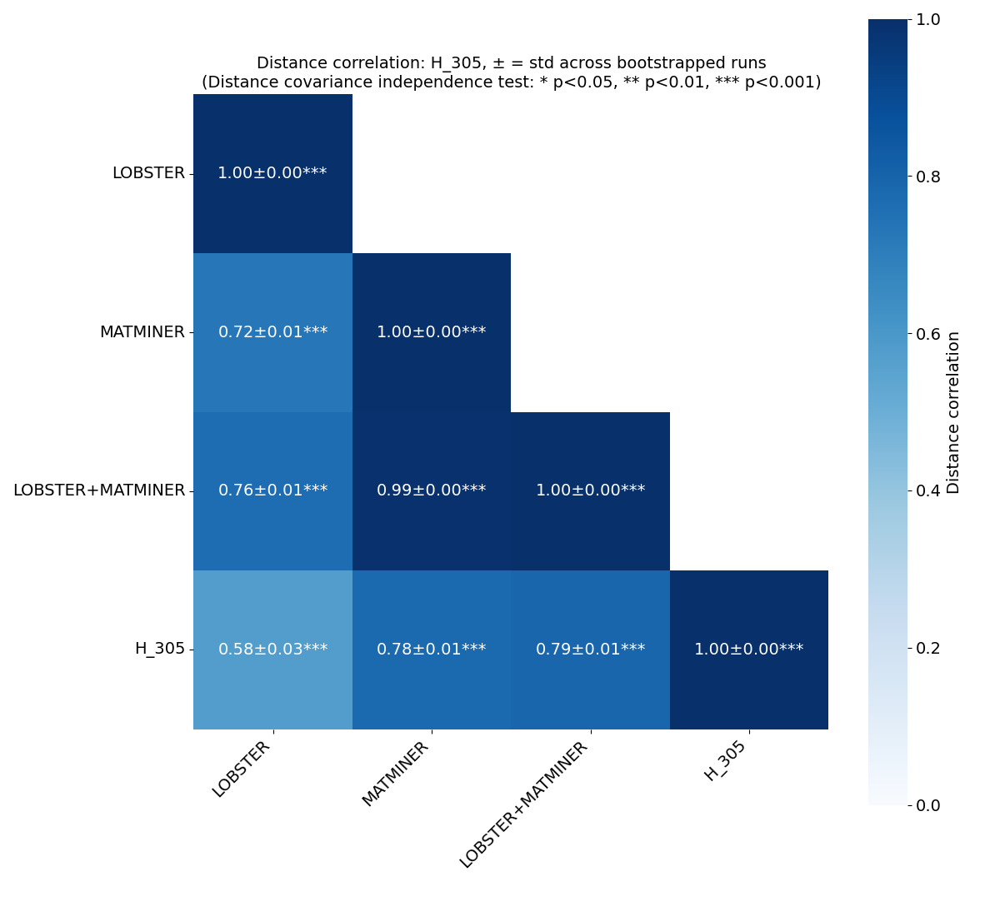
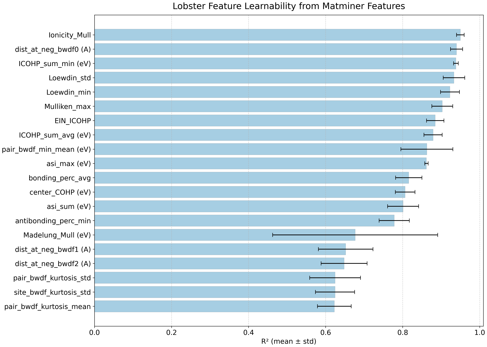
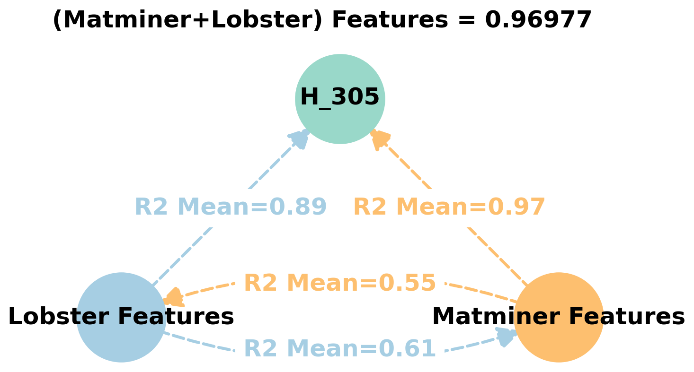
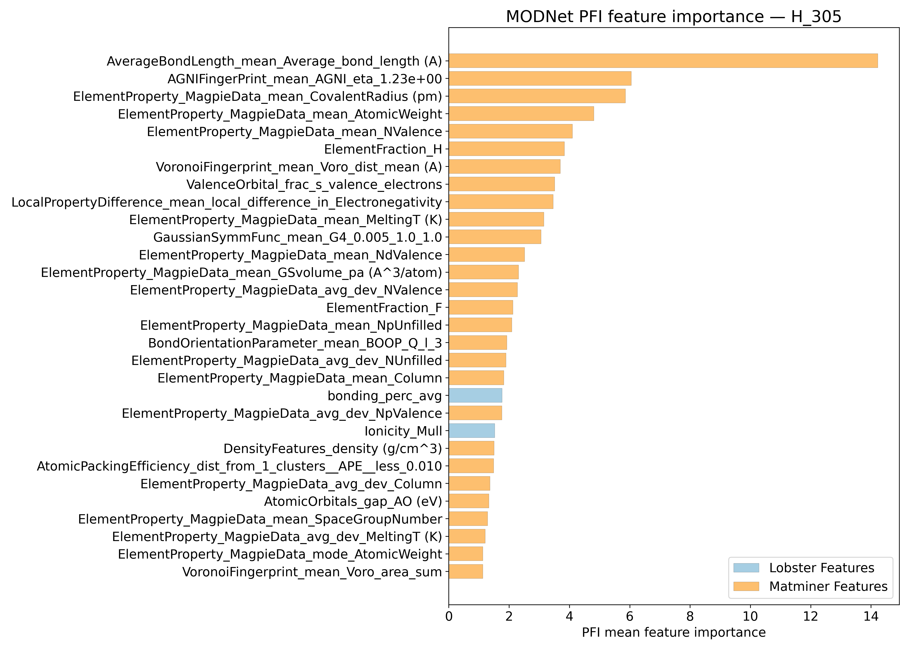
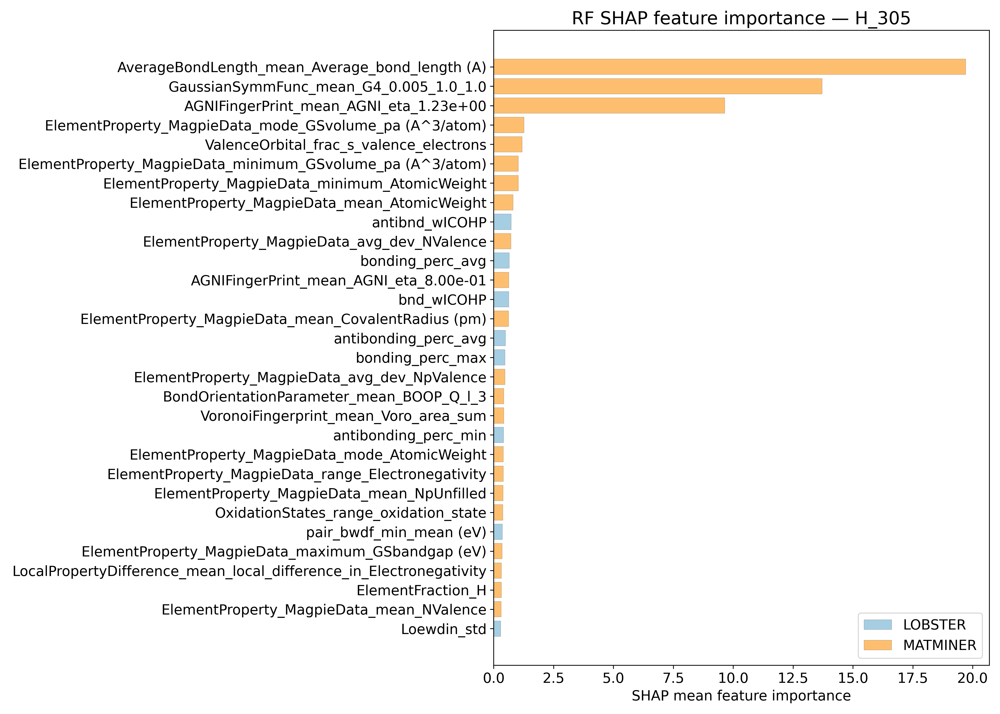
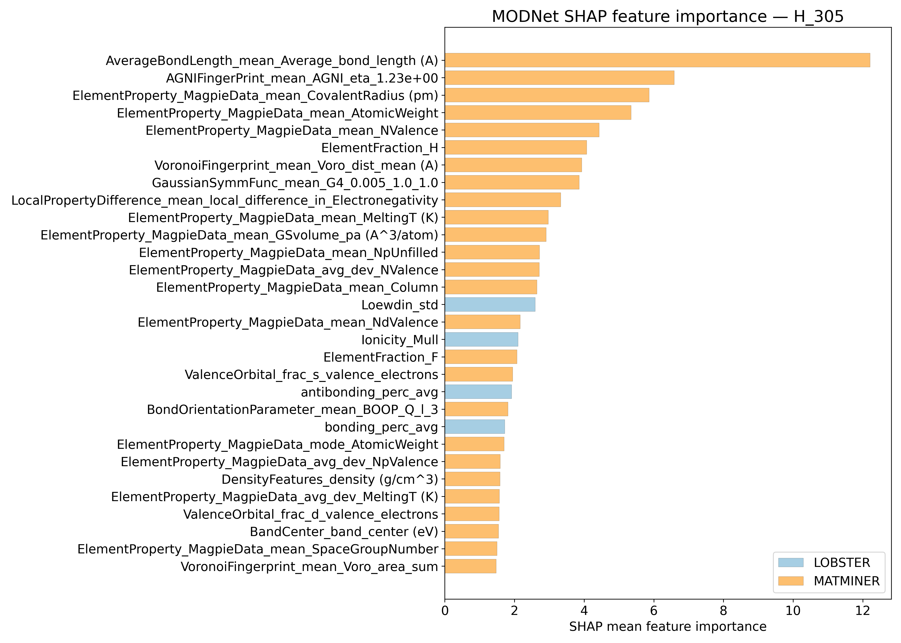
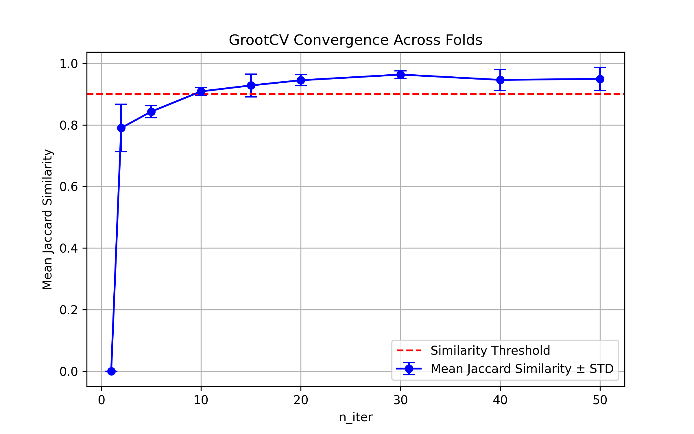

# Helmholtz energy @ 305K - H_305

## ARFS Top features

### ARFS selected descriptors

---

## Correlation analysis

### Distance correlation

### Dependency graphs

### Feature learnability

---

## Model performance

### Metrics overview

RF - MATMINER

|      |   train_rmse |   test_rmse |   train_errors |   test_errors |    train_r2 |   test_r2 |
|:-----|-------------:|------------:|---------------:|--------------:|------------:|----------:|
| mean |    3.23246   |    8.7773   |      2.32612   |      6.34774  | 0.99594     | 0.96972   |
| min  |    3.1379    |    8.1178   |      2.2606    |      5.7665   | 0.9958      | 0.9677    |
| max  |    3.2895    |    9.8083   |      2.375     |      6.7487   | 0.9962      | 0.9723    |
| std  |    0.0535175 |    0.611964 |      0.0397092 |      0.364575 | 0.000149666 | 0.0018851 |

RF - MATMINER+LOBSTER

|      |   train_rmse |   test_rmse |   train_errors |   test_errors |    train_r2 |   test_r2 |
|:-----|-------------:|------------:|---------------:|--------------:|------------:|----------:|
| mean |    3.24454   |    8.82368  |      2.35628   |      6.41346  | 0.9959      | 0.9694    |
| min  |    3.1357    |    8.2653   |      2.2706    |      5.8134   | 0.9958      | 0.9671    |
| max  |    3.3136    |    9.923    |      2.4036    |      6.8482   | 0.9962      | 0.9718    |
| std  |    0.0662611 |    0.600891 |      0.0479771 |      0.373208 | 0.000154919 | 0.0017309 |

MODNet - MATMINER

|      |   train_rmse |   test_rmse |   train_errors |   test_errors |    train_r2 |    test_r2 |
|:-----|-------------:|------------:|---------------:|--------------:|------------:|-----------:|
| mean |    1.5778    |    4.7282   |      1.05254   |      3.3068   | 0.99902     | 0.991      |
| min  |    1.4746    |    3.9458   |      0.9705    |      2.9961   | 0.9989      | 0.9871     |
| max  |    1.659     |    5.6778   |      1.0835    |      3.7378   | 0.9992      | 0.9936     |
| std  |    0.0649442 |    0.682539 |      0.0424827 |      0.316567 | 0.000116619 | 0.00267432 |

MODNet - MATMINER+LOBSTER

|      |   train_rmse |   test_rmse |   train_errors |   test_errors |    train_r2 |    test_r2 |
|:-----|-------------:|------------:|---------------:|--------------:|------------:|-----------:|
| mean |      1.82036 |    4.65458  |       1.18826  |      3.29742  | 0.99868     | 0.99132    |
| min  |      1.5455  |    4.0238   |       1.0469   |      2.8837   | 0.9978      | 0.9881     |
| max  |      2.3434  |    5.4543   |       1.4651   |      3.7622   | 0.9991      | 0.9936     |
| std  |      0.27844 |    0.511349 |       0.152066 |      0.301184 | 0.000462169 | 0.00206436 |

---

## Model Explainer

### PFI

### SHAP

---

## Misc

### ARFS n-iter convergence checks

