# Helmholtz energy @ 705K - meV/atom - H_705

## ARFS Top features

### ARFS selected descriptors

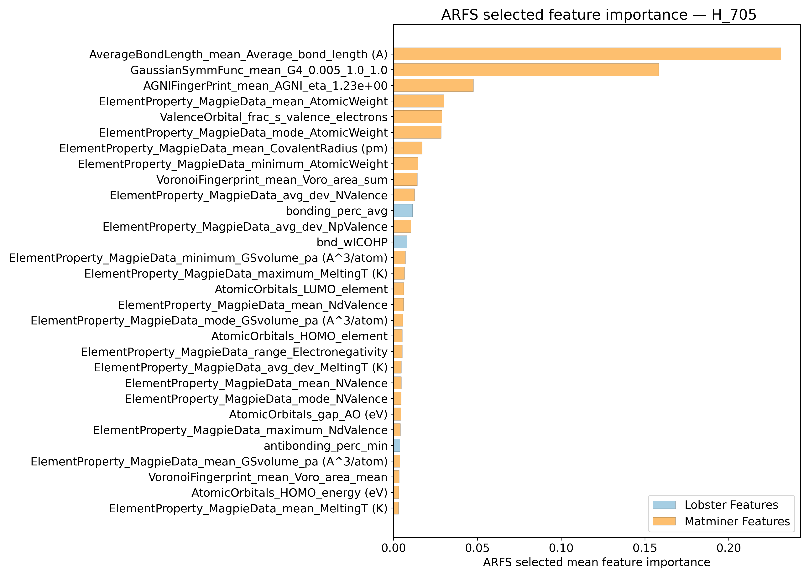

---

## Correlation analysis

### Distance correlation

### Dependency graphs

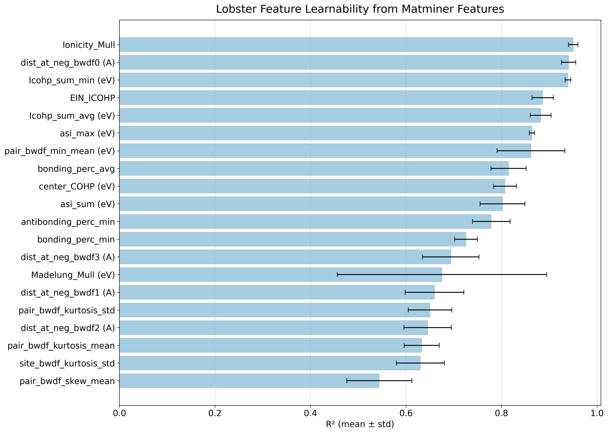

### Feature learnability

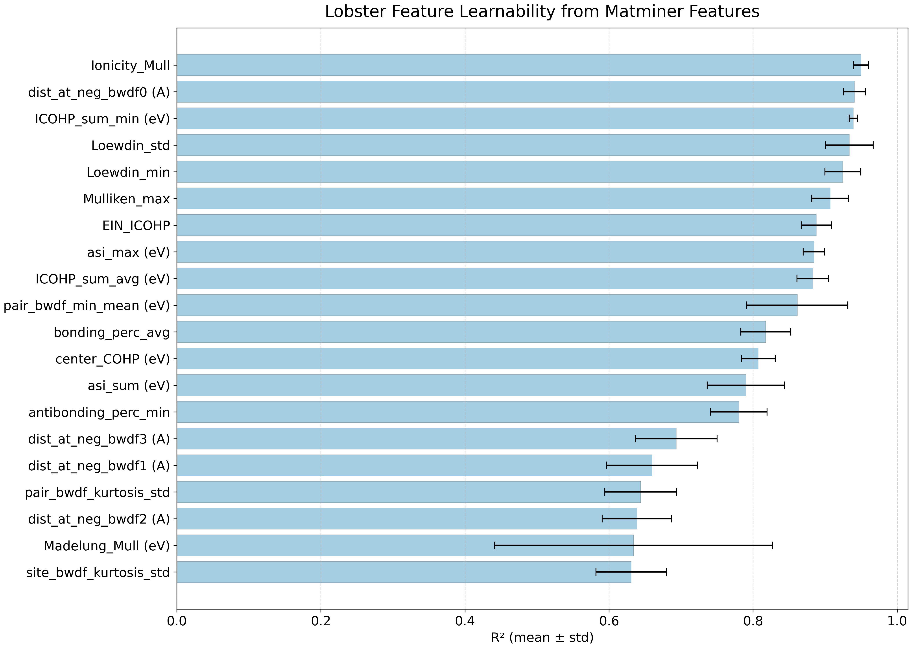

---

## Model performance

### 5-Fold CV Metrics overview

**RF - MATMINER**

|      |   train_rmse |   test_rmse |   train_errors |   test_errors |   train_r2 |    test_r2 |
|:-----|-------------:|------------:|---------------:|--------------:|-----------:|-----------:|
| mean |    6.6628    |   18.1112   |      4.91462   |     13.4184   | 0.99574    | 0.96826    |
| min  |    6.5445    |   16.7774   |      4.816     |     12.2073   | 0.9956     | 0.9649     |
| max  |    6.7686    |   19.3591   |      4.9787    |     14.3122   | 0.9959     | 0.9719     |
| std  |    0.0831141 |    0.968364 |      0.0610702 |      0.794522 | 0.00010198 | 0.00230877 |

**RF - MATMINER+LOBSTER**

|      |   train_rmse |   test_rmse |   train_errors |   test_errors |    train_r2 |    test_r2 |
|:-----|-------------:|------------:|---------------:|--------------:|------------:|-----------:|
| mean |     6.622    |    18.0368  |      4.93562   |     13.447    | 0.99578     | 0.96856    |
| min  |     6.4909   |    16.5873  |      4.8139    |     12.1975   | 0.9956      | 0.9668     |
| max  |     6.7971   |    19.5815  |      5.03      |     14.4323   | 0.9959      | 0.9726     |
| std  |     0.115579 |     1.02301 |      0.0785848 |      0.858628 | 0.000116619 | 0.00211149 |

**MODNet - MATMINER**

|      |   train_rmse |   test_rmse |   train_errors |   test_errors |    train_r2 |    test_r2 |
|:-----|-------------:|------------:|---------------:|--------------:|------------:|-----------:|
| mean |     3.84202  |    10.0375  |       2.62622  |      7.22558  | 0.99852     | 0.99016    |
| min  |     3.3672   |     8.5071  |       2.3459   |      6.3834   | 0.9975      | 0.9869     |
| max  |     5.0759   |    11.4619  |       3.4663   |      8.2574   | 0.9989      | 0.9928     |
| std  |     0.626903 |     1.11496 |       0.423513 |      0.719284 | 0.000515364 | 0.00222764 |

**MODNet - MATMINER+LOBSTER**

|      |   train_rmse |   test_rmse |   train_errors |   test_errors |    train_r2 |    test_r2 |
|:-----|-------------:|------------:|---------------:|--------------:|------------:|-----------:|
| mean |     3.78794  |    9.9903   |       2.53938  |       7.25782 | 0.9986      | 0.9903     |
| min  |     3.1643   |    8.715    |       2.1522   |       6.4654  | 0.998       | 0.9888     |
| max  |     4.5003   |   10.7757   |       2.9598   |       7.6685  | 0.999       | 0.9924     |
| std  |     0.451815 |    0.732369 |       0.279269 |       0.43552 | 0.000352136 | 0.00138996 |

### Corrected resampled t-test on 10-fold CV 

**Summary**
|        |    t_stat |   p_value | significance_stars   |      d_av |   rel_improvement |   percent_folds_improved |
|:-------|----------:|----------:|:---------------------|----------:|------------------:|-------------------------:|
| RF     | -0.889042 | 0.80144   |                      | -0.153435 |          -1.1443  |                       40 |
| MODNet |  2.14591  | 0.0302188 | *                    |  0.324657 |           3.10819 |                       90 |

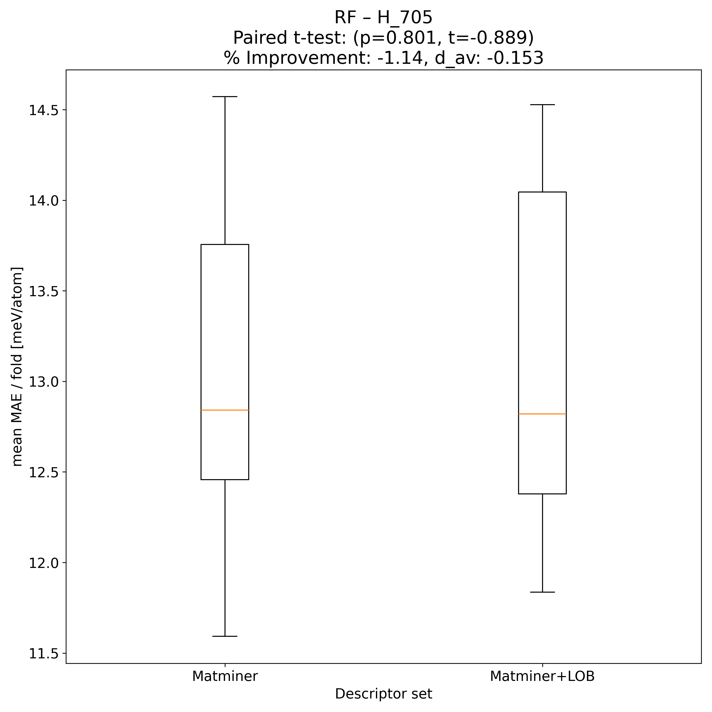

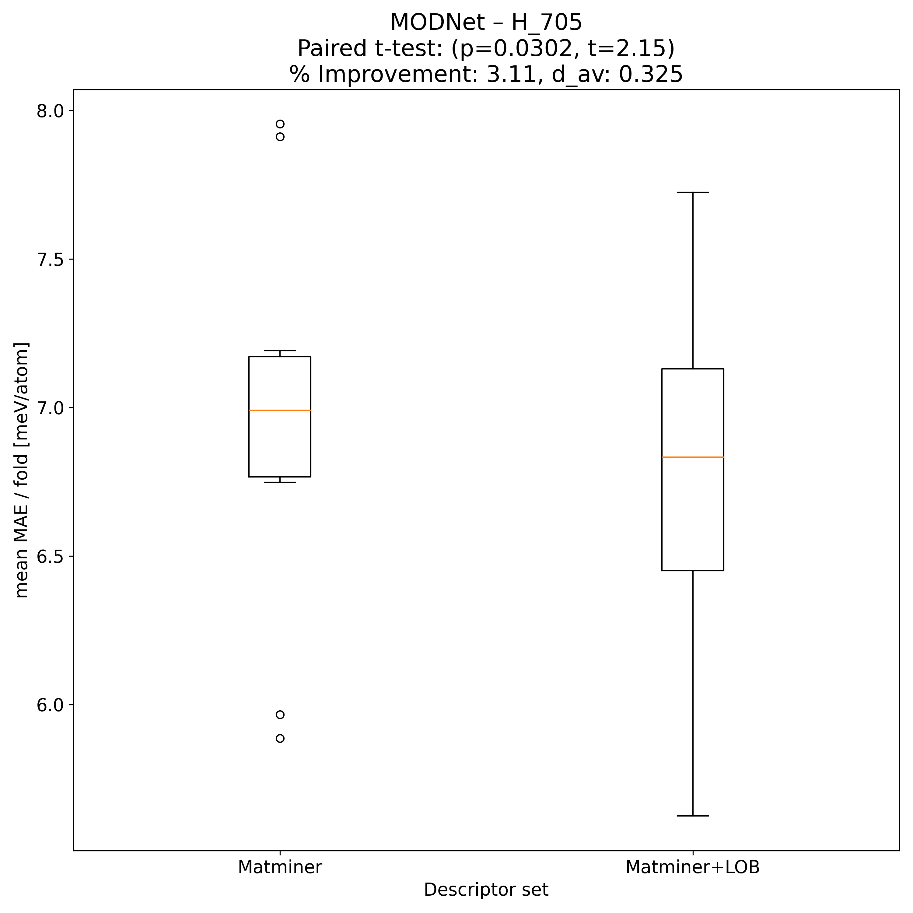

---

## Model Explainer

### PFI
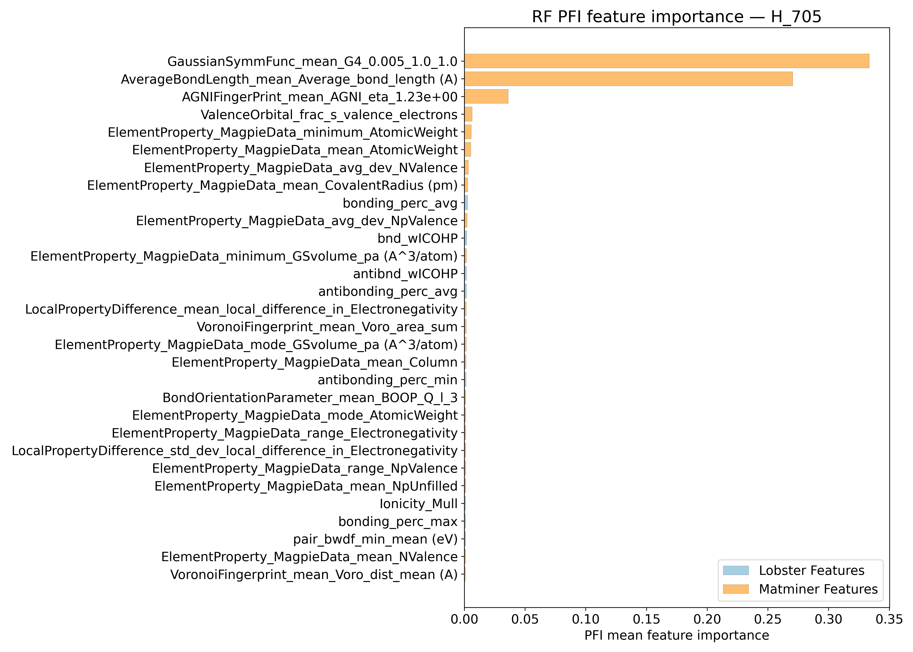
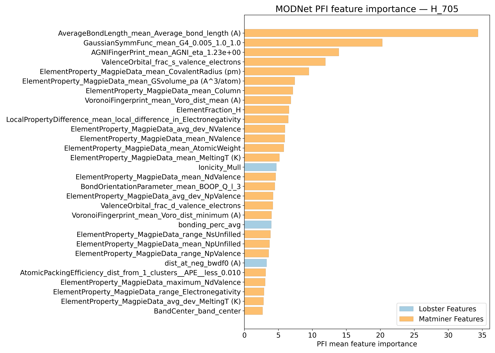

### SHAP
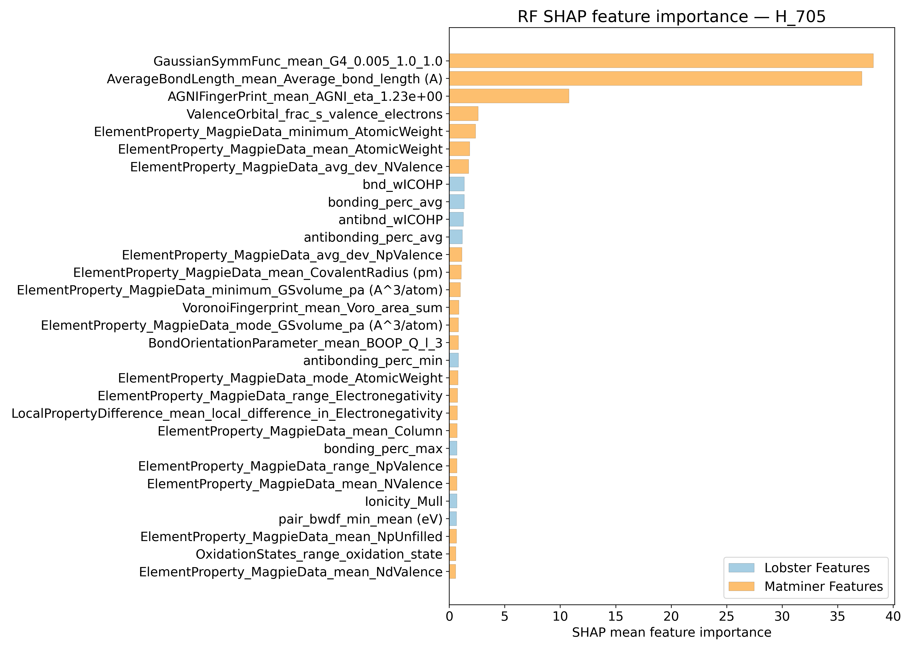
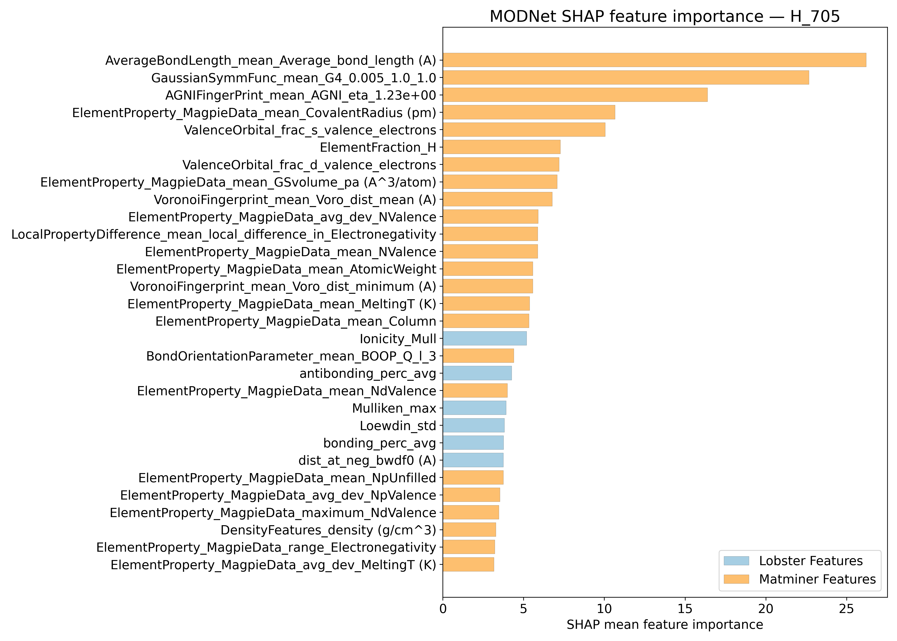

---

## Misc

### ARFS n-iter convergence checks

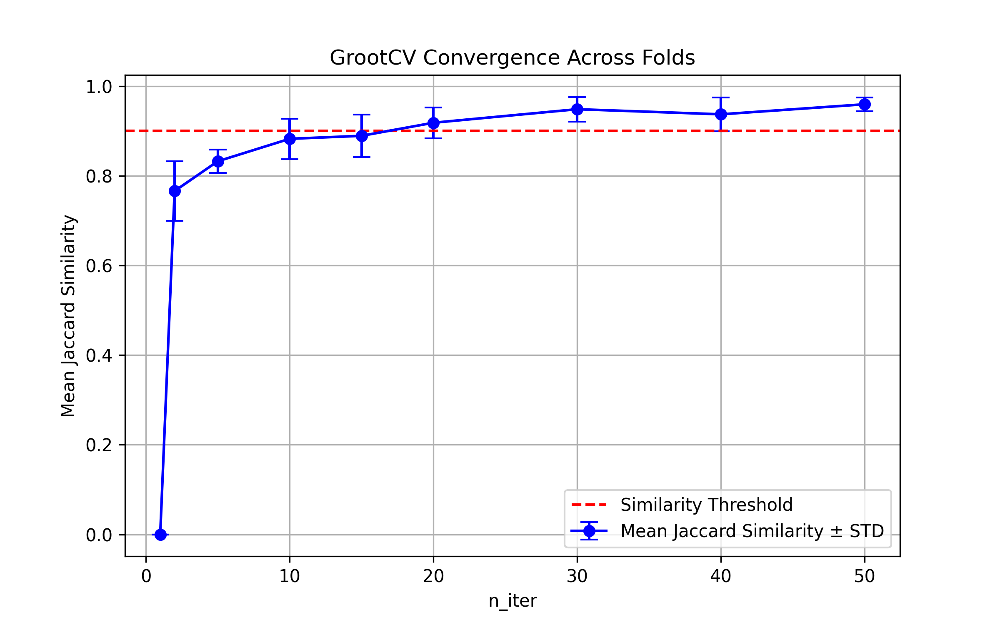

### MAE/ fold from 10-fold CV

Alternative visual summary of input data for t-test 

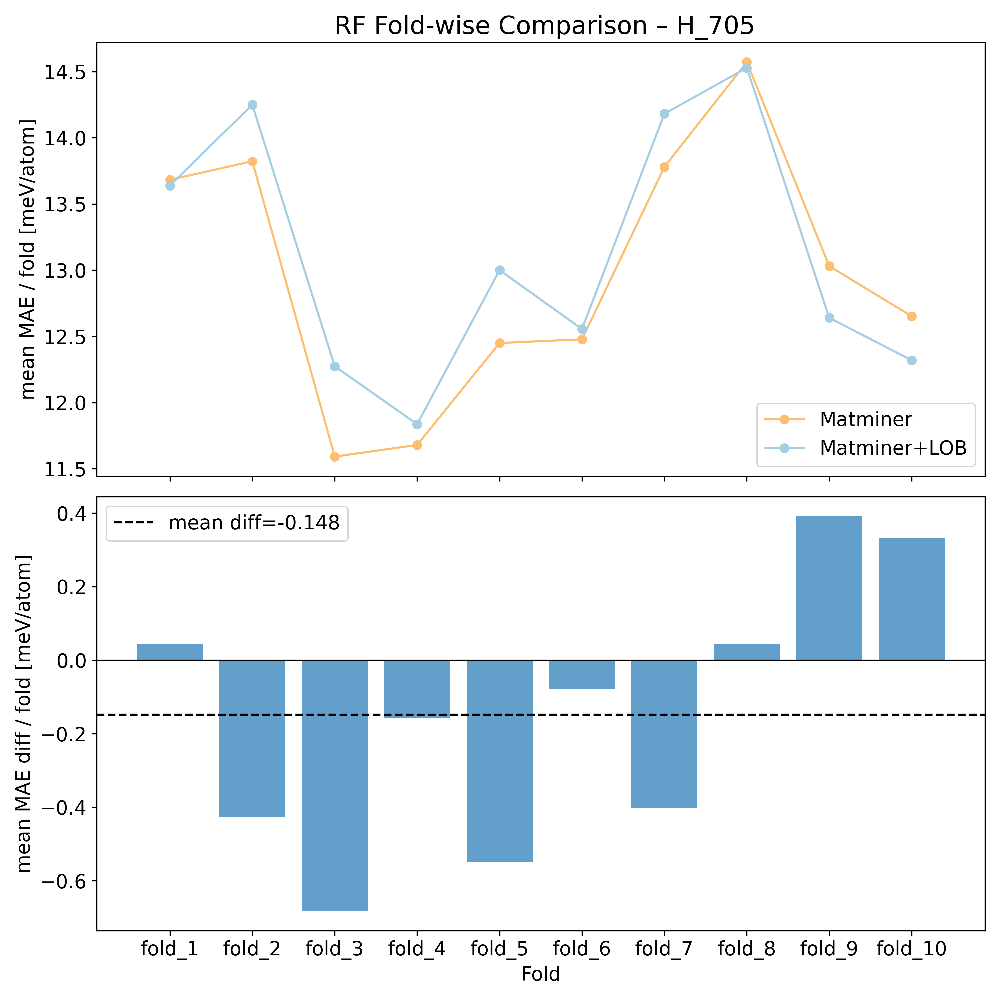

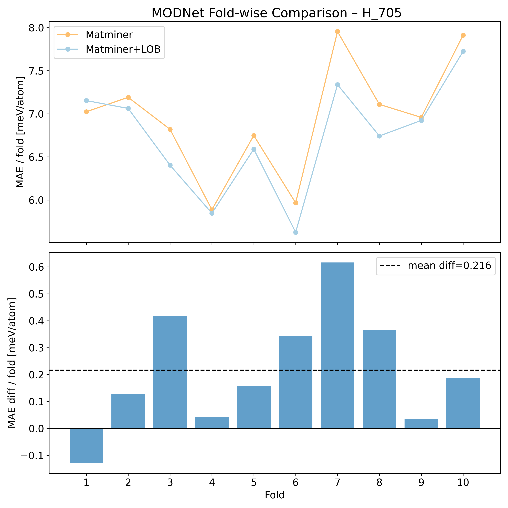

