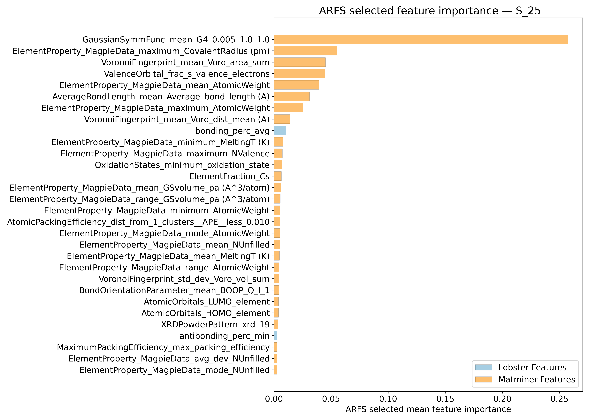
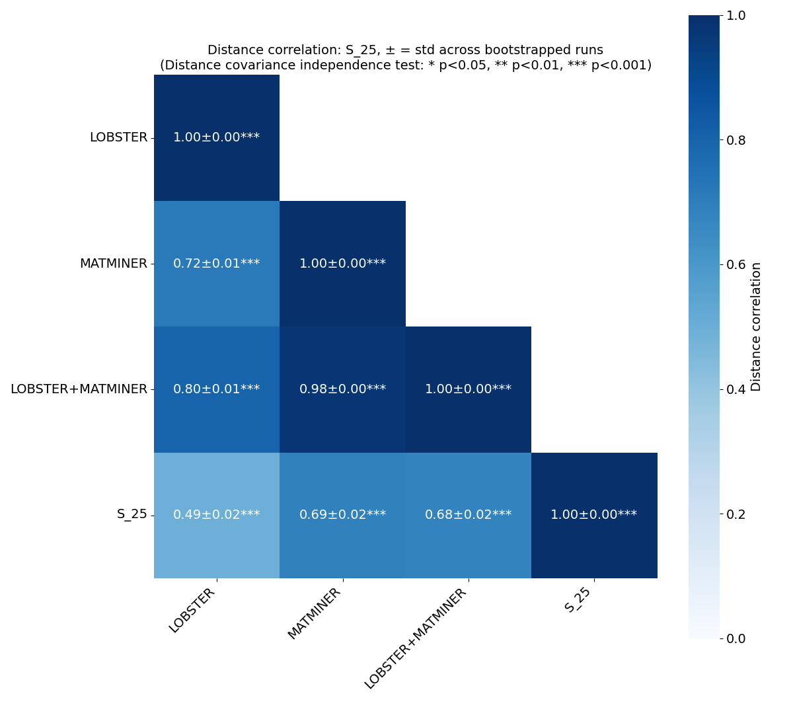
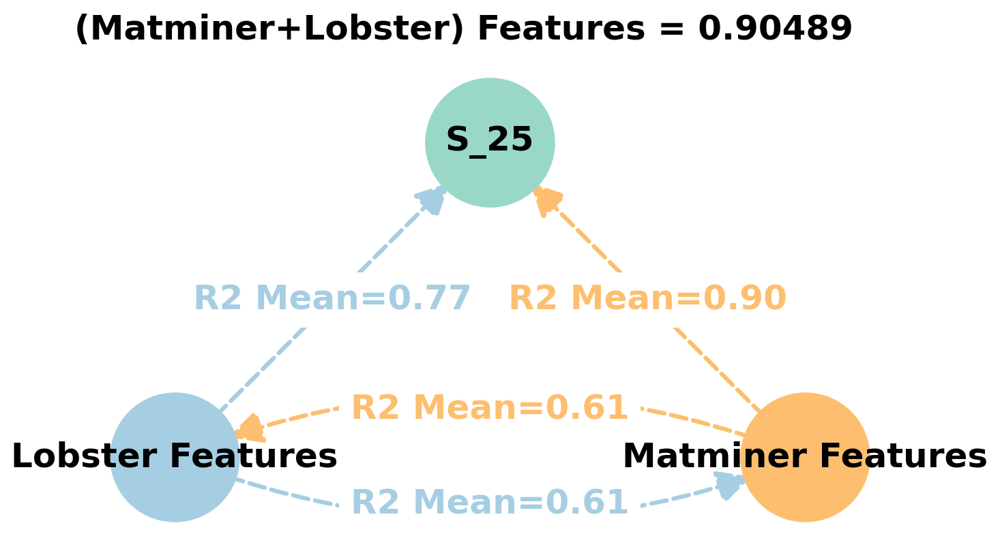
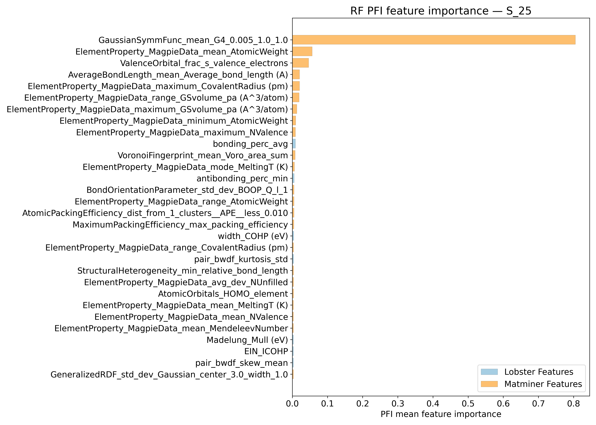
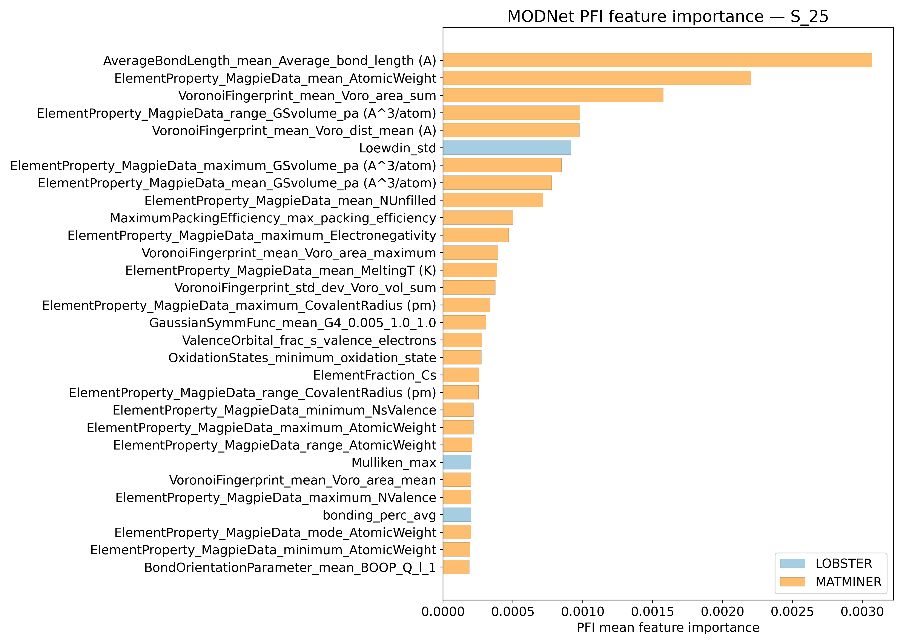
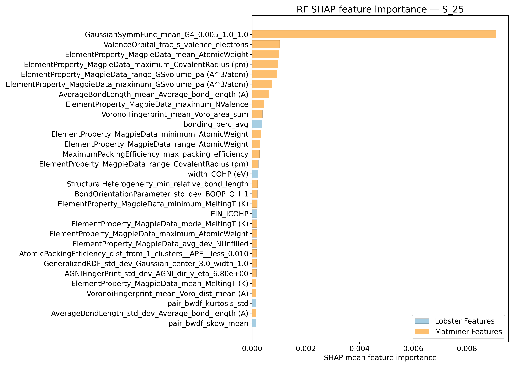
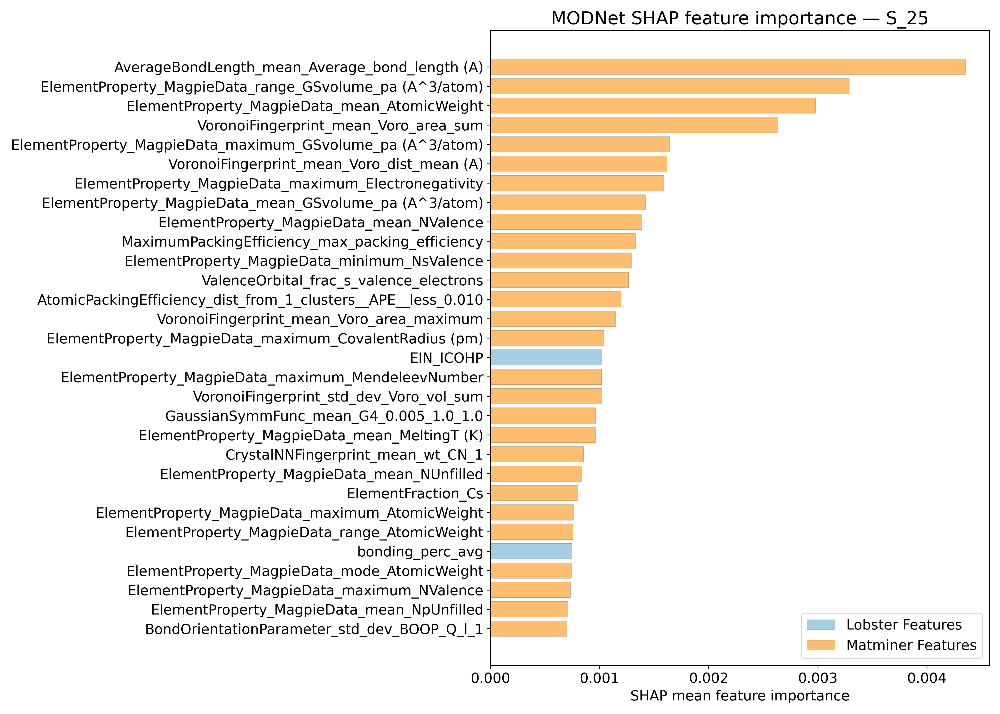
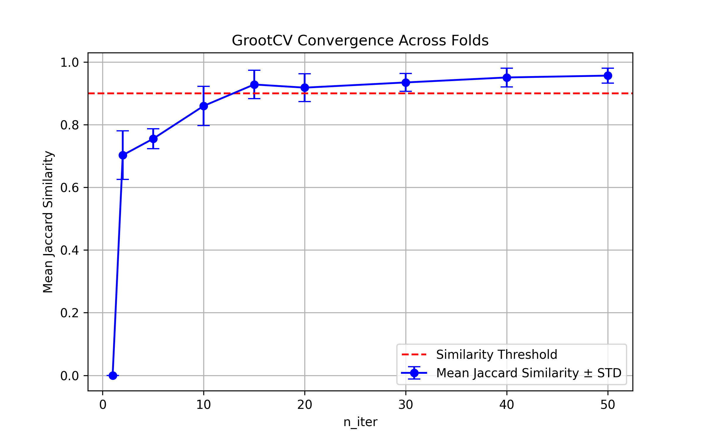

# Vibrational entropy @ 25K - S_25

## ARFS Top features

### ARFS selected descriptors

---

## Correlation analysis

### Distance correlation

### Dependency graphs

### Feature learnability

---

## Model performance

### Metrics overview

RF - MATMINER

|      |   train_rmse |   test_rmse |   train_errors |   test_errors |    train_r2 |   test_r2 |
|:-----|-------------:|------------:|---------------:|--------------:|------------:|----------:|
| mean |       0.0019 | 0.00516     |         0.0011 |   0.00304     | 0.9877      | 0.90696   |
| min  |       0.0019 | 0.005       |         0.0011 |   0.0029      | 0.9874      | 0.8873    |
| max  |       0.0019 | 0.0054      |         0.0011 |   0.0033      | 0.9882      | 0.9156    |
| std  |       0      | 0.000162481 |         0      |   0.000135647 | 0.000303315 | 0.0103188 |

RF - MATMINER+LOBSTER

|      |   train_rmse |   test_rmse |   train_errors |   test_errors |    train_r2 |   test_r2 |
|:-----|-------------:|------------:|---------------:|--------------:|------------:|----------:|
| mean |       0.0019 |     0.00518 |         0.0011 |   0.003       | 0.98782     |  0.90646  |
| min  |       0.0019 |     0.0049  |         0.0011 |   0.0028      | 0.9872      |  0.8861   |
| max  |       0.0019 |     0.0054  |         0.0011 |   0.0033      | 0.9882      |  0.9196   |
| std  |       0      |     0.00016 |         0      |   0.000167332 | 0.000370945 |  0.011569 |

MODNet - MATMINER

|      |   train_rmse |   test_rmse |   train_errors |   test_errors |   train_r2 |   test_r2 |
|:-----|-------------:|------------:|---------------:|--------------:|-----------:|----------:|
| mean |  0.004       | 0.0048      |    0.0024      |   0.00288     |  0.94334   | 0.91606   |
| min  |  0.0034      | 0.0038      |    0.0021      |   0.0025      |  0.9239    | 0.8679    |
| max  |  0.0047      | 0.0058      |    0.0027      |   0.0032      |  0.9587    | 0.9506    |
| std  |  0.000451664 | 0.000712741 |    0.000219089 |   0.000248193 |  0.0118142 | 0.0306986 |

MODNet - MATMINER+LOBSTER

|      |   train_rmse |   test_rmse |   train_errors |   test_errors |   train_r2 |   test_r2 |
|:-----|-------------:|------------:|---------------:|--------------:|-----------:|----------:|
| mean |  0.00416     | 0.00524     |    0.00246     |   0.003       |   0.9385   | 0.90362   |
| min  |  0.0035      | 0.005       |    0.0022      |   0.0029      |   0.9091   | 0.8834    |
| max  |  0.0051      | 0.0055      |    0.0029      |   0.0031      |   0.9575   | 0.9165    |
| std  |  0.000535164 | 0.000162481 |    0.000241661 |   8.94427e-05 |   0.016419 | 0.0109784 |

---

## Model Explainer

### PFI

### SHAP

---

## Misc

### ARFS n-iter convergence checks

