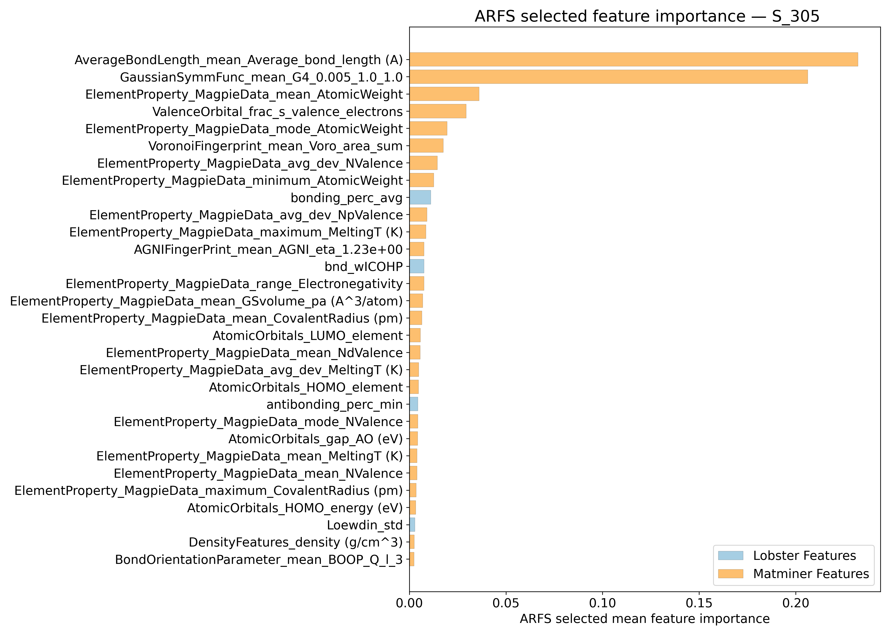
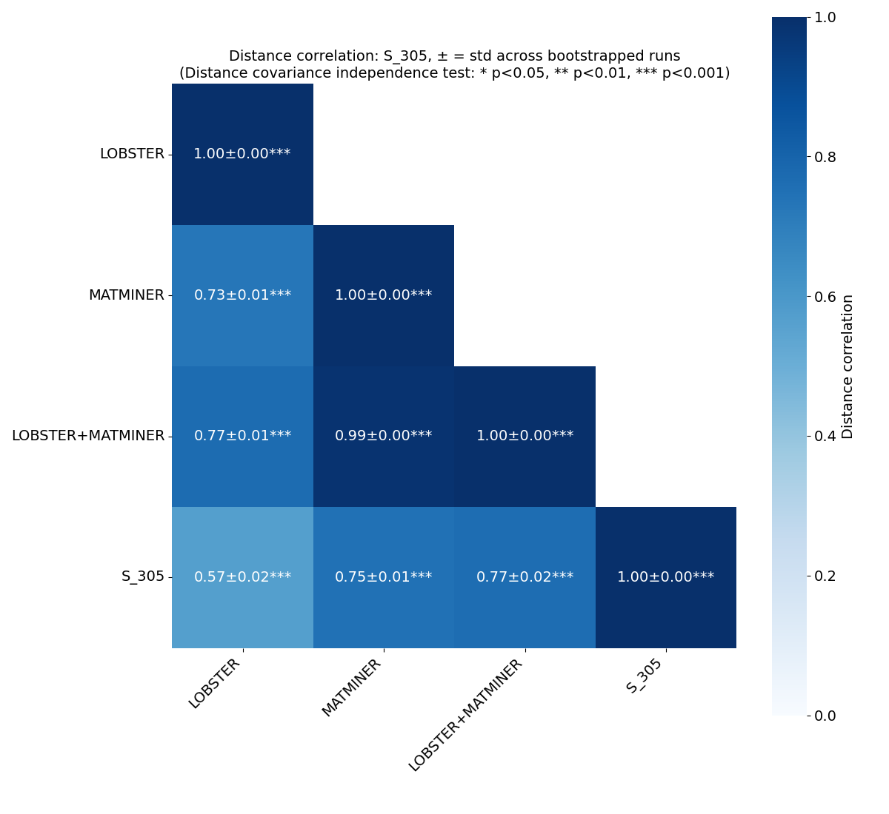
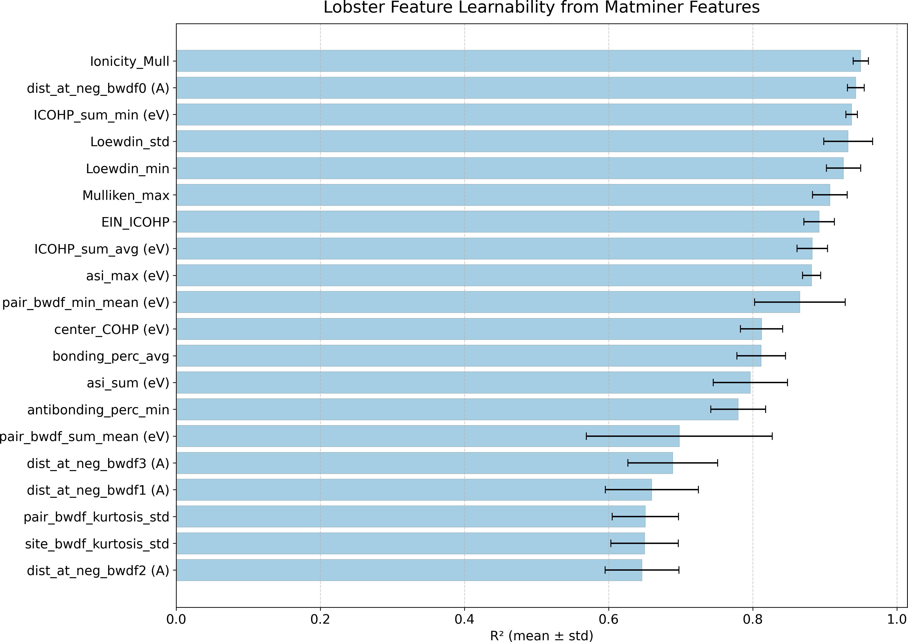
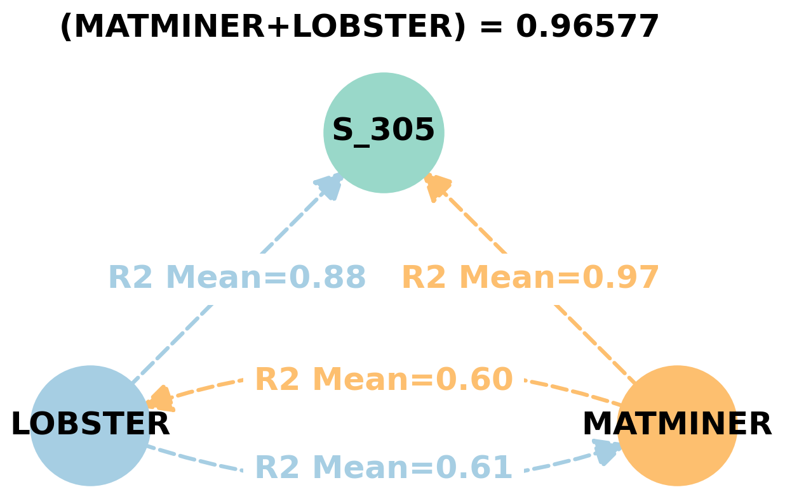
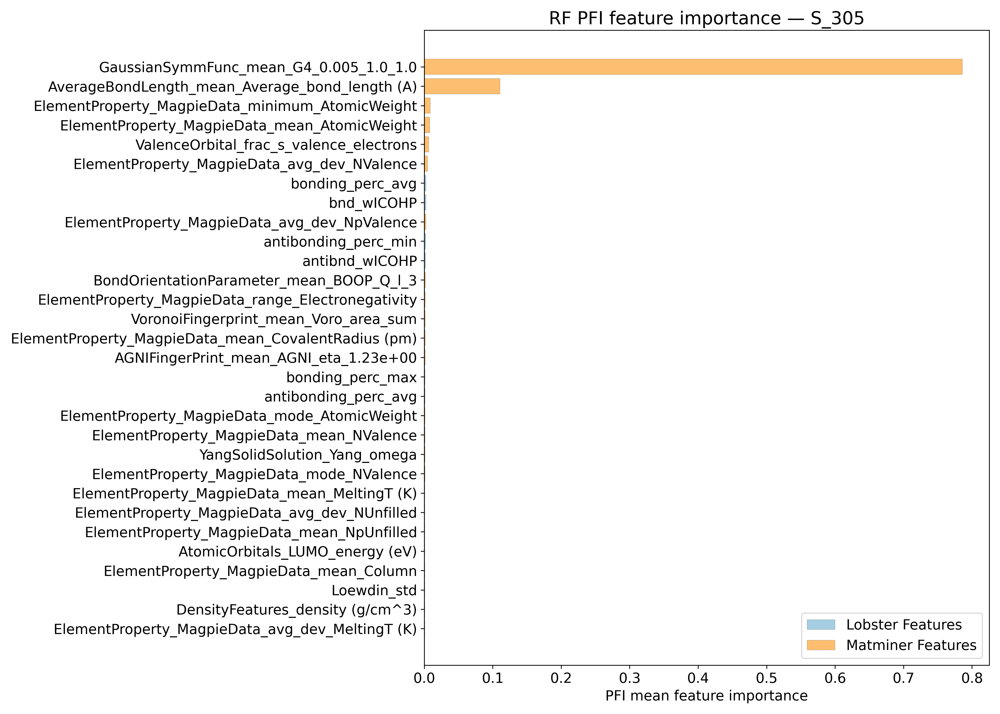
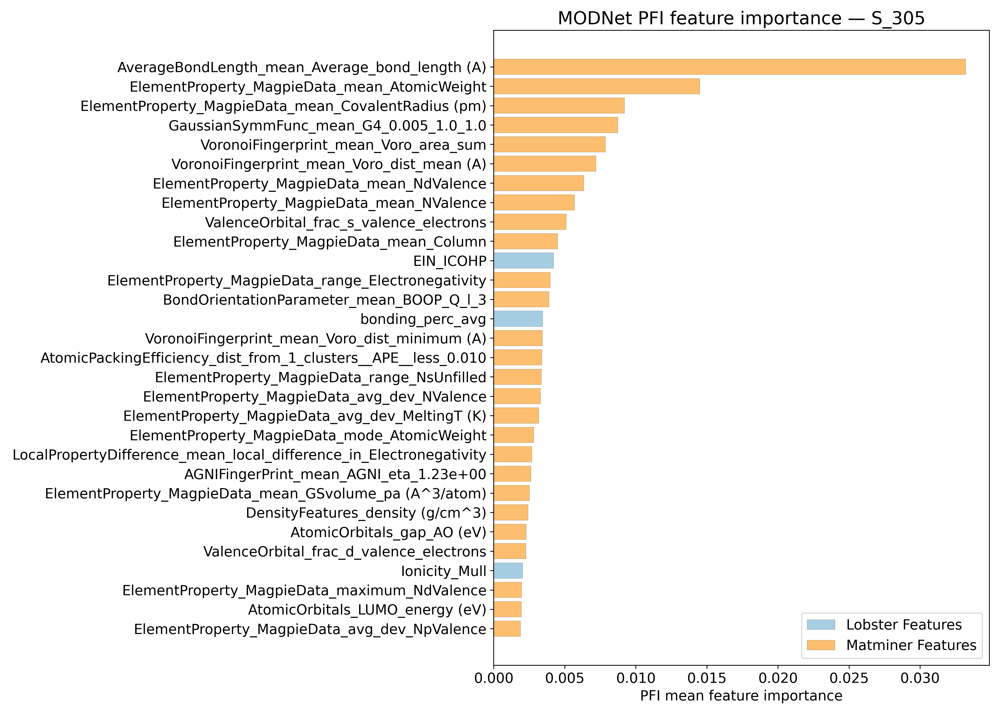
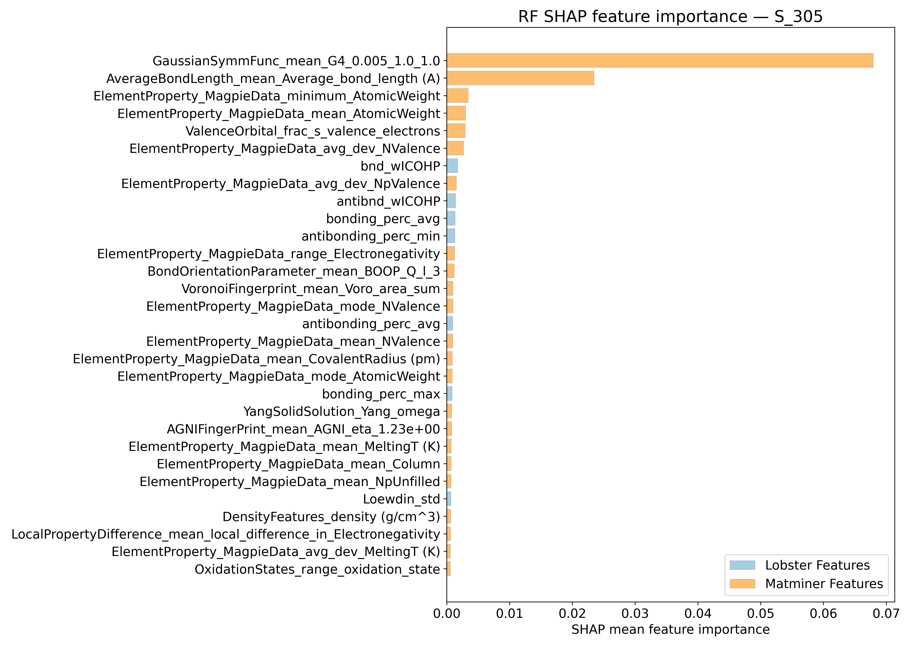
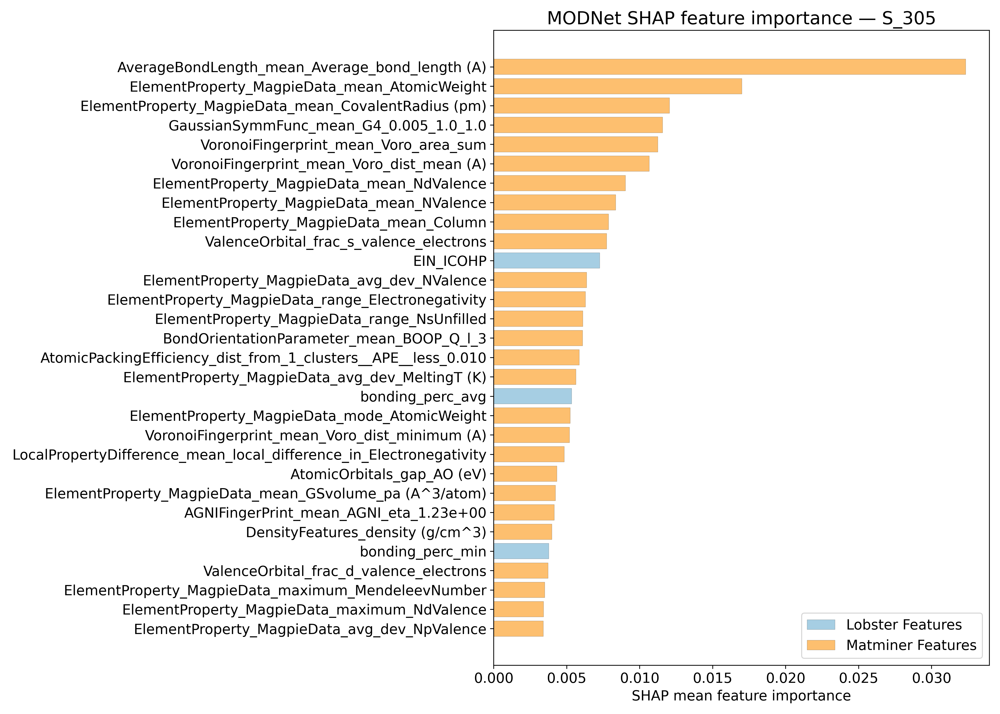
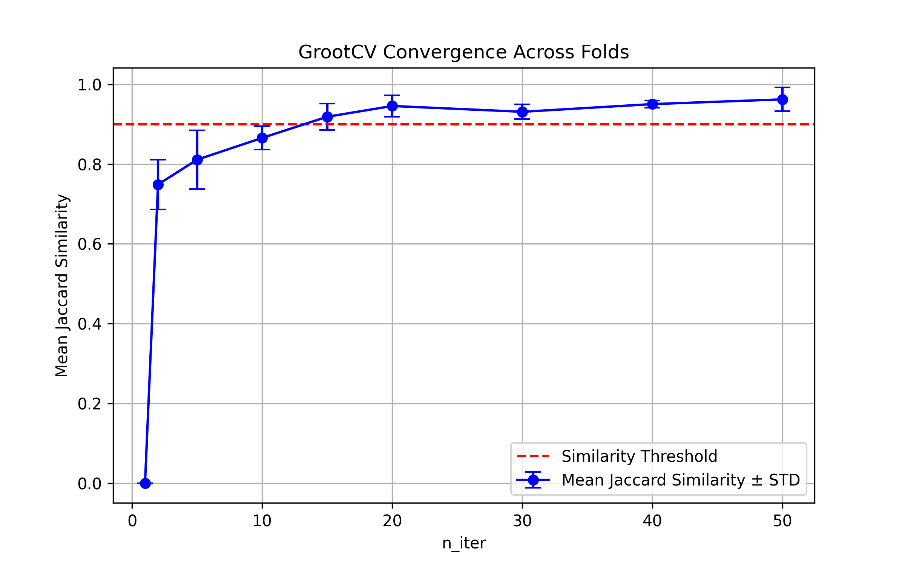

# Vibrational entropy @ 305K - S_305

## ARFS Top features

### ARFS selected descriptors

---

## Correlation analysis

### Distance correlation

### Dependency graphs

### Feature learnability

---

## Model performance

### Metrics overview

RF - MATMINER

|      |   train_rmse |   test_rmse |   train_errors |   test_errors |    train_r2 |    test_r2 |
|:-----|-------------:|------------:|---------------:|--------------:|------------:|-----------:|
| mean |      0.00826 |   0.02256   |    0.0062      |   0.01688     | 0.99536     | 0.96506    |
| min  |      0.0082  |   0.0199    |    0.0061      |   0.015       | 0.9951      | 0.9582     |
| max  |      0.0084  |   0.024     |    0.0063      |   0.0178      | 0.9955      | 0.9726     |
| std  |      8e-05   |   0.0014094 |    6.32456e-05 |   0.000970361 | 0.000135647 | 0.00474367 |

RF - MATMINER+LOBSTER

|      |   train_rmse |   test_rmse |   train_errors |   test_errors |    train_r2 |   test_r2 |
|:-----|-------------:|------------:|---------------:|--------------:|------------:|----------:|
| mean |  0.0083      |  0.0226     |     0.00624    |    0.01694    | 0.99528     |  0.96496  |
| min  |  0.0082      |  0.0196     |     0.0061     |    0.0149     | 0.9949      |  0.9601   |
| max  |  0.0085      |  0.0236     |     0.0064     |    0.0178     | 0.9954      |  0.9735   |
| std  |  0.000109545 |  0.00151129 |     0.00010198 |    0.00111283 | 0.000193907 |  0.004794 |

MODNet - MATMINER

|      |   train_rmse |   test_rmse |   train_errors |   test_errors |   train_r2 |    test_r2 |
|:-----|-------------:|------------:|---------------:|--------------:|-----------:|-----------:|
| mean |   0.00982    | 0.01442     |    0.00724     |   0.0106      | 0.99336    | 0.98568    |
| min  |   0.0086     | 0.0132      |    0.0064      |   0.0096      | 0.9898     | 0.9837     |
| max  |   0.0123     | 0.0153      |    0.0089      |   0.0116      | 0.9948     | 0.9894     |
| std  |   0.00129213 | 0.000870402 |    0.000873155 |   0.000695701 | 0.00182494 | 0.00210466 |

MODNet - MATMINER+LOBSTER

|      |   train_rmse |   test_rmse |   train_errors |   test_errors |   train_r2 |    test_r2 |
|:-----|-------------:|------------:|---------------:|--------------:|-----------:|-----------:|
| mean |   0.0088     | 0.01394     |    0.00646     |   0.01        |  0.99468   | 0.98668    |
| min  |   0.0074     | 0.0131      |    0.0055      |   0.0094      |  0.9932    | 0.9846     |
| max  |   0.01       | 0.015       |    0.0073      |   0.0113      |  0.9963    | 0.9896     |
| std  |   0.00083666 | 0.000739189 |    0.000574804 |   0.000684105 |  0.0010008 | 0.00186054 |

---

## Model Explainer

### PFI

### SHAP

---

## Misc

### ARFS n-iter convergence checks

