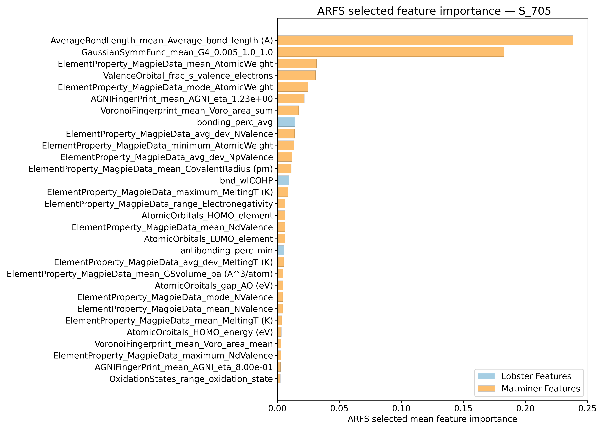
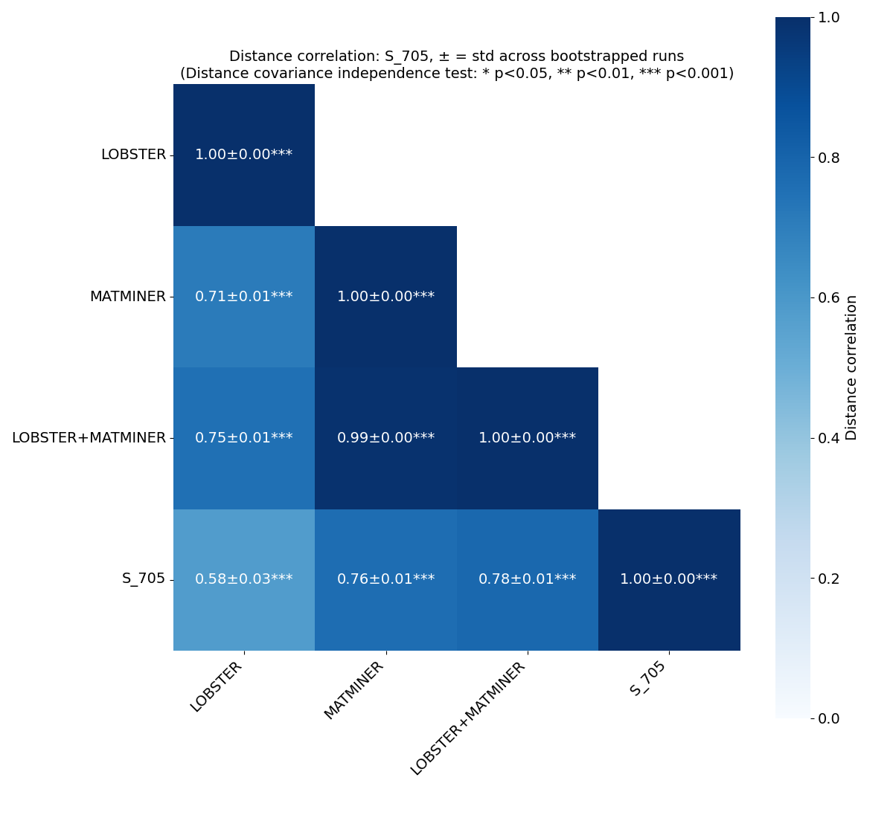
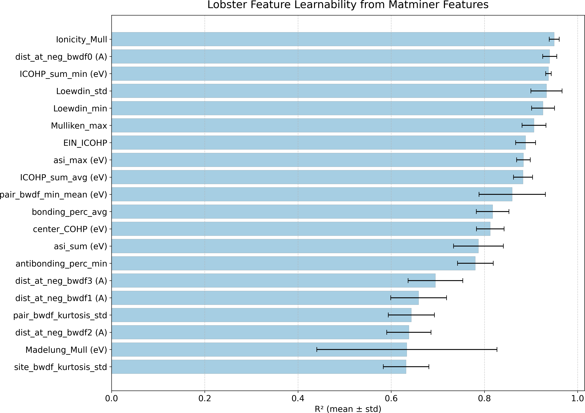
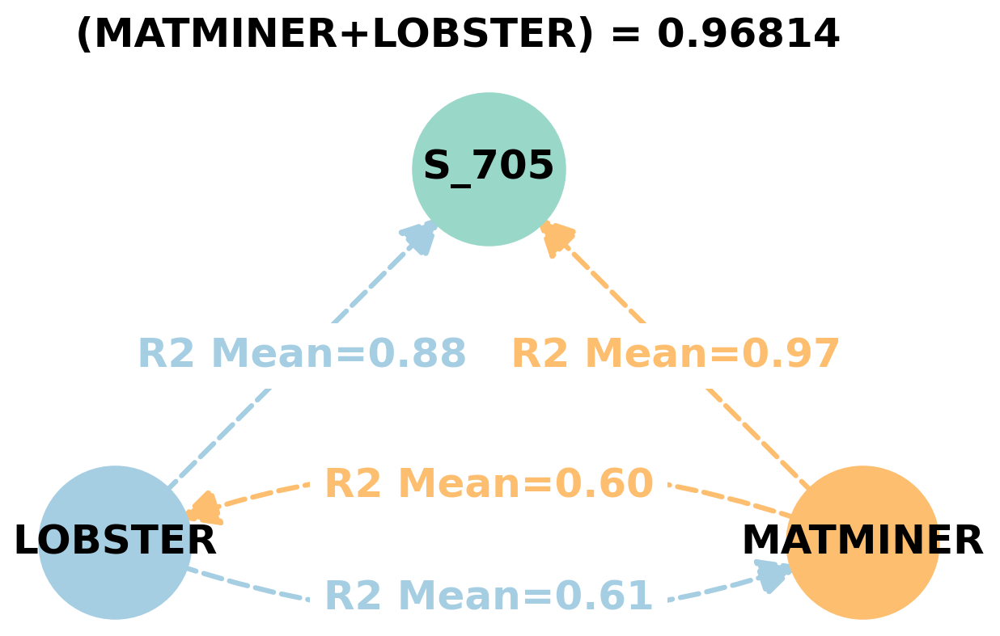
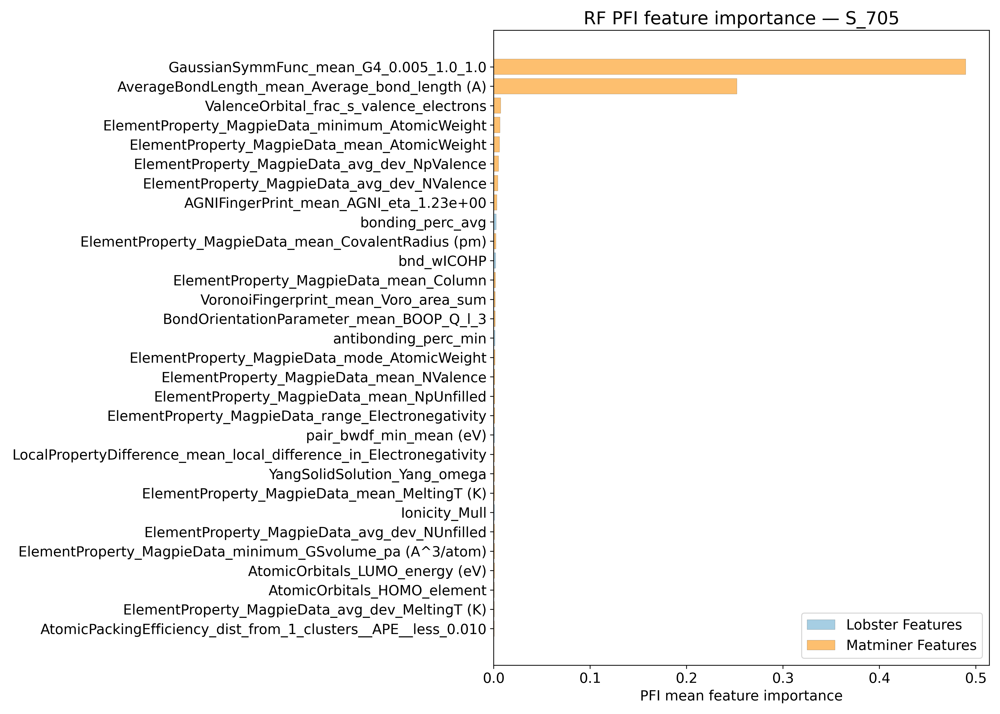
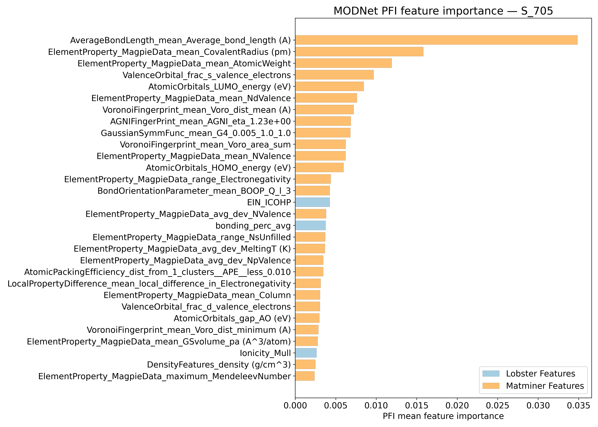
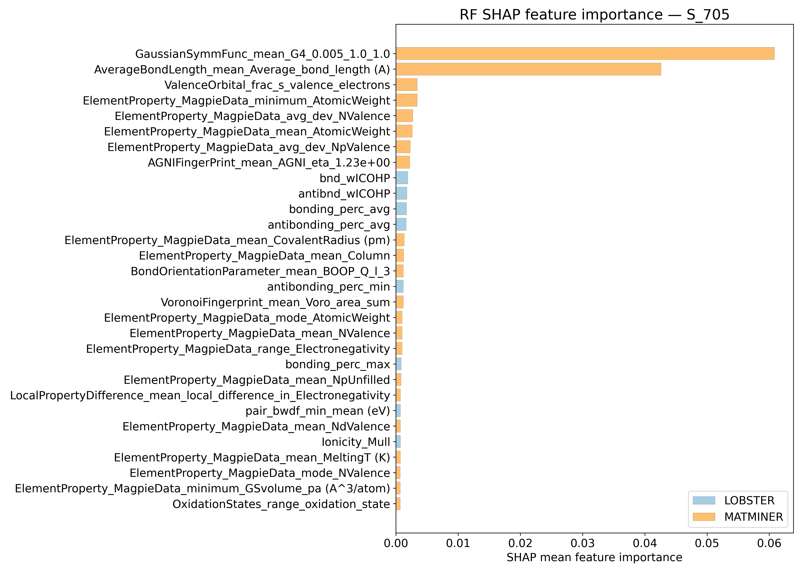
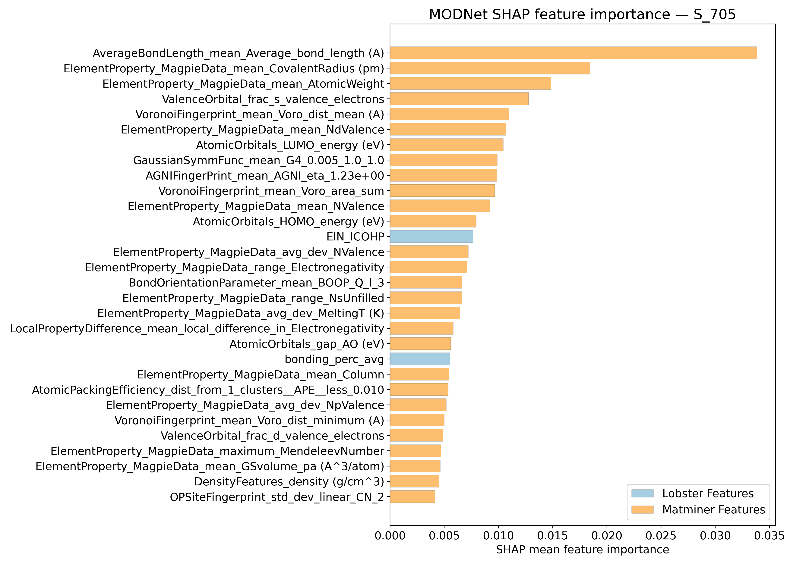
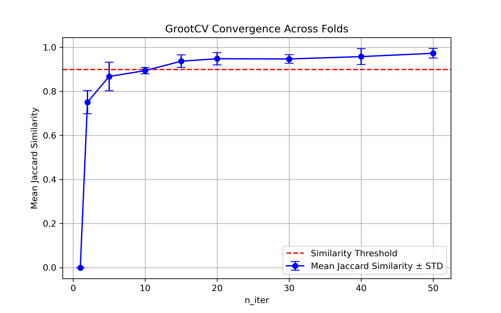

# Vibrational entropy @ 705K - S_705

## ARFS Top features

### ARFS selected descriptors

---

## Correlation analysis

### Distance correlation

### Dependency graphs

### Feature learnability

---

## Model performance

### Metrics overview

RF - MATMINER

|      |   train_rmse |   test_rmse |   train_errors |   test_errors |   train_r2 |    test_r2 |
|:-----|-------------:|------------:|---------------:|--------------:|-----------:|-----------:|
| mean |  0.00888     |  0.0241     |        0.00664 |    0.018      | 0.99564    | 0.96764    |
| min  |  0.0087      |  0.021      |        0.0065  |    0.016      | 0.9955     | 0.9618     |
| max  |  0.009       |  0.0257     |        0.0067  |    0.0192     | 0.9958     | 0.975      |
| std  |  9.79796e-05 |  0.00175499 |        8e-05   |    0.00117132 | 0.00010198 | 0.00425845 |

RF - MATMINER+LOBSTER

|      |   train_rmse |   test_rmse |   train_errors |   test_errors |    train_r2 |    test_r2 |
|:-----|-------------:|------------:|---------------:|--------------:|------------:|-----------:|
| mean |  0.0089      |   0.02434   |    0.00668     |    0.01822    | 0.99562     | 0.96706    |
| min  |  0.0087      |   0.0216    |    0.0065      |    0.0165     | 0.9954      | 0.9629     |
| max  |  0.009       |   0.0256    |    0.0068      |    0.0195     | 0.9958      | 0.9736     |
| std  |  0.000109545 |   0.0014472 |    9.79796e-05 |    0.00103034 | 0.000132665 | 0.00368109 |

MODNet - MATMINER

|      |   train_rmse |   test_rmse |   train_errors |   test_errors |   train_r2 |    test_r2 |
|:-----|-------------:|------------:|---------------:|--------------:|-----------:|-----------:|
| mean |   0.01038    |  0.01486    |     0.00762    |   0.01106     | 0.99396    | 0.98758    |
| min  |   0.0087     |  0.0126     |     0.0065     |   0.0096      | 0.9922     | 0.9854     |
| max  |   0.012      |  0.0163     |     0.0084     |   0.0122      | 0.9959     | 0.9909     |
| std  |   0.00116516 |  0.00125634 |     0.00069685 |   0.000852291 | 0.00131848 | 0.00211981 |

MODNet - MATMINER+LOBSTER

|      |   train_rmse |   test_rmse |   train_errors |   test_errors |   train_r2 |    test_r2 |
|:-----|-------------:|------------:|---------------:|--------------:|-----------:|-----------:|
| mean |   0.01072    |  0.01536    |     0.00788    |    0.01136    | 0.99356    | 0.98682    |
| min  |   0.0086     |  0.013      |     0.0063     |    0.0097     | 0.9918     | 0.9837     |
| max  |   0.012      |  0.017      |     0.009      |    0.0125     | 0.996      | 0.9904     |
| std  |   0.00125124 |  0.00154091 |     0.00096623 |    0.00113066 | 0.00149746 | 0.00251984 |

---

## Model Explainer

### PFI

### SHAP

---

## Misc

### ARFS n-iter convergence checks

