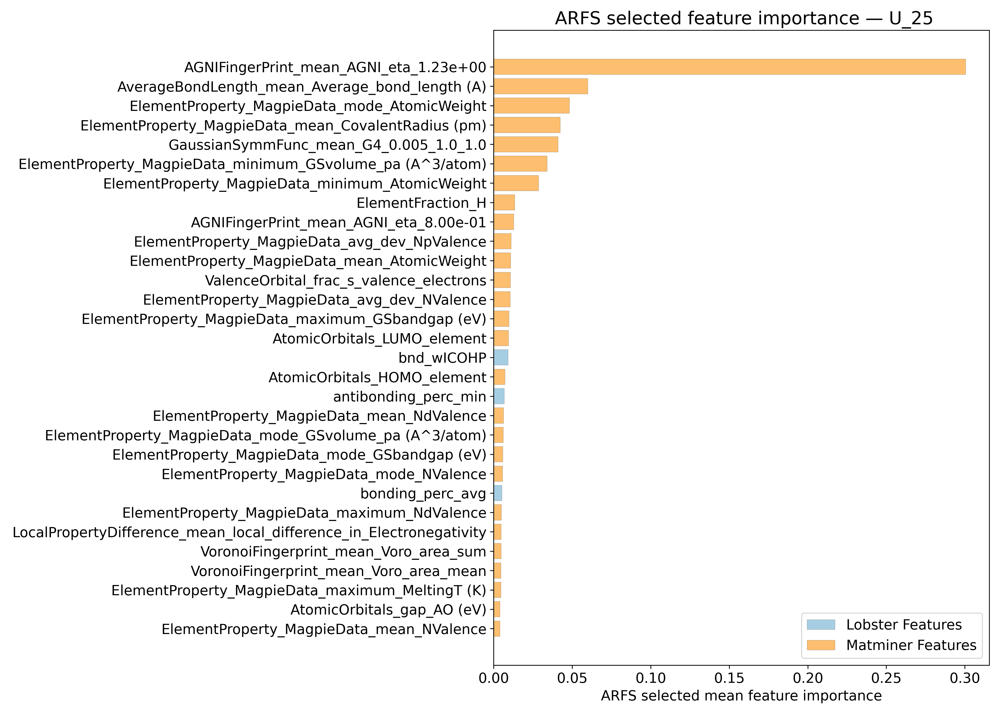
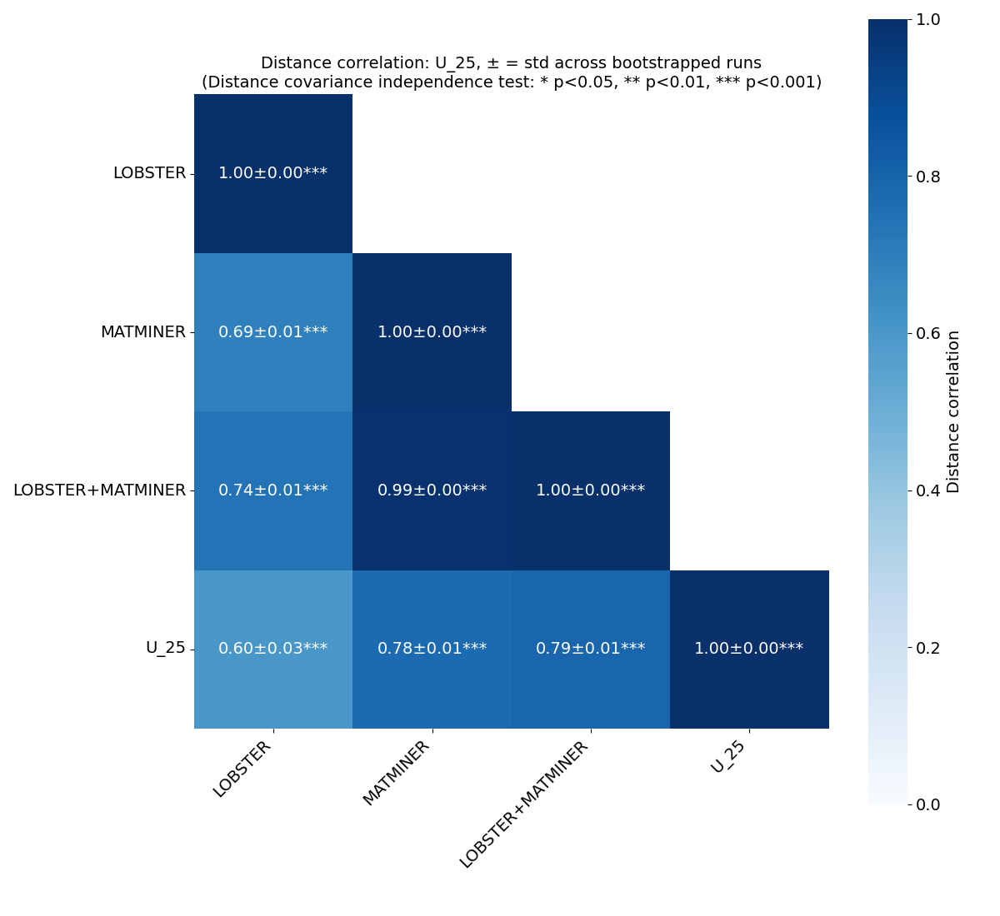
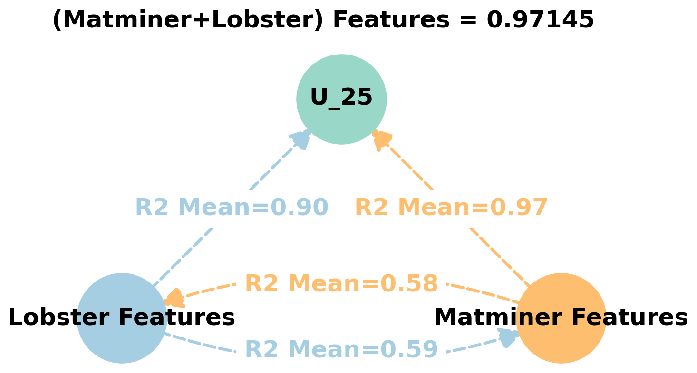
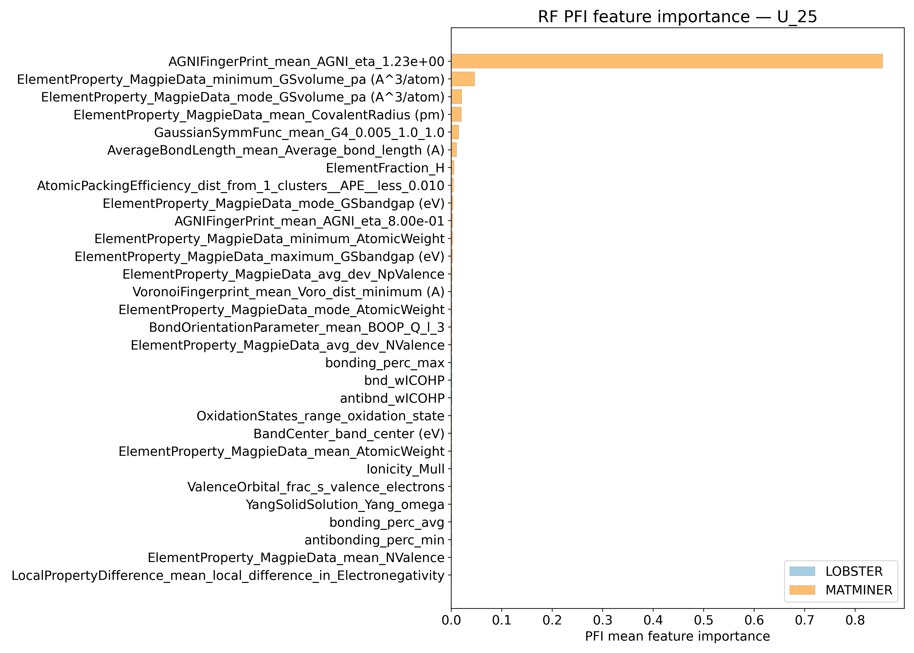
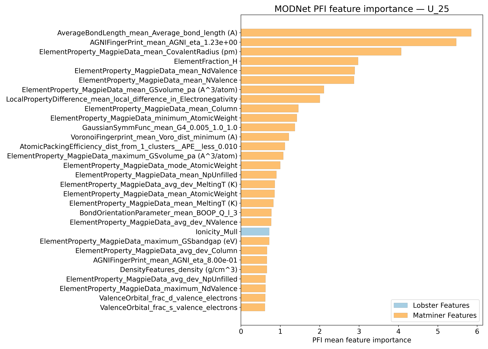
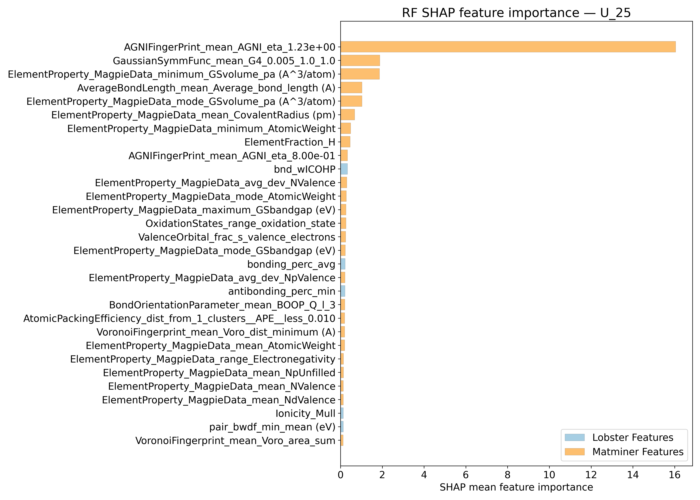
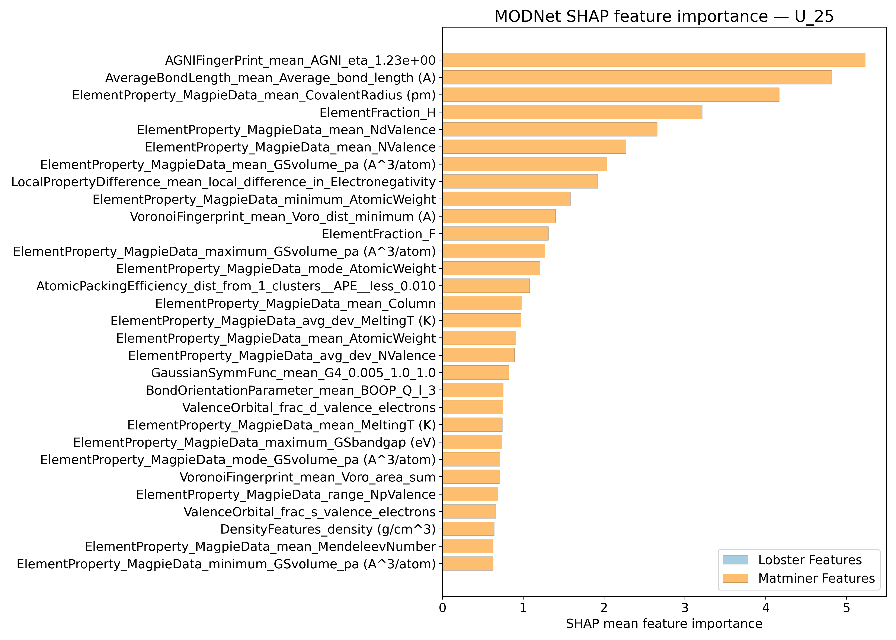
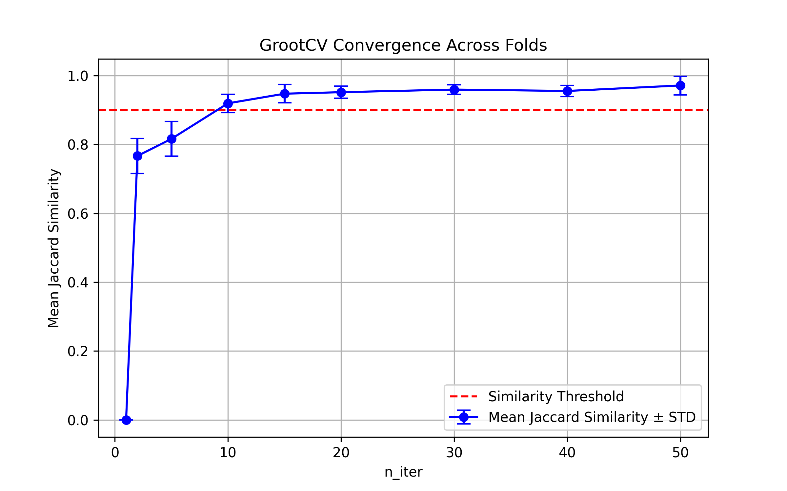

# Internal energy @ 25K - U_25

## ARFS Top features

### ARFS selected descriptors

---

## Correlation analysis

### Distance correlation

### Dependency graphs

### Feature learnability

---

## Model performance

### Metrics overview

RF - MATMINER

|      |   train_rmse |   test_rmse |   train_errors |   test_errors |    train_r2 |    test_r2 |
|:-----|-------------:|------------:|---------------:|--------------:|------------:|-----------:|
| mean |    1.7529    |     4.71544 |      1.0413    |      2.85568  | 0.99594     | 0.97026    |
| min  |    1.6015    |     3.964   |      1.011     |      2.5341   | 0.9955      | 0.9525     |
| max  |    1.8377    |     6.6593  |      1.0589    |      3.4639   | 0.9967      | 0.9789     |
| std  |    0.0871106 |     1.01579 |      0.0187927 |      0.327725 | 0.000407922 | 0.00969672 |

RF - MATMINER+LOBSTER

|      |   train_rmse |   test_rmse |   train_errors |   test_errors |    train_r2 |    test_r2 |
|:-----|-------------:|------------:|---------------:|--------------:|------------:|-----------:|
| mean |    1.76498   |    4.72508  |      1.05394   |      2.86394  | 0.9959      | 0.97014    |
| min  |    1.6896    |    3.9954   |      1.0364    |      2.5753   | 0.9955      | 0.953      |
| max  |    1.8362    |    6.6243   |      1.0776    |      3.4949   | 0.9963      | 0.9797     |
| std  |    0.0641057 |    0.997781 |      0.0157103 |      0.327456 | 0.000275681 | 0.00953365 |

MODNet - MATMINER

|      |   train_rmse |   test_rmse |   train_errors |   test_errors |    train_r2 |    test_r2 |
|:-----|-------------:|------------:|---------------:|--------------:|------------:|-----------:|
| mean |     1.01602  |    2.79694  |      0.54502   |      1.51732  | 0.9986      | 0.98904    |
| min  |     0.8572   |    1.9223   |      0.464     |      1.2741   | 0.9976      | 0.9789     |
| max  |     1.3158   |    3.86     |      0.6174    |      1.8255   | 0.9991      | 0.9945     |
| std  |     0.164871 |    0.724828 |      0.0513411 |      0.211522 | 0.000536656 | 0.00562587 |

MODNet - MATMINER+LOBSTER

|      |   train_rmse |   test_rmse |   train_errors |   test_errors |   train_r2 |    test_r2 |
|:-----|-------------:|------------:|---------------:|--------------:|-----------:|-----------:|
| mean |     0.96488  |    2.62966  |      0.53252   |      1.49818  | 0.99872    | 0.9904     |
| min  |     0.8315   |    1.8804   |      0.4766    |      1.1969   | 0.998      | 0.9825     |
| max  |     1.1903   |    3.5168   |      0.6186    |      1.7181   | 0.9991     | 0.9949     |
| std  |     0.132107 |    0.615588 |      0.0501971 |      0.193934 | 0.00040694 | 0.00444072 |

---

## Model Explainer

### PFI

### SHAP

---

## Misc

### ARFS n-iter convergence checks

