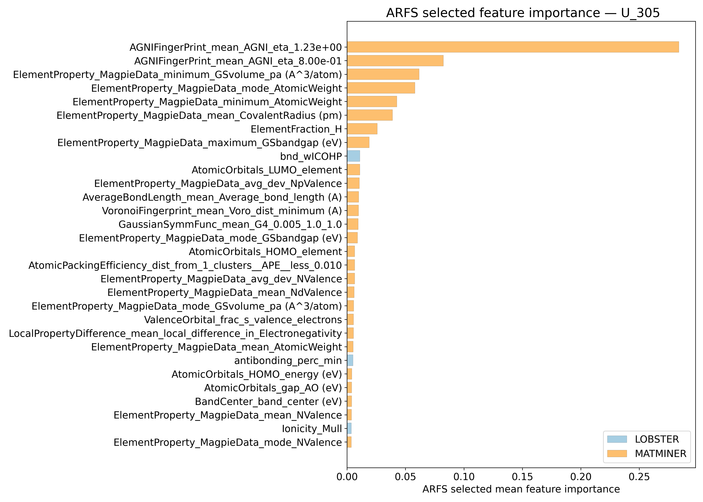
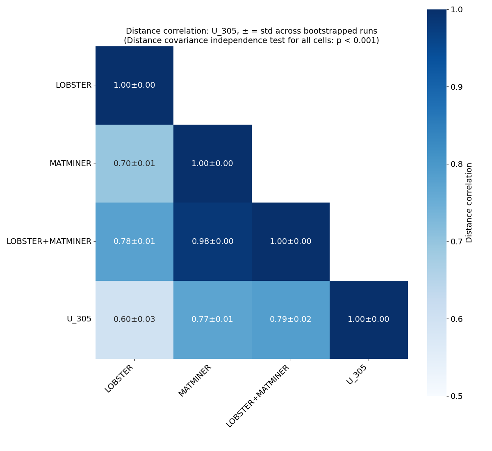
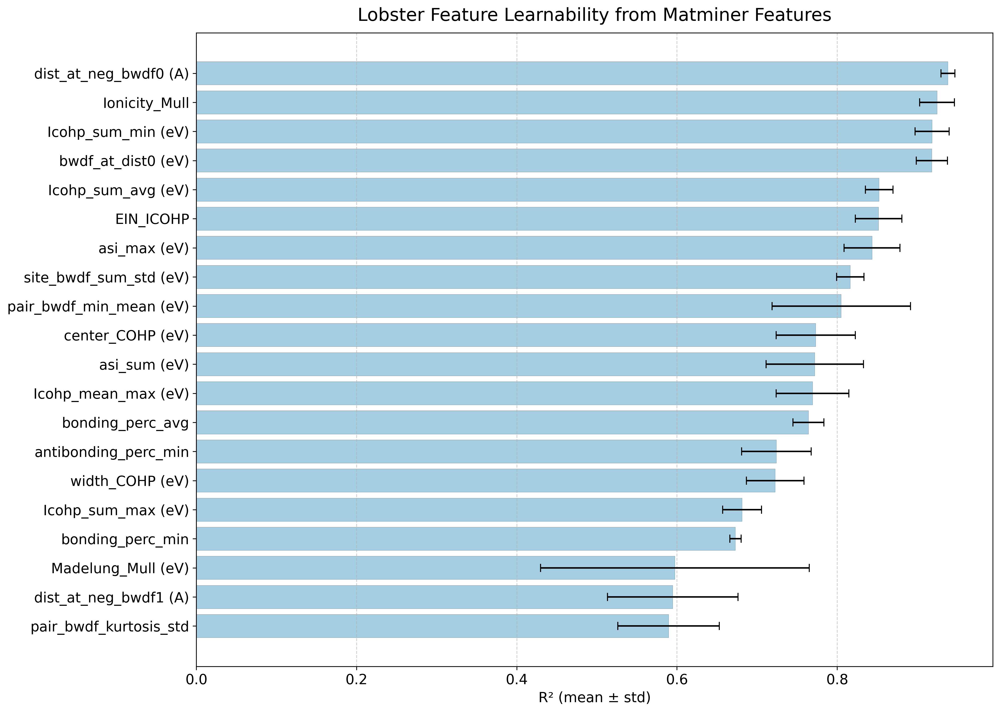
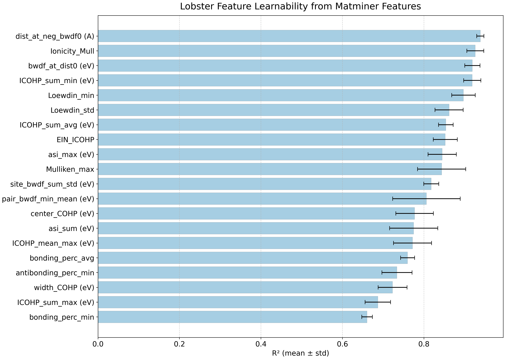
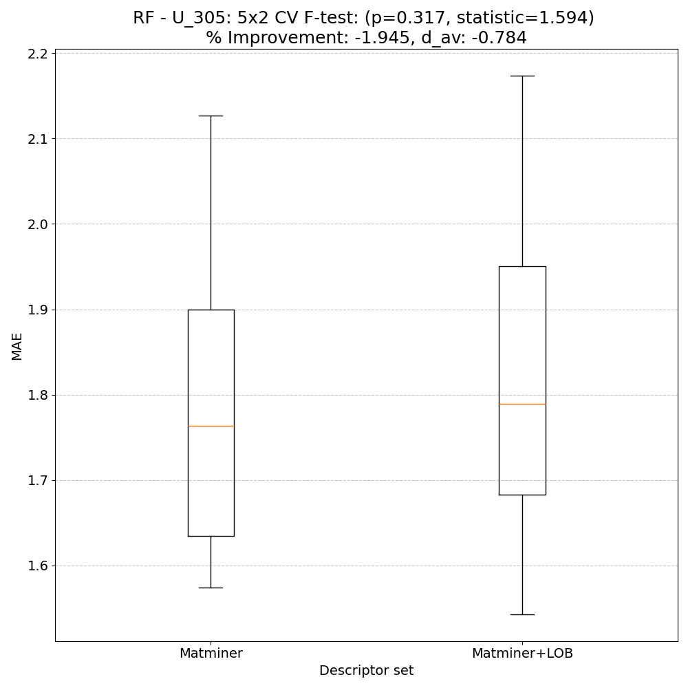
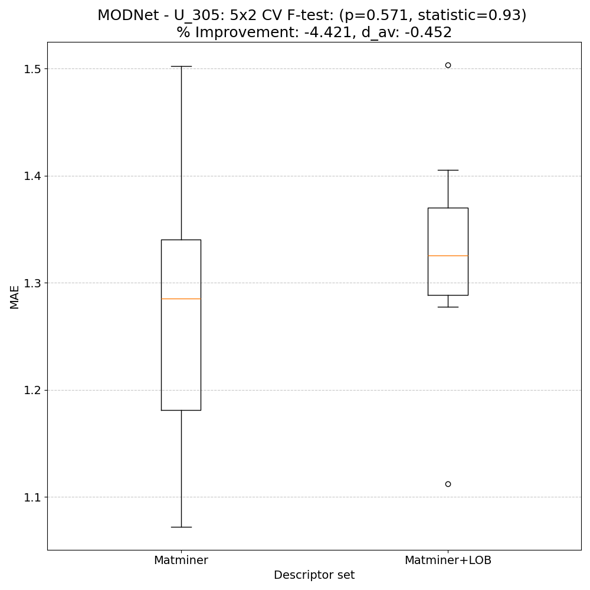
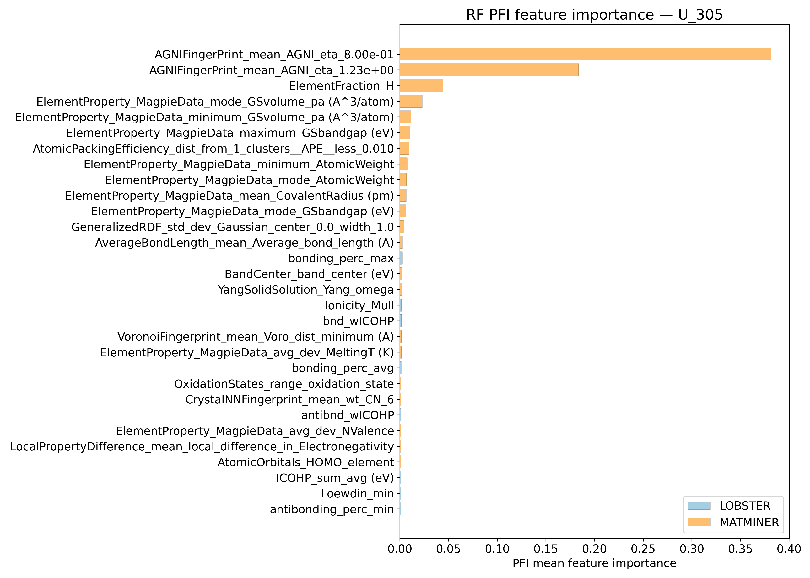
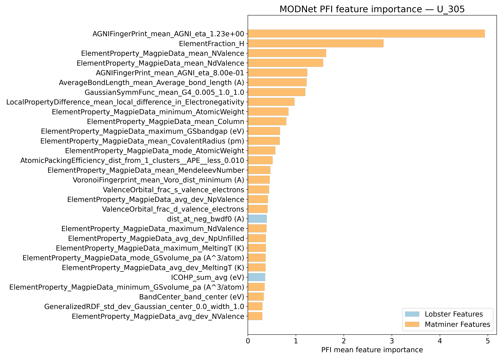
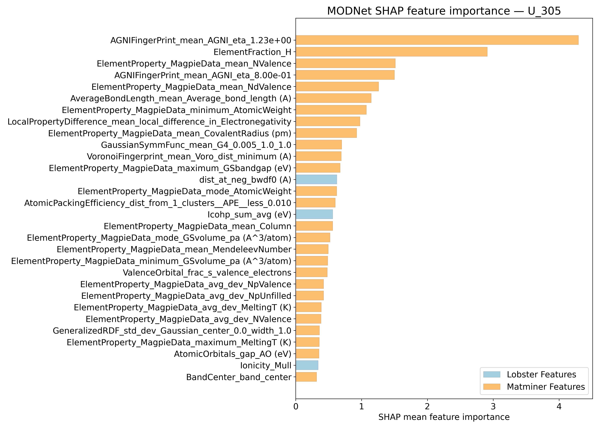
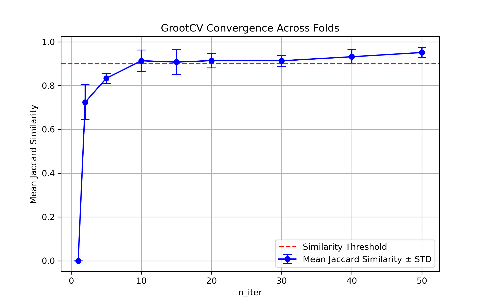

# Internal energy @ 305K - meV/atom - U_305

## ARFS Top features

### ARFS selected descriptors

---

## Correlation analysis

### Distance correlation

### Dependency graphs

### Feature learnability

---

## Model performance

### 5-Fold CV Metrics overview

**RF - MATMINER**

|      |   train_rmse |   test_rmse |   train_errors |   test_errors |    train_r2 |   test_r2 |
|:-----|-------------:|------------:|---------------:|--------------:|------------:|----------:|
| mean |    1.10228   |     3.10112 |      0.51416   |      1.45818  | 0.99592     | 0.96416   |
| min  |    0.9512    |     1.9772  |      0.4871    |      1.1411   | 0.9949      | 0.9168    |
| max  |    1.2009    |     5.5916  |      0.5279    |      2.2123   | 0.9971      | 0.9851    |
| std  |    0.0849173 |     1.38679 |      0.0148938 |      0.393203 | 0.000724983 | 0.0271721 |

**RF - MATMINER+LOBSTER**

|      |   train_rmse |   test_rmse |   train_errors |   test_errors |    train_r2 |   test_r2 |
|:-----|-------------:|------------:|---------------:|--------------:|------------:|----------:|
| mean |     1.11838  |     3.1261  |       0.51884  |      1.48044  | 0.99576     | 0.96384   |
| min  |     0.9565   |     2.0199  |       0.4843   |      1.1447   | 0.9945      | 0.9145    |
| max  |     1.2393   |     5.6675  |       0.5413   |      2.2484   | 0.997       | 0.9845    |
| std  |     0.101061 |     1.38621 |       0.019599 |      0.397882 | 0.000854634 | 0.0273843 |

**MODNet - MATMINER**

|      |   train_rmse |   test_rmse |   train_errors |   test_errors |   train_r2 |    test_r2 |
|:-----|-------------:|------------:|---------------:|--------------:|-----------:|-----------:|
| mean |     0.86996  |    2.02938  |      0.41634   |     0.88794   | 0.9974     | 0.98504    |
| min  |     0.7513   |    1.2503   |      0.3573    |     0.7657    | 0.9952     | 0.9707     |
| max  |     1.2165   |    2.7979   |      0.5904    |     1.0359    | 0.9982     | 0.9941     |
| std  |     0.176142 |    0.506548 |      0.0876599 |     0.0988839 | 0.00112606 | 0.00793161 |

**MODNet - MATMINER+LOBSTER**

|      |   train_rmse |   test_rmse |   train_errors |   test_errors |    train_r2 |    test_r2 |
|:-----|-------------:|------------:|---------------:|--------------:|------------:|-----------:|
| mean |    0.81928   |    2.05816  |      0.3918    |      0.89606  | 0.99776     | 0.9846     |
| min  |    0.7639    |    1.1016   |      0.3635    |      0.6256   | 0.9971      | 0.9728     |
| max  |    0.9272    |    2.6942   |      0.4369    |      1.1159   | 0.9981      | 0.9954     |
| std  |    0.0599704 |    0.553348 |      0.0265036 |      0.178661 | 0.000355528 | 0.00767151 |

### Paired 5x2 CV F-test

**RF F-tests metrics comparsion**

**MODNet F-tests metrics comparsion**

**Summary**
|        |   F-statistic |   p-value |      d_av |   % Relative MAE improvement | Improved folds   |
|:-------|--------------:|----------:|----------:|-----------------------------:|:-----------------|
| RF     |      1.59416  |  0.316526 | -0.78446  |                     -1.94539 | 2/10             |
| MODNet |      0.929529 |  0.571035 | -0.452351 |                     -4.42069 | 3/10             |

---

## Model Explainer

### PFI

### SHAP

---

## Misc

### ARFS n-iter convergence checks

