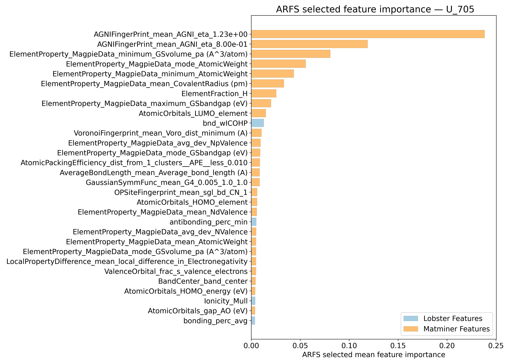
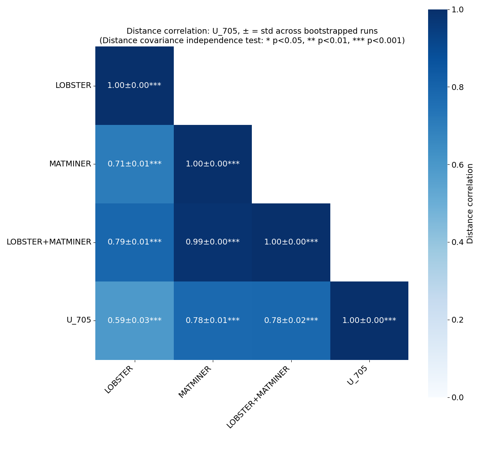
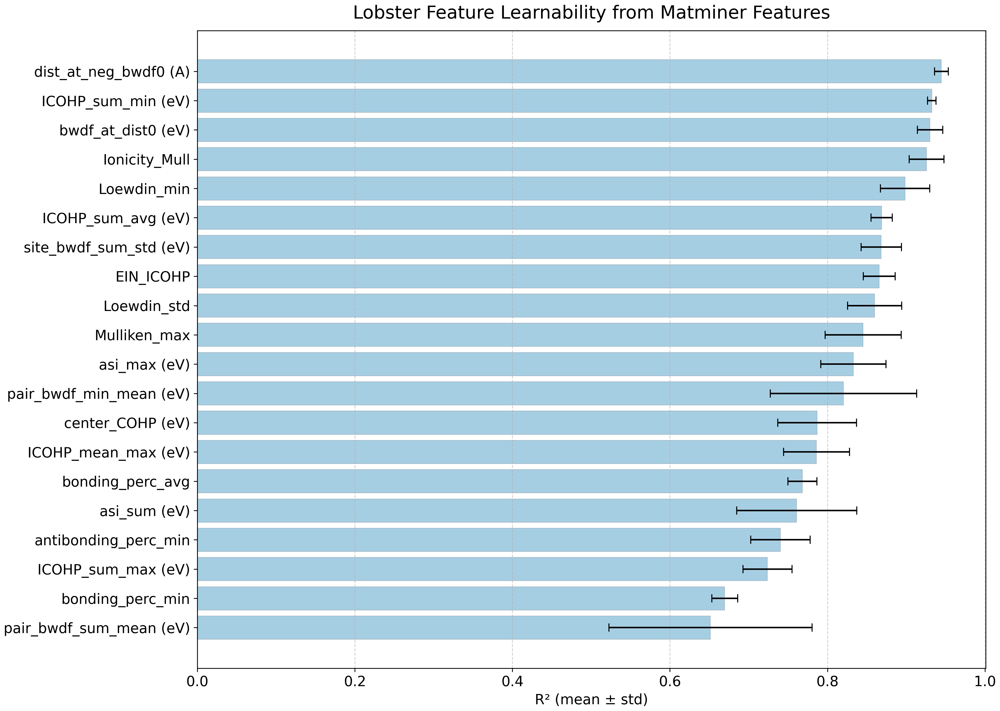
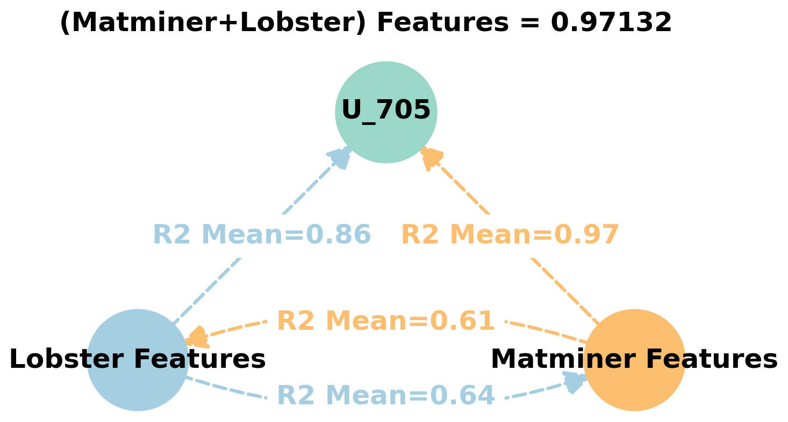
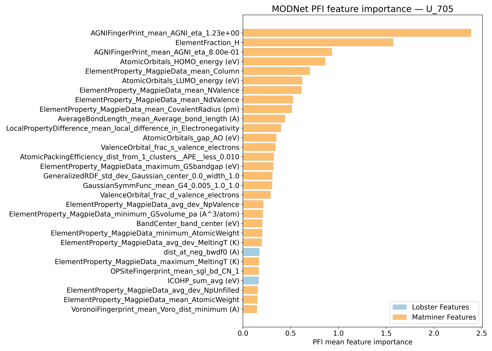
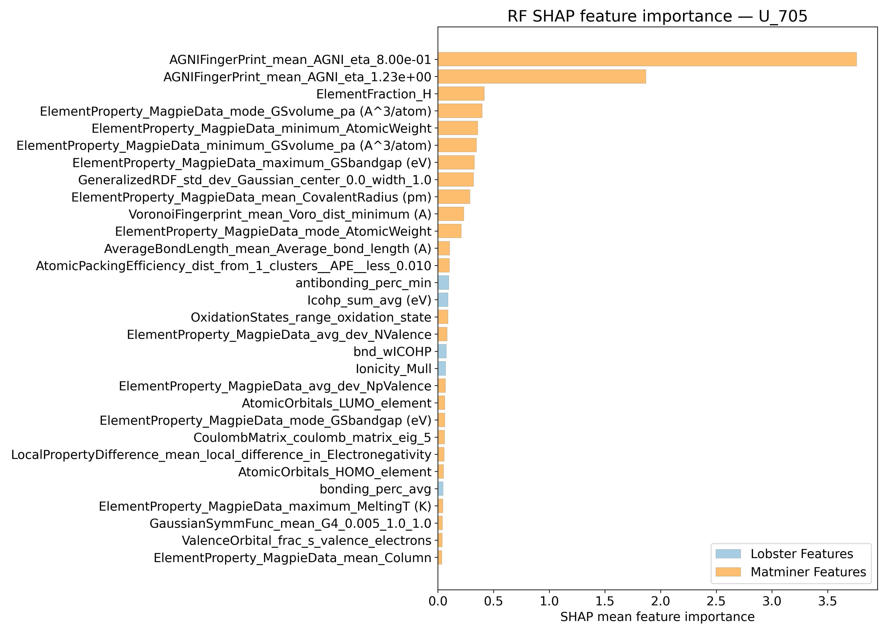
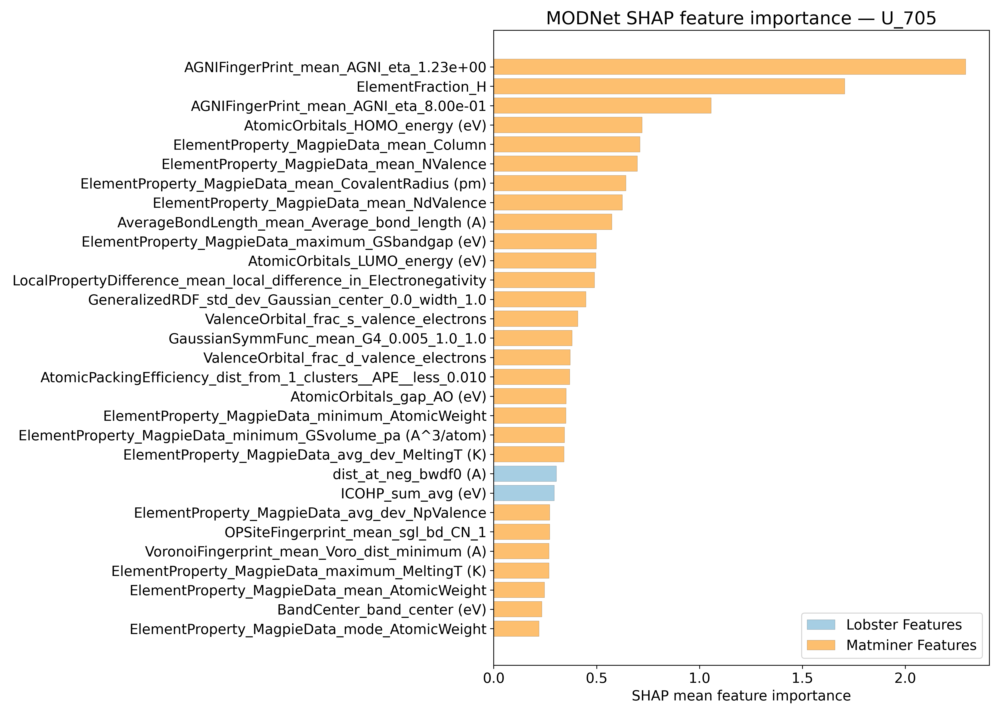

# Internal energy @ 705K - U_705

## ARFS Top features

### ARFS selected descriptors

---

## Correlation analysis

### Distance correlation

### Dependency graphs

### Feature learnability

---

## Model performance

### Metrics overview

RF - MATMINER

|      |   train_rmse |   test_rmse |   train_errors |   test_errors |    train_r2 |   test_r2 |
|:-----|-------------:|------------:|---------------:|--------------:|------------:|----------:|
| mean |    0.66134   |    1.77564  |     0.27874    |       0.7743  | 0.99594     | 0.96916   |
| min  |    0.5902    |    1.2164   |     0.2668     |       0.5944  | 0.995       | 0.9361    |
| max  |    0.7095    |    2.967    |     0.2903     |       1.1556  | 0.9969      | 0.9852    |
| std  |    0.0415249 |    0.636193 |     0.00890407 |       0.20593 | 0.000640625 | 0.0182291 |

RF - MATMINER+LOBSTER

|      |   train_rmse |   test_rmse |   train_errors |   test_errors |   train_r2 |   test_r2 |
|:-----|-------------:|------------:|---------------:|--------------:|-----------:|----------:|
| mean |    0.68492   |    1.72338  |     0.2831     |      0.76868  | 0.99562    | 0.9705    |
| min  |    0.601     |    1.1597   |     0.273      |      0.6137   | 0.9946     | 0.9347    |
| max  |    0.7671    |    2.9994   |     0.2958     |      1.1559   | 0.9968     | 0.9862    |
| std  |    0.0582301 |    0.672994 |     0.00779333 |      0.202766 | 0.00084947 | 0.0194217 |

MODNet - MATMINER

|      |   train_rmse |   test_rmse |   train_errors |   test_errors |   train_r2 |   test_r2 |
|:-----|-------------:|------------:|---------------:|--------------:|-----------:|----------:|
| mean |     0.91394  |    1.448    |      0.44542   |      0.63224  | 0.99204    | 0.97838   |
| min  |     0.5985   |    0.9162   |      0.2882    |      0.4418   | 0.9892     | 0.9556    |
| max  |     1.0744   |    1.9875   |      0.529     |      0.7755   | 0.9968     | 0.9921    |
| std  |     0.170175 |    0.373402 |      0.0874145 |      0.121754 | 0.00261885 | 0.0126926 |

MODNet - MATMINER+LOBSTER

|      |   train_rmse |   test_rmse |   train_errors |   test_errors |   train_r2 |   test_r2 |
|:-----|-------------:|------------:|---------------:|--------------:|-----------:|----------:|
| mean |     0.93168  |    1.4944   |      0.44898   |      0.6453   | 0.99178    | 0.97624   |
| min  |     0.658    |    0.6434   |      0.3119    |      0.3753   | 0.9889     | 0.9539    |
| max  |     1.0927   |    2.0257   |      0.5135    |      0.8562   | 0.996      | 0.9961    |
| std  |     0.159306 |    0.479101 |      0.0738411 |      0.163985 | 0.00251984 | 0.0140732 |

---

## Model Explainer

### PFI

### SHAP

---

## Misc

### ARFS n-iter convergence checks

