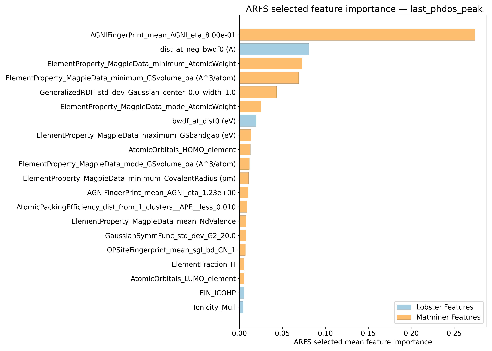
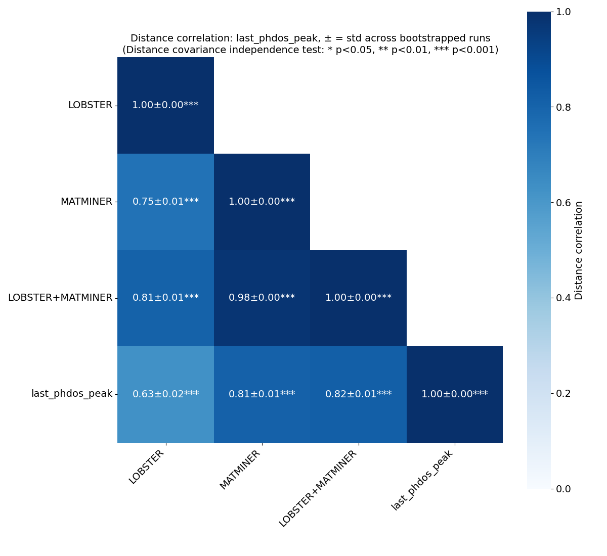
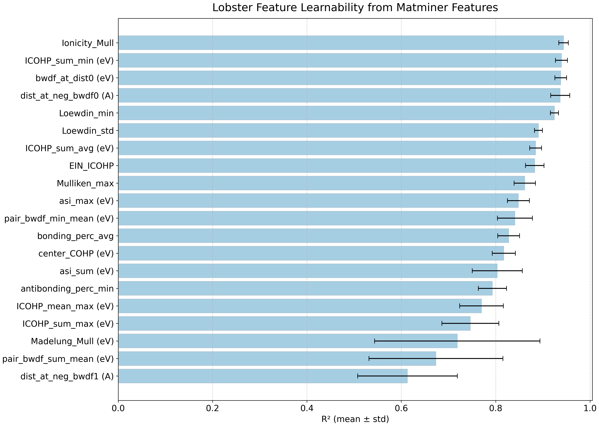
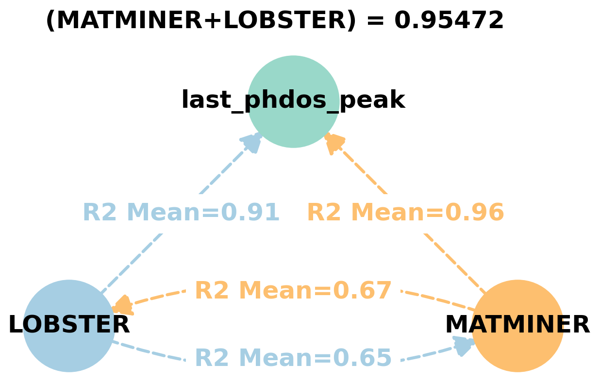
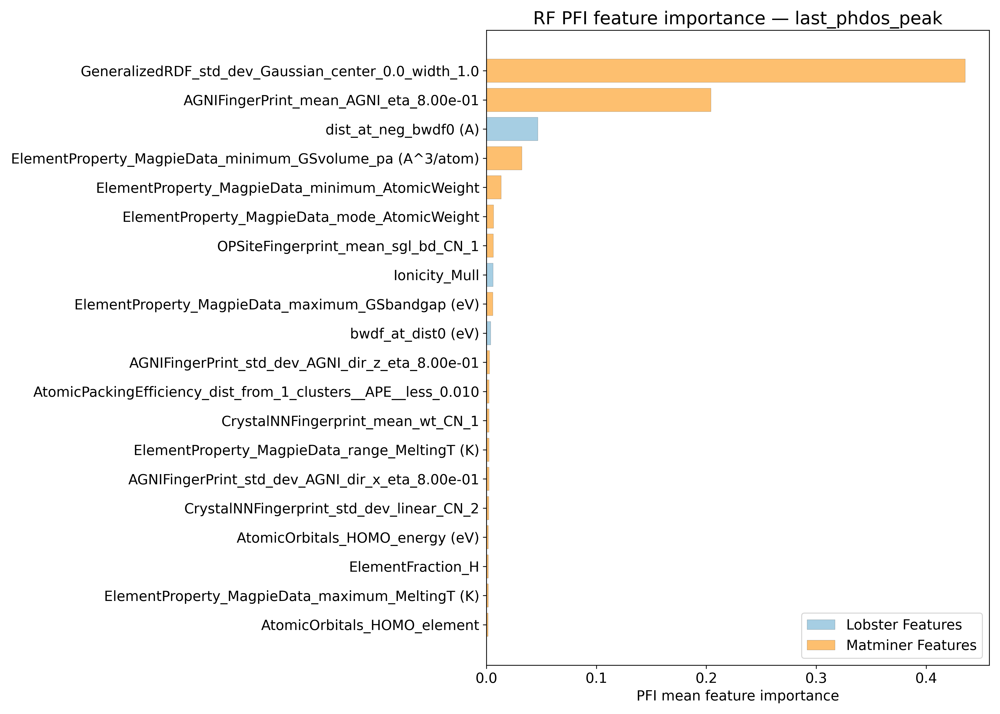
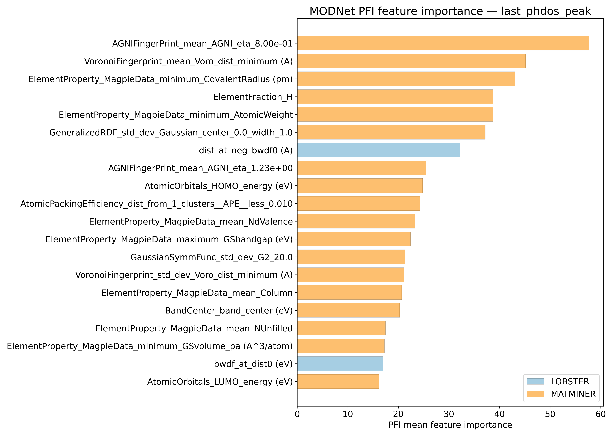
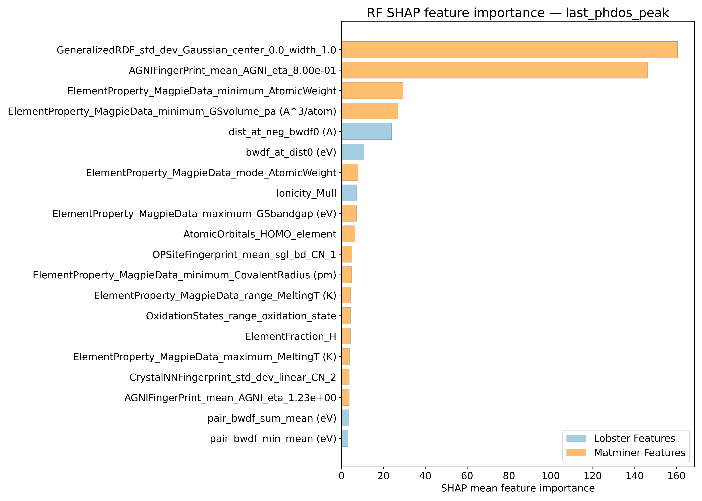
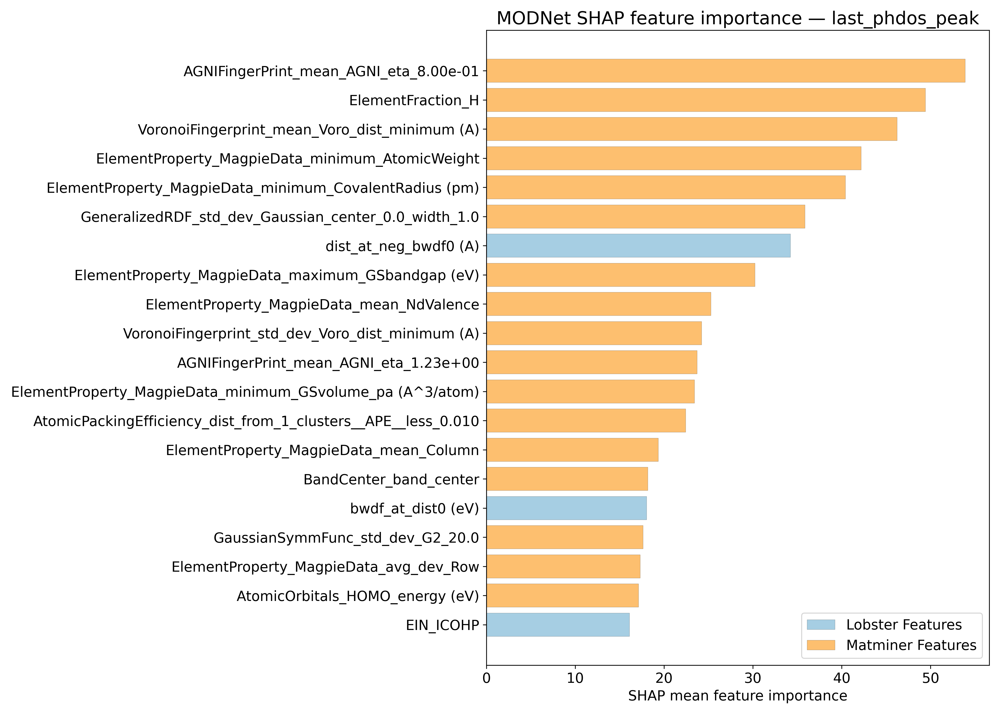
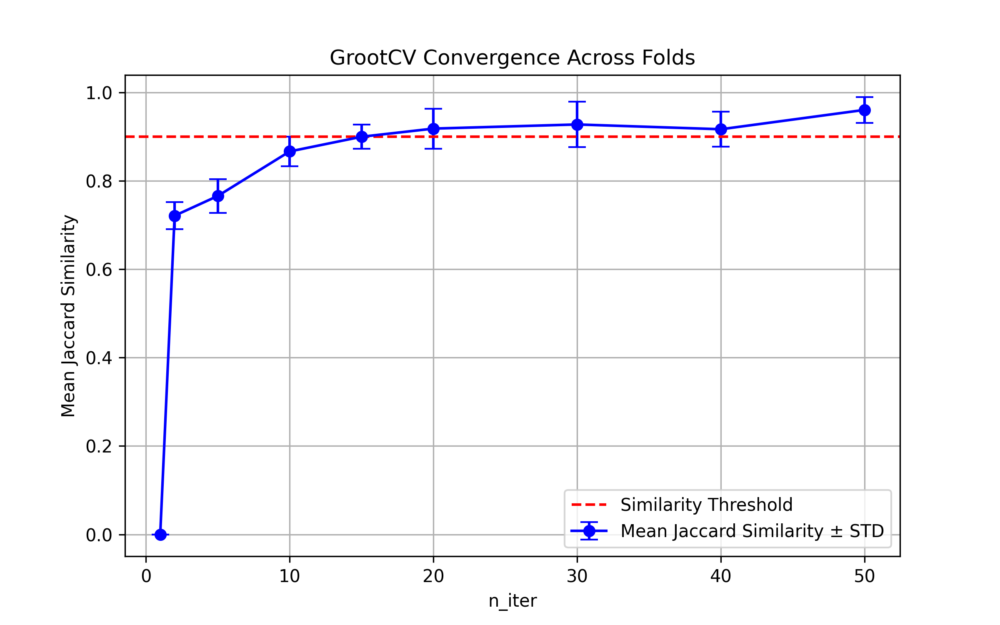

# Last phonon dos peak - last_phdos_peak

## ARFS Top features

### ARFS selected descriptors

---

## Correlation analysis

### Distance correlation

### Dependency graphs

### Feature learnability

---

## Model performance

### Metrics overview

RF - MATMINER

|      |   train_rmse |   test_rmse |   train_errors |   test_errors |   train_r2 |   test_r2 |
|:-----|-------------:|------------:|---------------:|--------------:|-----------:|----------:|
| mean |     32.7937  |     84.3866 |      14.6748   |      39.5086  | 0.9956     | 0.96906   |
| min  |     30.4141  |     55.9272 |      14.2786   |      31.0462  | 0.9951     | 0.954     |
| max  |     34.5876  |    106.683  |      14.9702   |      44.2828  | 0.9961     | 0.9853    |
| std  |      1.47065 |     18.1411 |       0.251989 |       4.91545 | 0.00032249 | 0.0127694 |

RF - MATMINER+LOBSTER

|      |   train_rmse |   test_rmse |   train_errors |   test_errors |   train_r2 |   test_r2 |
|:-----|-------------:|------------:|---------------:|--------------:|-----------:|----------:|
| mean |      32.7851 |     80.6867 |      14.5877   |      39.2469  | 0.99558    | 0.97228   |
| min  |      26.3867 |     62.7826 |      13.6297   |      33.7883  | 0.9947     | 0.9513    |
| max  |      36.0886 |    112.842  |      15.1984   |      44.6627  | 0.9971     | 0.9815    |
| std  |       3.4597 |     16.8804 |       0.520001 |       3.88335 | 0.00082801 | 0.0110778 |

MODNet - MATMINER

|      |   train_rmse |   test_rmse |   train_errors |   test_errors |    train_r2 |   test_r2 |
|:-----|-------------:|------------:|---------------:|--------------:|------------:|----------:|
| mean |     21.0344  |     67.8693 |      11.2568   |      33.7528  | 0.99816     | 0.97826   |
| min  |     18.1914  |     39.8363 |      10.0124   |      26.0072  | 0.9975      | 0.9431    |
| max  |     25.2585  |    121.977  |      12.2069   |      45.7835  | 0.9986      | 0.9925    |
| std  |      2.36596 |     28.2644 |       0.717572 |       6.52812 | 0.000382623 | 0.0180929 |

MODNet - MATMINER+LOBSTER

|      |   train_rmse |   test_rmse |   train_errors |   test_errors |    train_r2 |   test_r2 |
|:-----|-------------:|------------:|---------------:|--------------:|------------:|----------:|
| mean |     20.9232  |     63.1663 |       10.818   |      31.226   | 0.99814     | 0.98238   |
| min  |     16.1711  |     44.3115 |        9.5887  |      26.501   | 0.9971      | 0.9608    |
| max  |     26.7804  |    101.344  |       12.588   |      36.2288  | 0.9989      | 0.9908    |
| std  |      4.35961 |     20.2705 |        1.22546 |       3.51789 | 0.000739189 | 0.0111151 |

---

## Model Explainer

### PFI

### SHAP

---

## SISSO Models

### Rung 1
\begin{align*}
& last\_phdos\_peak = c_0 \\
    & + a_0\left(\frac{1.0}{ dist_{at\_ neg\_ bwdf0} }\right) \\ 
    & + a_1\left(\frac{ BandCenter_{band\_ center} }{ ElementProperty_{MagpieData\_ minimum\_ AtomicWeight} } \right)
\end{align*}

### Rung 2
\begin{align*}
& last\_phdos\_peak = c_0 \\
    & + a_0\left(\left(\exp{ \left(-ElementProperty_{MagpieData\_ minimum\_ AtomicWeight} \right) } \right) \\ 
    + \left(\sqrt[3]{ AGNIFingerPrint_{mean\_ AGNI\_ eta\_ 8.00e-01} }\right)\right) \\
    & + a_1\left(\frac{ \left(bnd_{wICOHP} - ElementProperty_{MagpieData\_ minimum\_ AtomicWeight}\right) }{ \left(dist_{at\_ neg\_ bwdf0}^3\right) } \right)
\end{align*}

---

## Misc

### ARFS n-iter convergence checks

