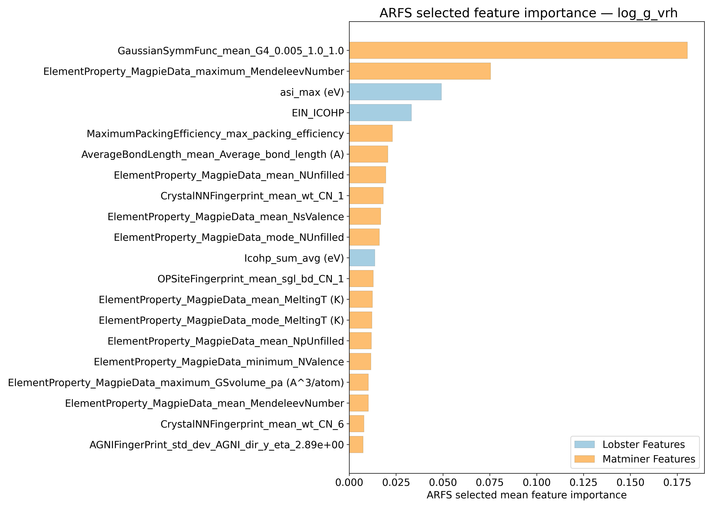
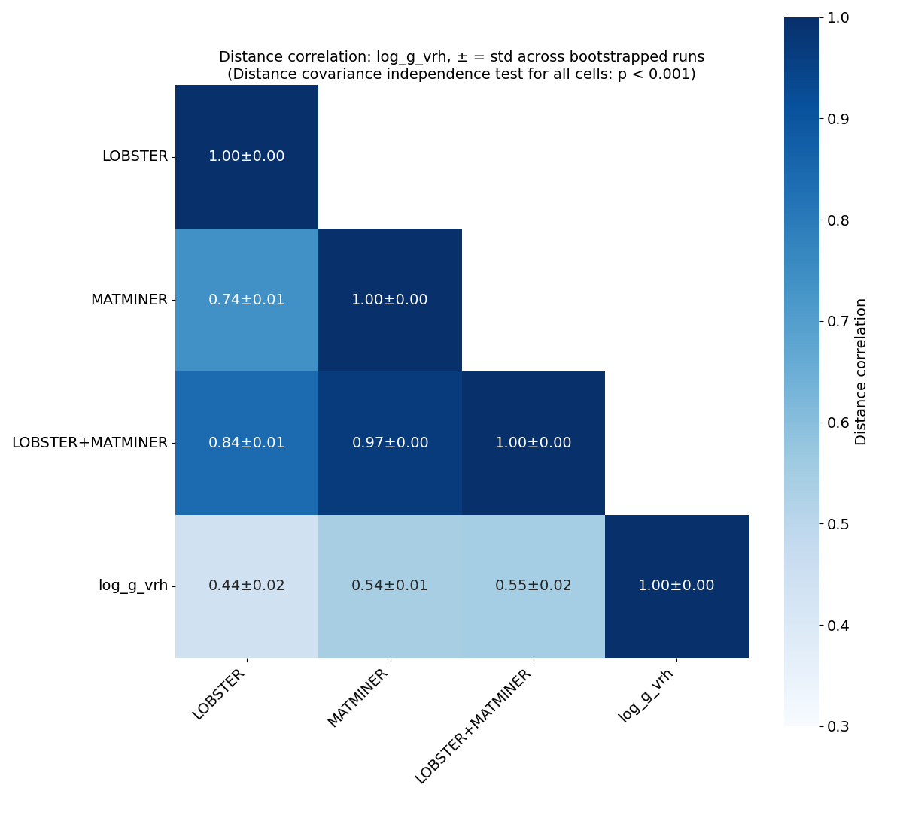
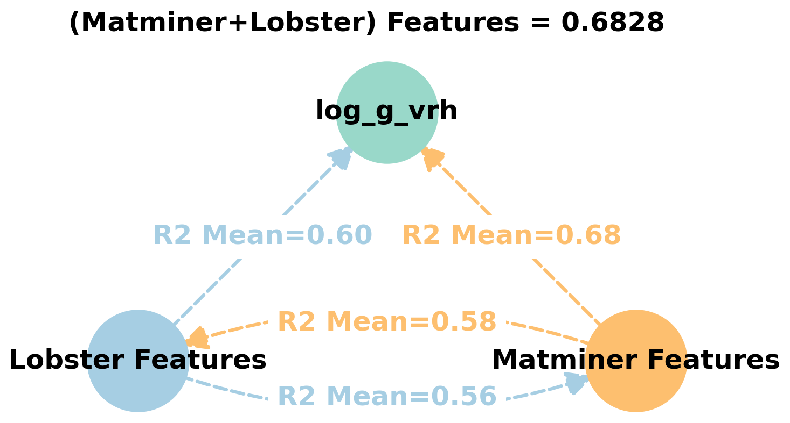
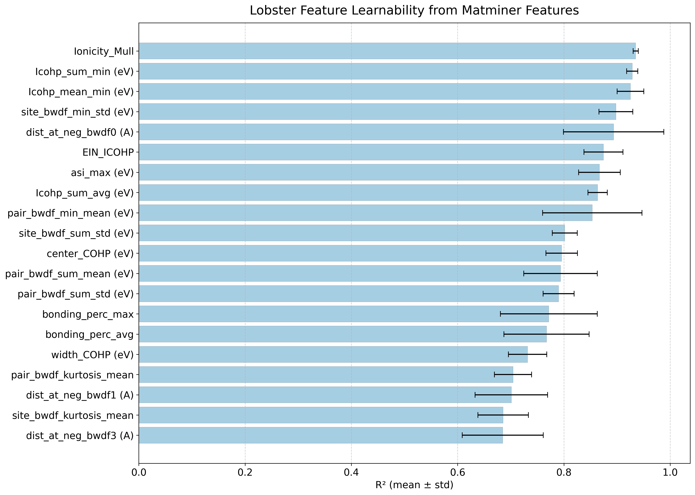
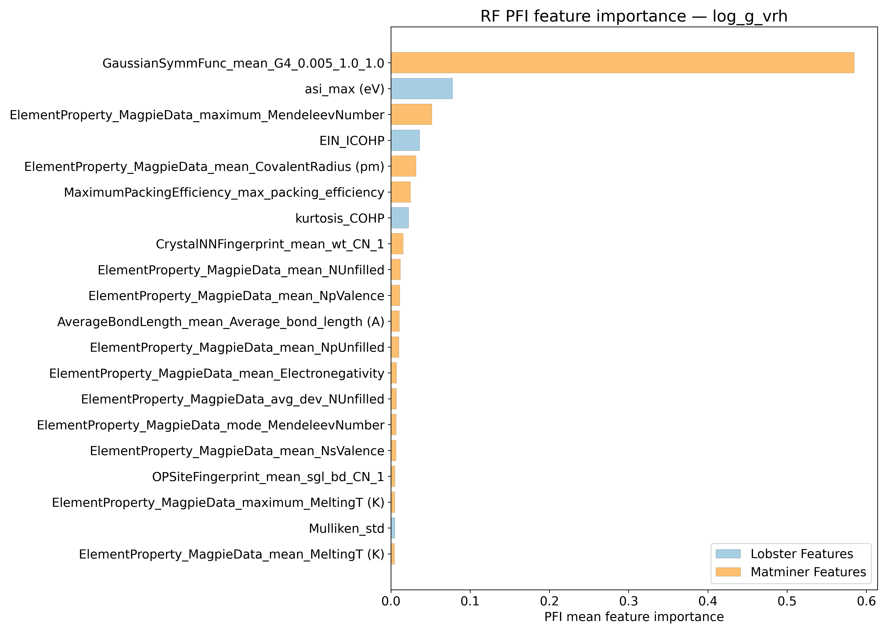
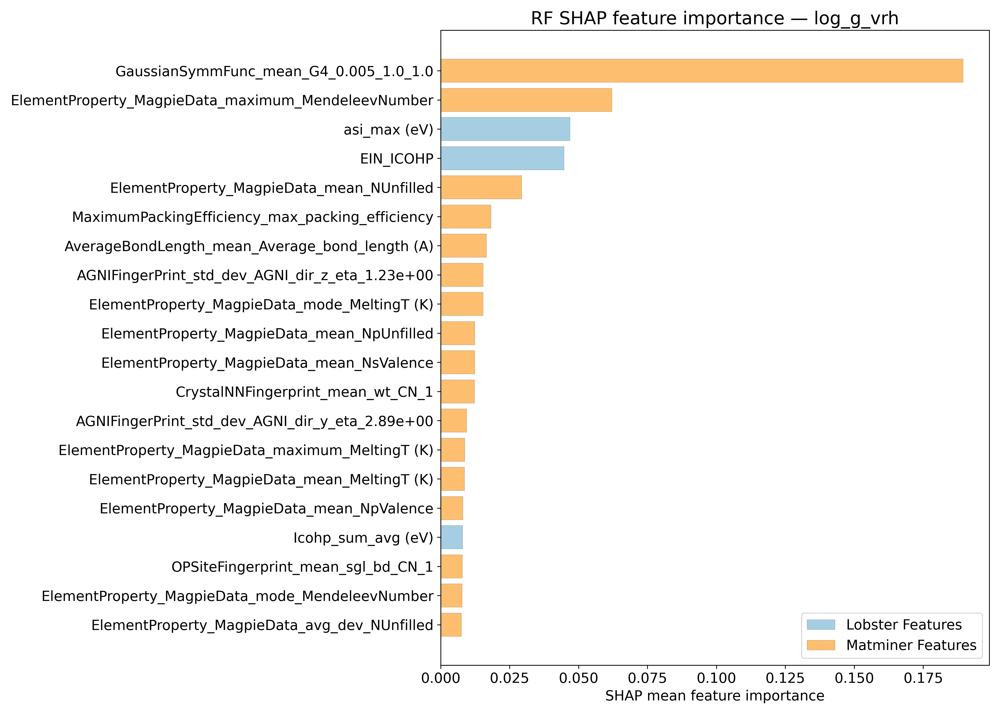
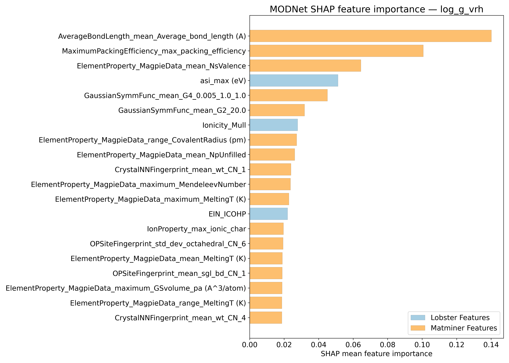
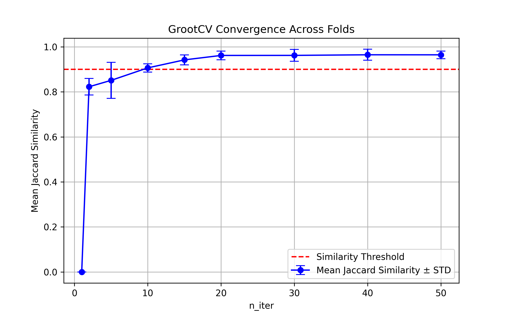

# Log10 (Shear modulus - GPa) - log_g_vrh

## ARFS Top features

### ARFS selected descriptors

---

## Correlation analysis

### Distance correlation

### Dependency graphs

### Feature learnability

---

## Model performance

### Metrics overview

RF - MATMINER

|      |   train_rmse |   test_rmse |   train_errors |   test_errors |   train_r2 |   test_r2 |
|:-----|-------------:|------------:|---------------:|--------------:|-----------:|----------:|
| mean |    0.11378   |    0.28652  |     0.04046    |     0.11038   |  0.95118   |  0.6903   |
| min  |    0.0709    |    0.1753   |     0.0371     |     0.0997    |  0.9431    |  0.411    |
| max  |    0.1274    |    0.5354   |     0.0421     |     0.1294    |  0.9763    |  0.8482   |
| std  |    0.0215666 |    0.127987 |     0.00177606 |     0.0107449 |  0.0127327 |  0.147157 |

RF - MATMINER+LOBSTER

|      |   train_rmse |   test_rmse |   train_errors |   test_errors |   train_r2 |   test_r2 |
|:-----|-------------:|------------:|---------------:|--------------:|-----------:|----------:|
| mean |    0.11396   |    0.29708  |     0.03866    |    0.10748    |  0.95092   |  0.66802  |
| min  |    0.0682    |    0.209    |     0.0349     |    0.0973     |  0.94      |  0.4287   |
| max  |    0.1276    |    0.5273   |     0.0407     |    0.1198     |  0.9781    |  0.7842   |
| std  |    0.0229419 |    0.116995 |     0.00198151 |    0.00827367 |  0.0137822 |  0.124065 |

MODNet - MATMINER

|      |   train_rmse |   test_rmse |   train_errors |   test_errors |   train_r2 |   test_r2 |
|:-----|-------------:|------------:|---------------:|--------------:|-----------:|----------:|
| mean |    0.23352   |    0.22002  |     0.036      |    0.07684    |  0.78882   |  0.80578  |
| min  |    0.1029    |    0.1105   |     0.0227     |    0.0704     |  0.7349    |  0.4465   |
| max  |    0.2761    |    0.519    |     0.0459     |    0.0849     |  0.9501    |  0.9397   |
| std  |    0.0657517 |    0.156096 |     0.00895053 |    0.00621501 |  0.0813263 |  0.188142 |

MODNet - MATMINER+LOBSTER

|      |   train_rmse |   test_rmse |   train_errors |   test_errors |   train_r2 |   test_r2 |
|:-----|-------------:|------------:|---------------:|--------------:|-----------:|----------:|
| mean |    0.23408   |    0.21784  |     0.03968    |    0.07512    |  0.78876   |  0.8077   |
| min  |    0.111     |    0.1013   |     0.033      |    0.0644     |  0.727     |  0.4436   |
| max  |    0.2785    |    0.5204   |     0.0492     |    0.0848     |  0.942     |  0.9456   |
| std  |    0.0636781 |    0.158745 |     0.00587244 |    0.00799885 |  0.0807652 |  0.191683 |

---

## Model Explainer

### PFI

### SHAP

---

## SISSO Models

### Rung 1
\begin{align*}
& log\_g\_vrh = c_0 \\
    & + a_0\left(MaximumPackingEfficiency_{max\_ packing\_ efficiency} \\ \cdot ElementProperty_{MagpieData\_ mean\_ NsValence}\right) \\
    & + a_1\left(AverageBondLength_{mean\_ Average\_ bond\_ length} \\ \cdot ElementProperty_{MagpieData\_ maximum\_ MendeleevNumber}\right)
\end{align*}

### Rung 2
\begin{align*}
& log\_g\_vrh = c_0 \\
    & + a_0\left(\left(bonding_{perc\_ max} \cdot ElementProperty_{MagpieData\_ mean\_ NsValence}\right) \\ - \left(AGNIFingerPrint_{std\_ dev\_ AGNI\_ dir\_ y\_ eta\_ 2.89e+00} + MaximumPackingEfficiency_{max\_ packing\_ efficiency}\right)\right) \\
    & + a_1\left(\frac{ \left(AverageBondLength_{mean\_ Average\_ bond\_ length} ElementProperty_{MagpieData\_ maximum\_ MendeleevNumber}\right) }{ \left(\sqrt[3]{ MaximumPackingEfficiency_{max\_ packing\_ efficiency} }\right) } \right)
\end{align*}

---

## Misc

### ARFS n-iter convergence checks

