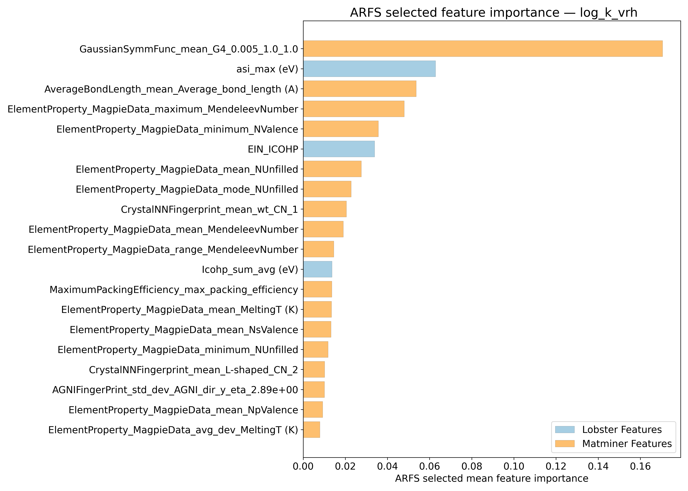
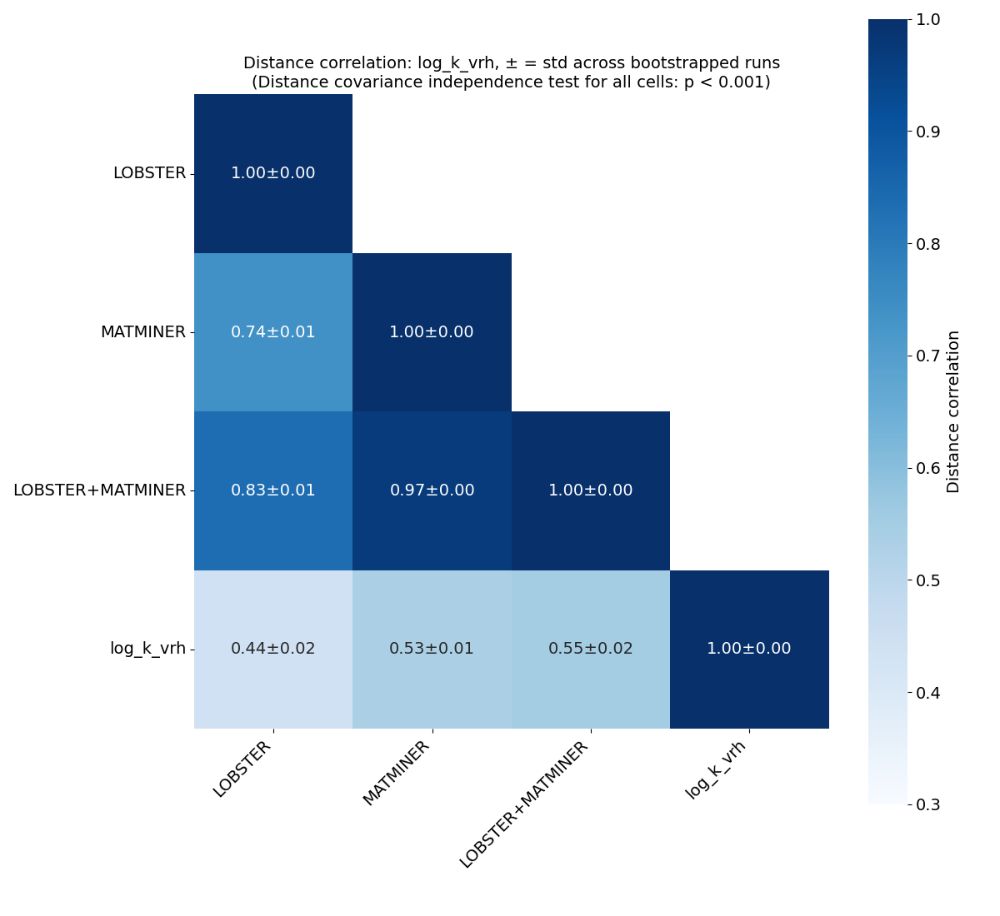
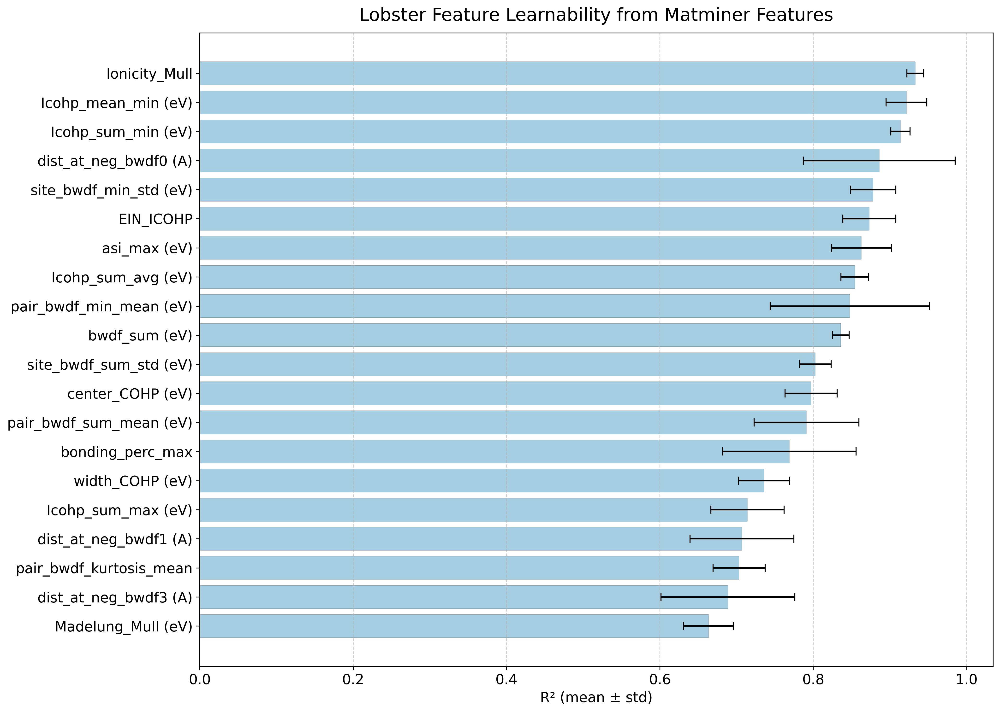
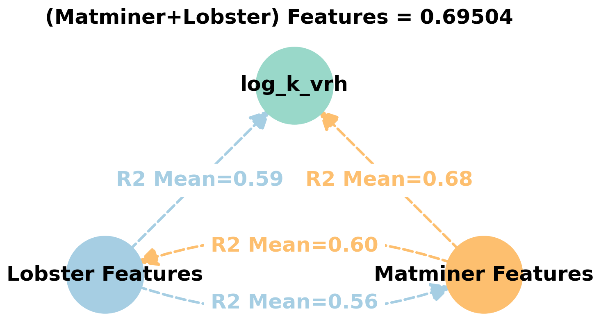
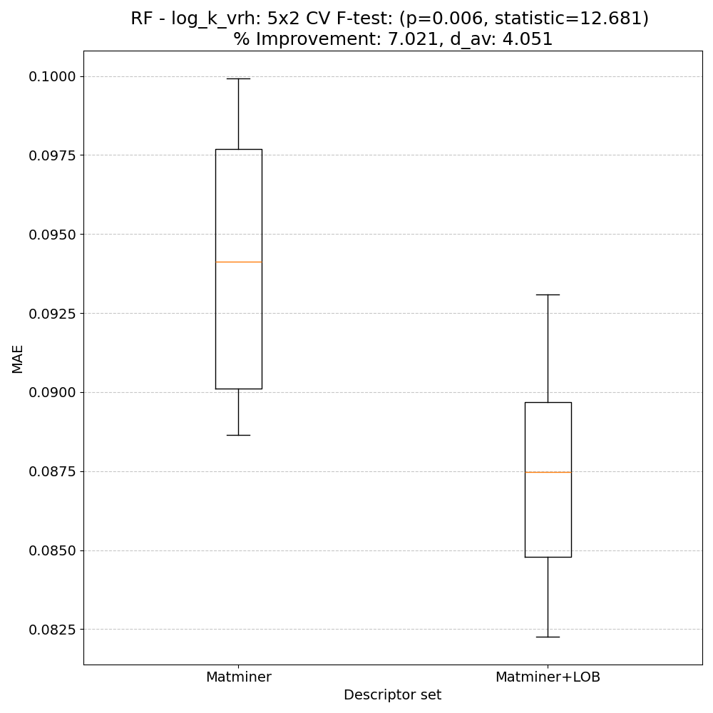
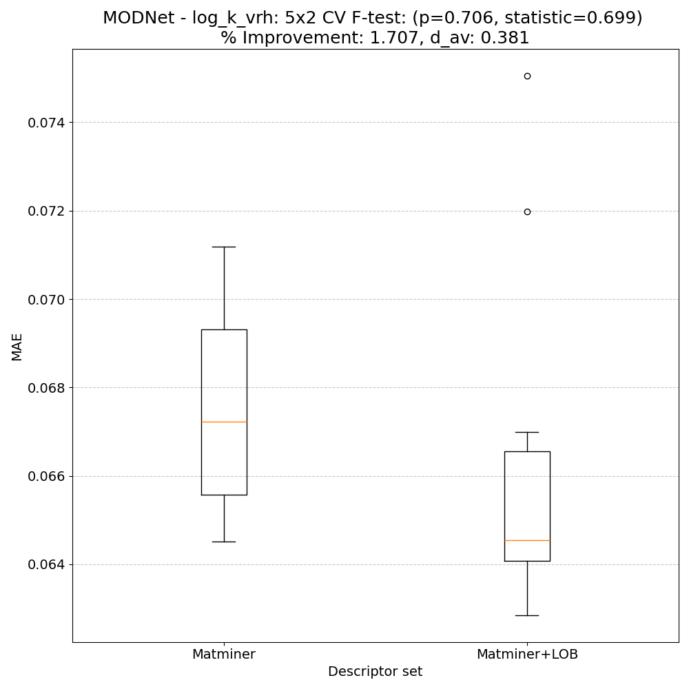
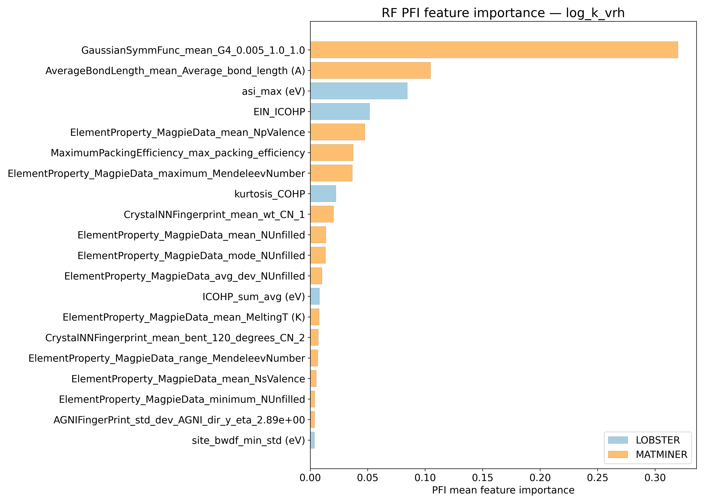
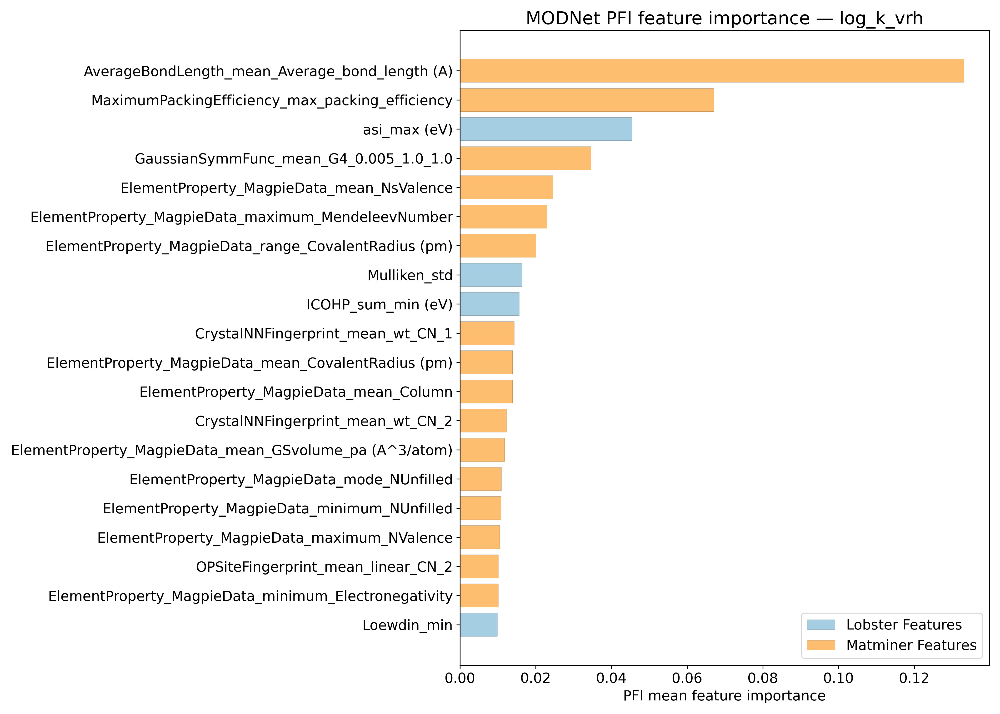
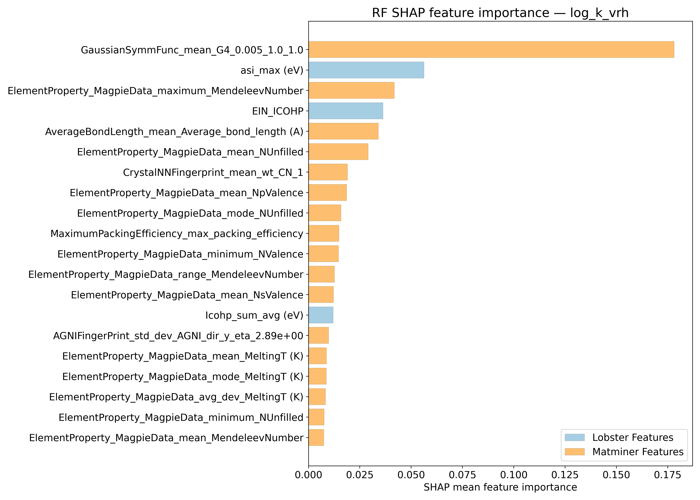
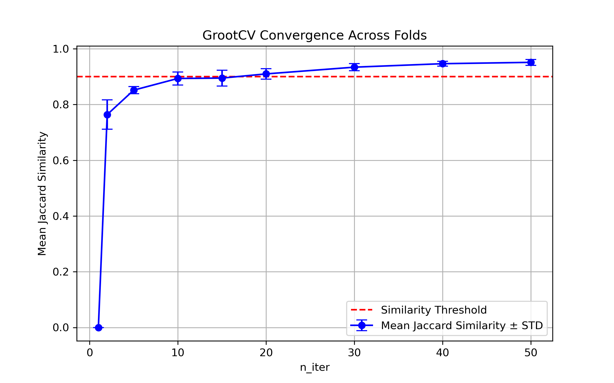

# Log10 (Bulk modulus - GPa) - log_k_vrh

## ARFS Top features

### ARFS selected descriptors

---

## Correlation analysis

### Distance correlation

### Dependency graphs

### Feature learnability

---

## Model performance

### 5-Fold CV Metrics overview

**RF - MATMINER**

|      |   train_rmse |   test_rmse |   train_errors |   test_errors |   train_r2 |   test_r2 |
|:-----|-------------:|------------:|---------------:|--------------:|-----------:|----------:|
| mean |   0.05888    |    0.1602   |    0.03082     |    0.08502    | 0.98278    | 0.87066   |
| min  |   0.0486     |    0.126    |    0.0294      |    0.0773     | 0.9805     | 0.7842    |
| max  |   0.0626     |    0.2181   |    0.032       |    0.093      | 0.9881     | 0.9186    |
| std  |   0.00530863 |    0.032413 |    0.000830422 |    0.00605785 | 0.00288541 | 0.0457325 |

**RF - MATMINER+LOBSTER**

|      |   train_rmse |   test_rmse |   train_errors |   test_errors |   train_r2 |   test_r2 |
|:-----|-------------:|------------:|---------------:|--------------:|-----------:|----------:|
| mean |   0.05636    |   0.14536   |    0.02896     |    0.07868    | 0.9842     | 0.89198   |
| min  |   0.0463     |   0.1111    |    0.0278      |    0.0723     | 0.9815     | 0.7963    |
| max  |   0.0608     |   0.2118    |    0.0301      |    0.0844     | 0.9892     | 0.9367    |
| std  |   0.00527886 |   0.0354314 |    0.000755248 |    0.00494668 | 0.00276767 | 0.0491209 |

**MODNet - MATMINER**

|      |   train_rmse |   test_rmse |   train_errors |   test_errors |   train_r2 |   test_r2 |
|:-----|-------------:|------------:|---------------:|--------------:|-----------:|----------:|
| mean |    0.07562   |   0.11798   |     0.0169     |    0.05536    |  0.96896   | 0.9255    |
| min  |    0.0264    |   0.0854    |     0.0152     |    0.0494     |  0.9611    | 0.824     |
| max  |    0.0884    |   0.1969    |     0.0184     |    0.0604     |  0.9965    | 0.9622    |
| std  |    0.0246114 |   0.0413765 |     0.00105451 |    0.00483554 |  0.0137889 | 0.0516946 |

**MODNet - MATMINER+LOBSTER**

|      |   train_rmse |   test_rmse |   train_errors |   test_errors |   train_r2 |   test_r2 |
|:-----|-------------:|------------:|---------------:|--------------:|-----------:|----------:|
| mean |    0.07764   |   0.11406   |     0.01956    |    0.05336    |  0.96694   | 0.92956   |
| min  |    0.026     |   0.0792    |     0.0156     |    0.0456     |  0.9491    | 0.8275    |
| max  |    0.1004    |   0.1949    |     0.0323     |    0.0583     |  0.9966    | 0.9678    |
| std  |    0.0263257 |   0.0421391 |     0.00639206 |    0.00542977 |  0.0158044 | 0.0518521 |

### Paired 5x2 CV F-test

**RF F-tests metrics comparsion**

**MODNet F-tests metrics comparsion**

**Summary**
|        |   F-statistic |    p-value |     d_av |   % Relative MAE improvement | Improved folds   |
|:-------|--------------:|-----------:|---------:|-----------------------------:|:-----------------|
| RF     |     12.6808   | 0.00589357 | 4.05067  |                      7.02058 | 10/10            |
| MODNet |      0.698996 | 0.706032   | 0.380568 |                      1.70687 | 7/10             |

---

## Model Explainer

### PFI

### SHAP

---

## Misc

### ARFS n-iter convergence checks

