# Log10 (Lattice thermal conductivity @ 300K - W/m/K) - log_klat_300

## ARFS Top features

### ARFS selected descriptors

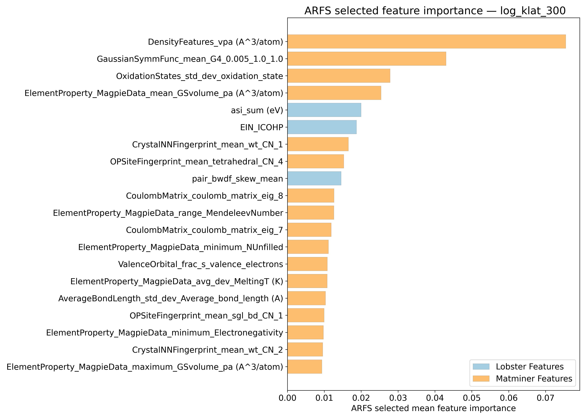

---

## Correlation analysis

### Distance correlation

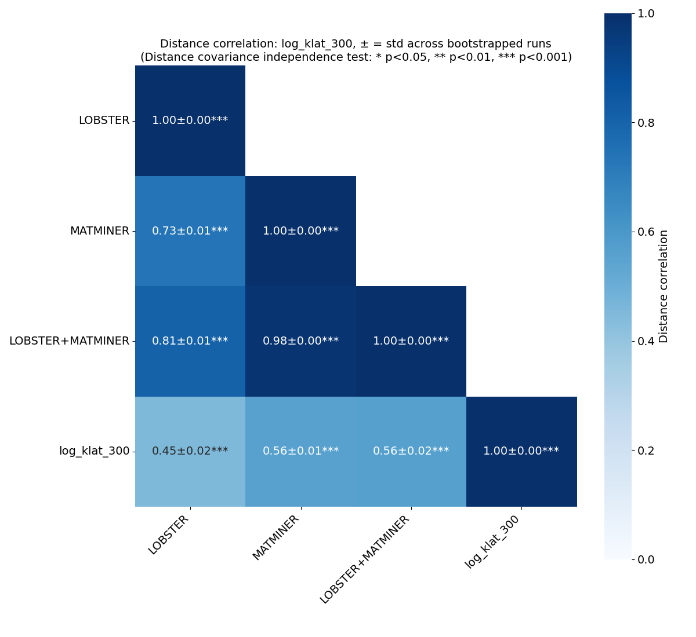

### Dependency graphs

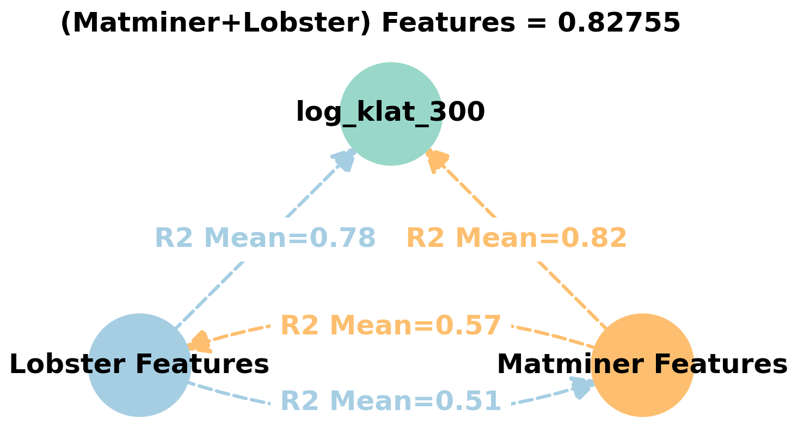

### Feature learnability

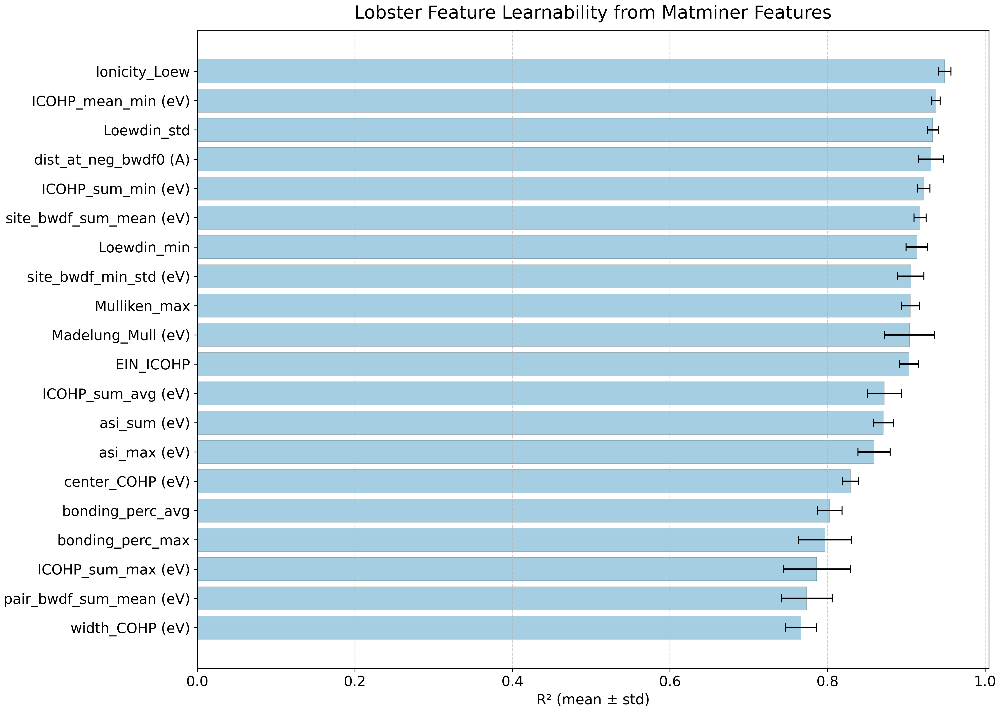

---

## Model performance

### 5-Fold CV Metrics overview

**RF - MATMINER**

|      |   train_rmse |   test_rmse |   train_errors |   test_errors |    train_r2 |   test_r2 |
|:-----|-------------:|------------:|---------------:|--------------:|------------:|----------:|
| mean |   0.10284    |   0.27392   |    0.07034     |    0.19008    | 0.9751      | 0.82228   |
| min  |   0.1002     |   0.2634    |    0.0691      |    0.1868     | 0.9744      | 0.7947    |
| max  |   0.1043     |   0.293     |    0.0711      |    0.1937     | 0.9758      | 0.84      |
| std  |   0.00153441 |   0.0102144 |    0.000722772 |    0.00250152 | 0.000473286 | 0.0159938 |

**RF - MATMINER+LOBSTER**

|      |   train_rmse |   test_rmse |   train_errors |   test_errors |    train_r2 |   test_r2 |
|:-----|-------------:|------------:|---------------:|--------------:|------------:|----------:|
| mean |   0.10082    |   0.2671    |     0.0688     |      0.18506  | 0.9761      | 0.83108   |
| min  |   0.0981     |   0.2574    |     0.0678     |      0.1822   | 0.9757      | 0.8045    |
| max  |   0.1029     |   0.2853    |     0.0701     |      0.1882   | 0.9768      | 0.8472    |
| std  |   0.00158291 |   0.0100493 |     0.00074027 |      0.002196 | 0.000374166 | 0.0153718 |

**MODNet - MATMINER**

|      |   train_rmse |   test_rmse |   train_errors |   test_errors |   train_r2 |   test_r2 |
|:-----|-------------:|------------:|---------------:|--------------:|-----------:|----------:|
| mean |    0.0842    |   0.2451    |     0.04628    |     0.15856   | 0.9828     | 0.85764   |
| min  |    0.0634    |   0.2243    |     0.0384     |     0.1503    | 0.9728     | 0.8382    |
| max  |    0.1076    |   0.274     |     0.056      |     0.1677    | 0.9908     | 0.884     |
| std  |    0.0142122 |   0.0179393 |     0.00568837 |     0.0064695 | 0.00581481 | 0.0181706 |

**MODNet - MATMINER+LOBSTER**

|      |   train_rmse |   test_rmse |   train_errors |   test_errors |   train_r2 |   test_r2 |
|:-----|-------------:|------------:|---------------:|--------------:|-----------:|----------:|
| mean |    0.08892   |   0.24038   |     0.04742    |    0.15434    |  0.98022   | 0.86304   |
| min  |    0.0646    |   0.2234    |     0.0373     |    0.1449     |  0.9619    | 0.8314    |
| max  |    0.1257    |   0.2796    |     0.0645     |    0.1703     |  0.9901    | 0.8827    |
| std  |    0.0213519 |   0.0203273 |     0.00958278 |    0.00862104 |  0.0100298 | 0.0194139 |

### Paired 5x2 CV F-test

**RF F-tests metrics comparsion**
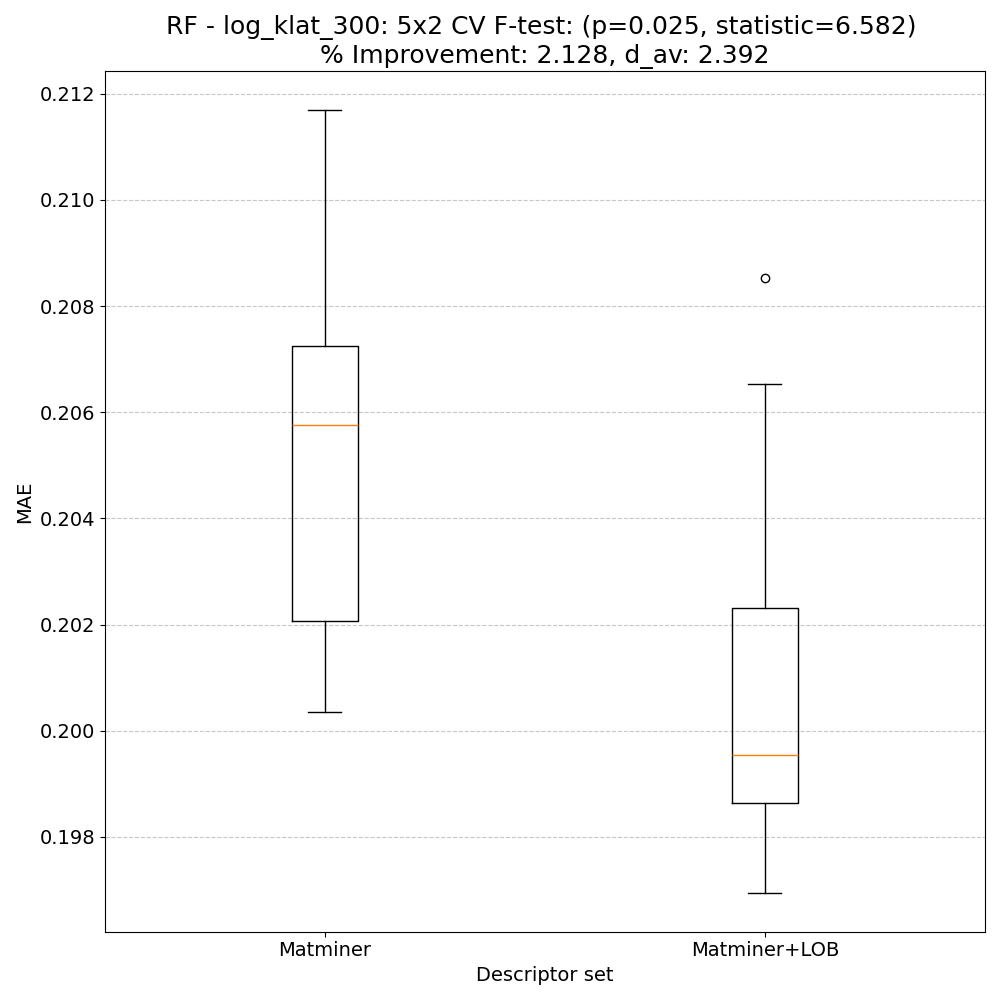

**MODNet F-tests metrics comparsion**
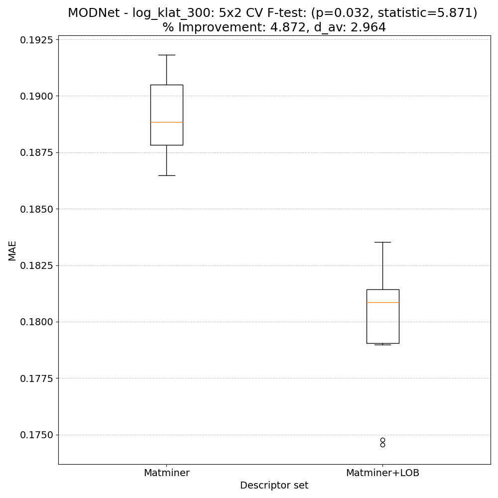

**Summary**
|        |   F-statistic |   p-value |    d_av |   % Relative MAE improvement | Improved folds   |
|:-------|--------------:|----------:|--------:|-----------------------------:|:-----------------|
| RF     |       6.58183 | 0.025303  | 2.39224 |                      2.12836 | 10/10            |
| MODNet |       5.87116 | 0.0321982 | 2.96368 |                      4.87181 | 10/10            |

---

## Model Explainer

### PFI
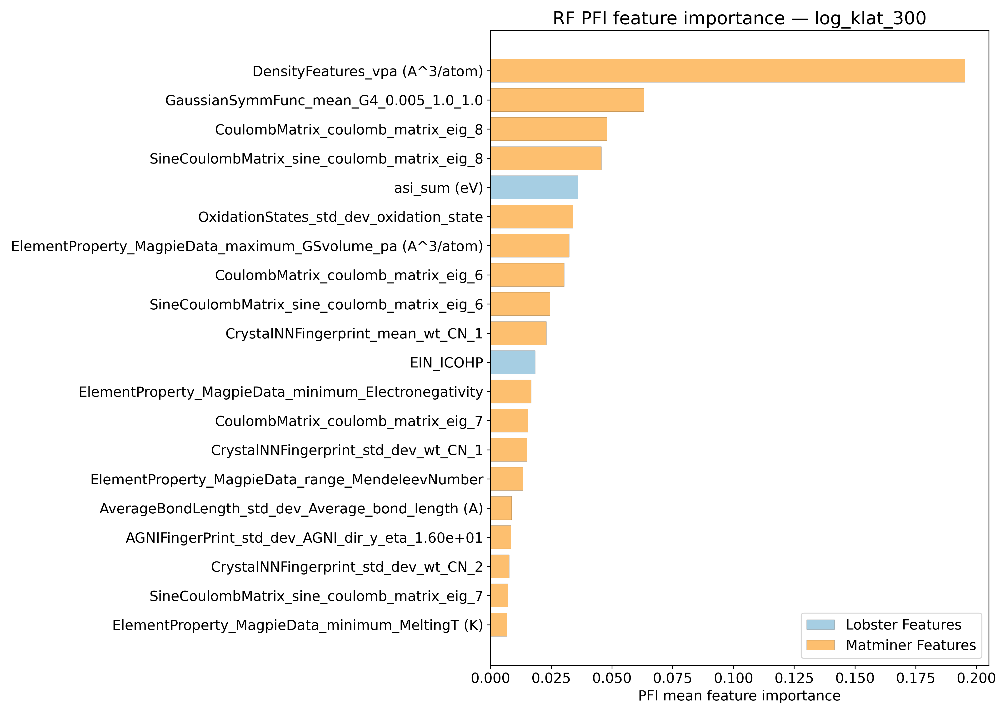
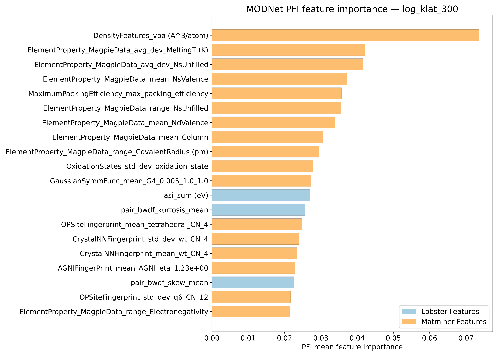

### SHAP
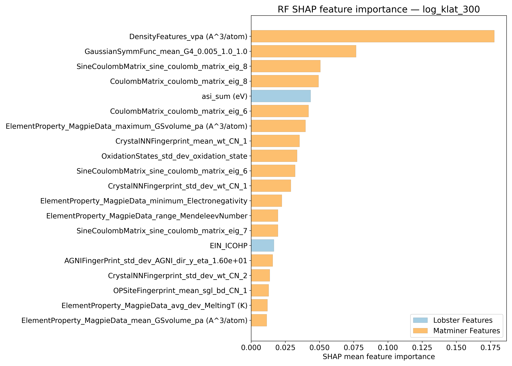
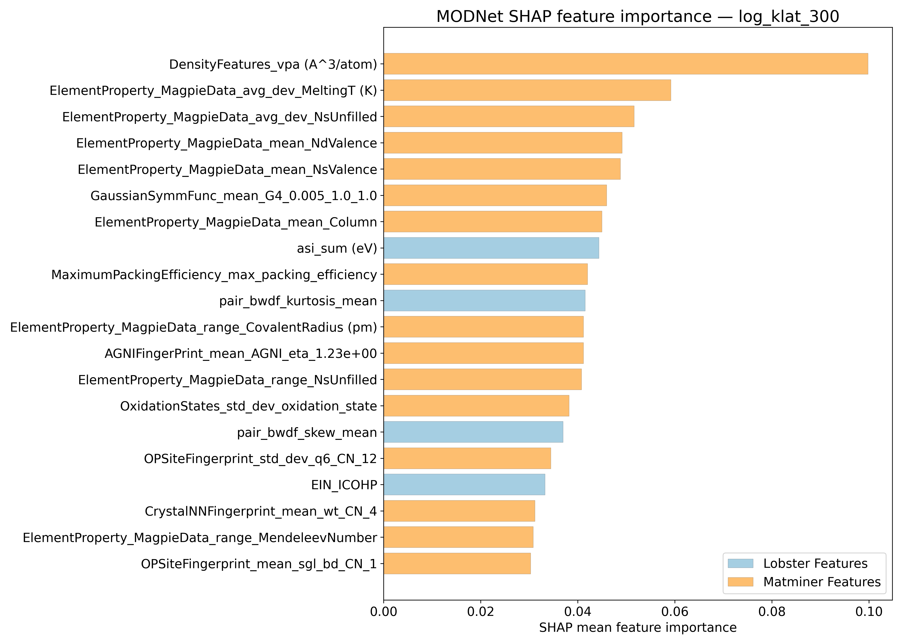

---

## Misc

### ARFS n-iter convergence checks

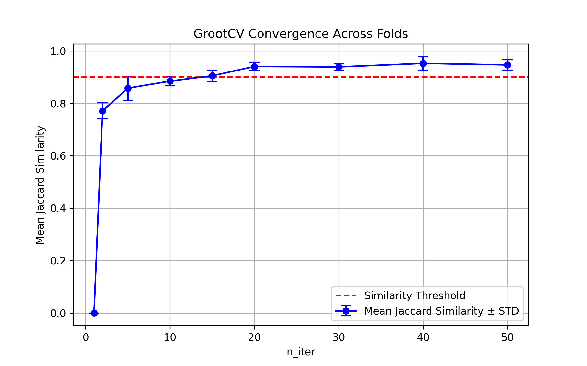

