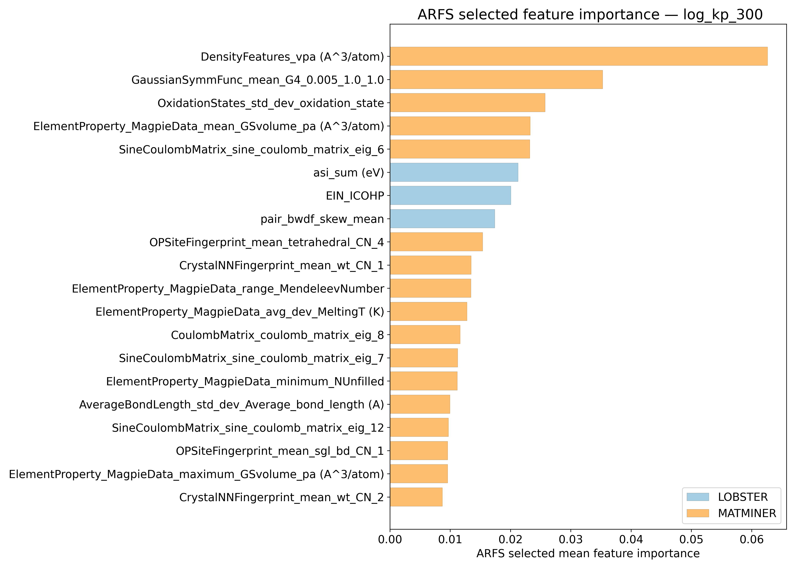
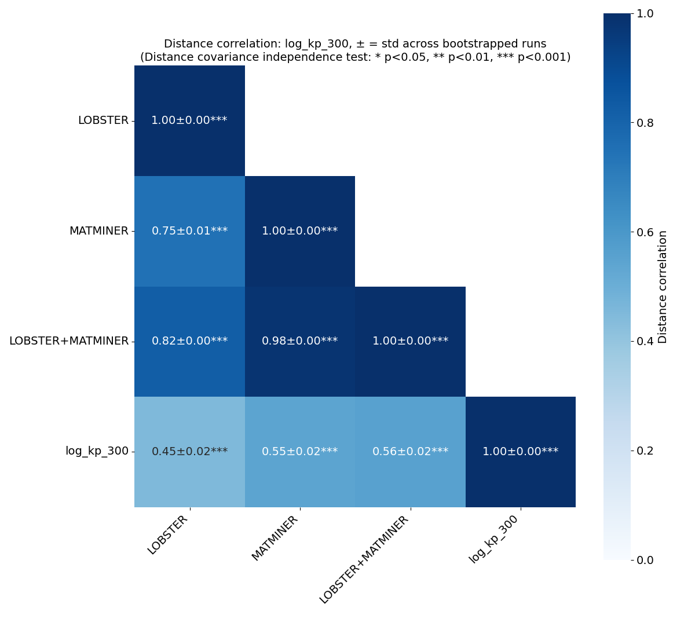
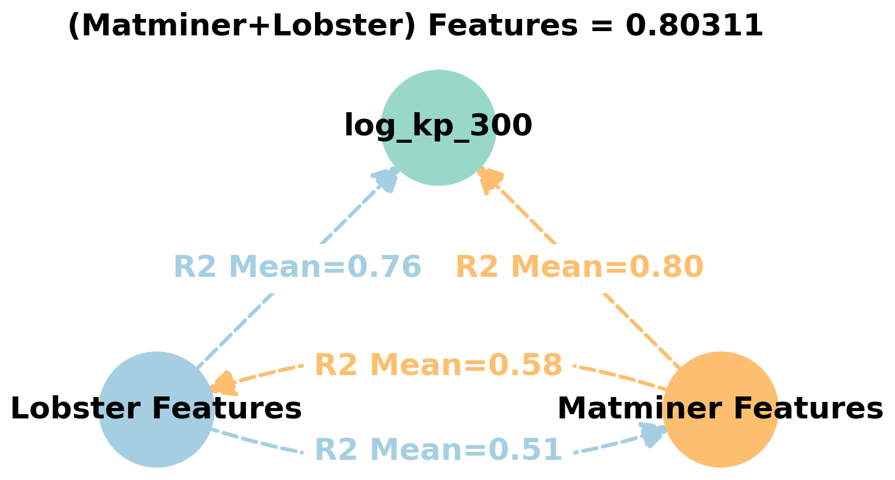
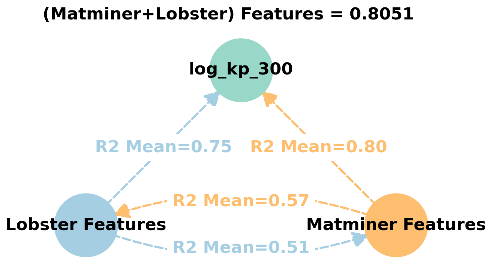
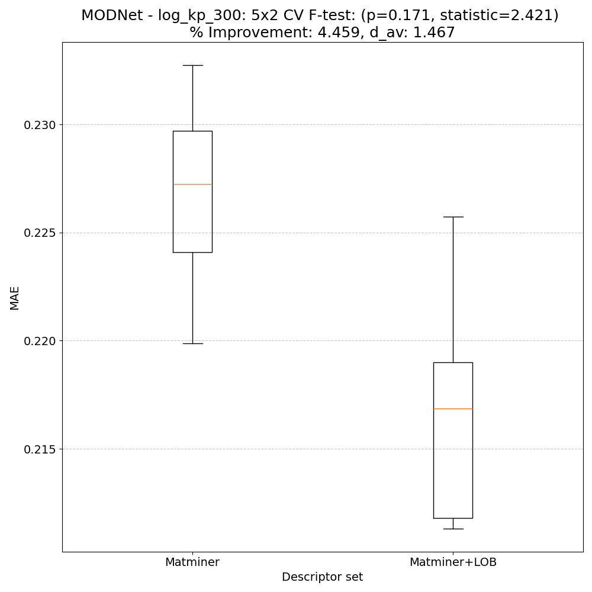
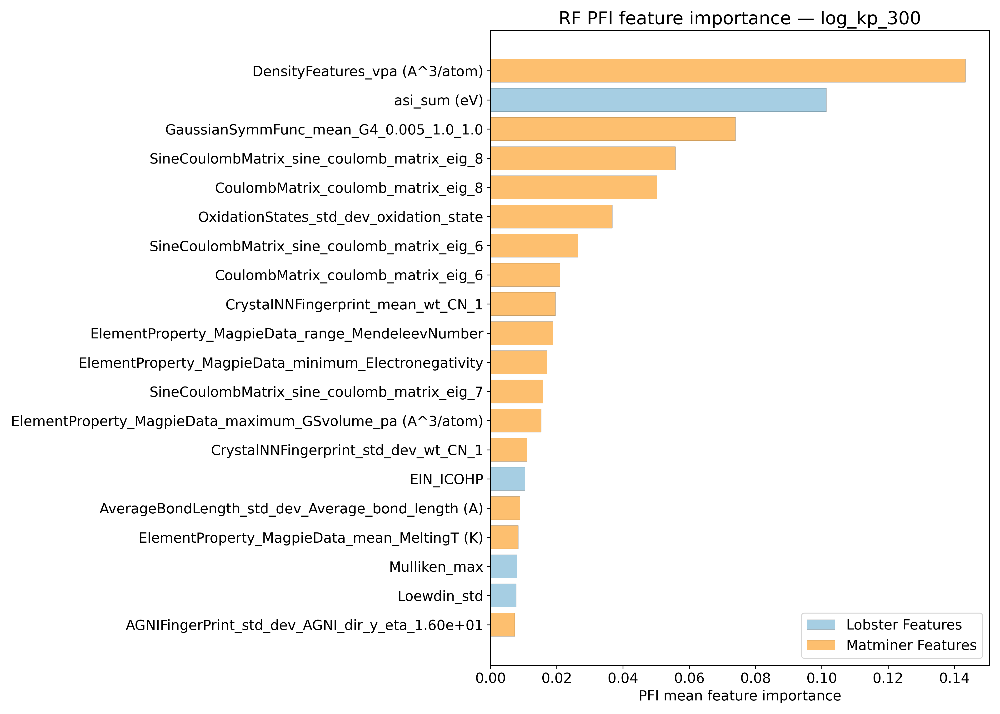
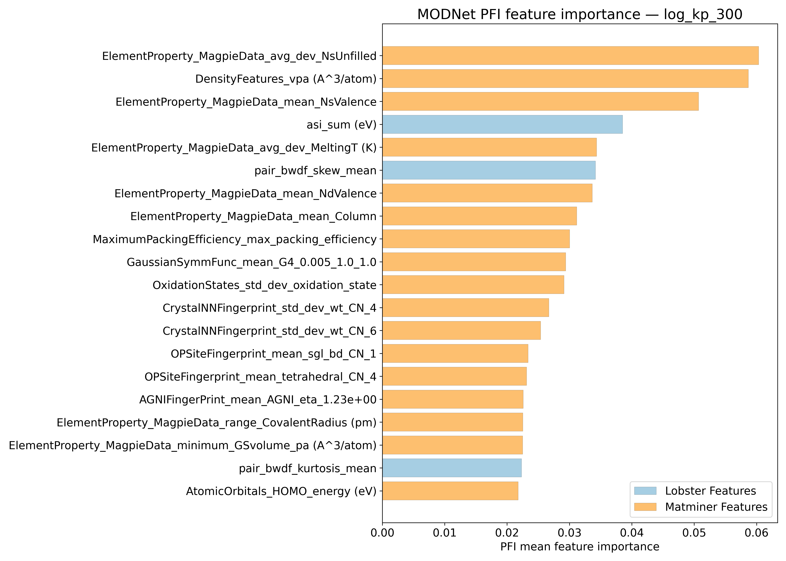
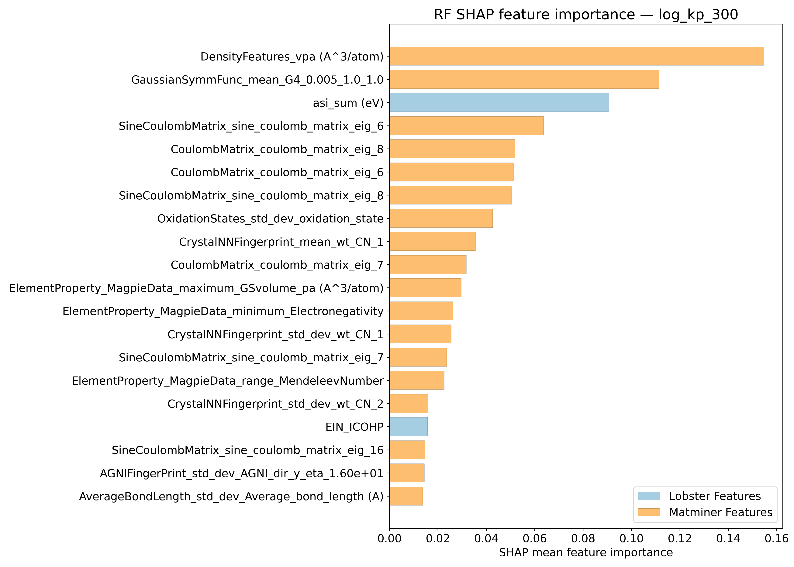
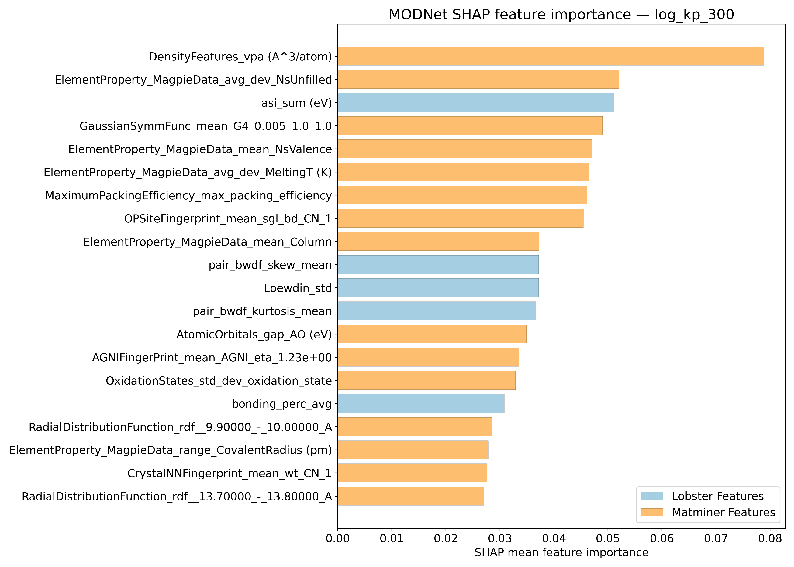
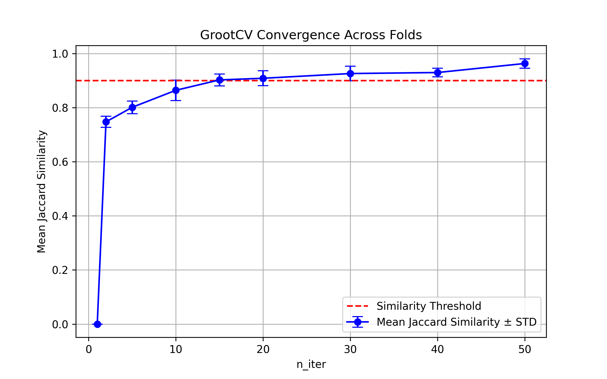

# Log10 (Peierls lattice thermal conductivity ) @ 300K - W/m/K) - log_kp_300

## ARFS Top features

### ARFS selected descriptors

---

## Correlation analysis

### Distance correlation

### Dependency graphs

### Feature learnability

---

## Model performance

### 5-Fold CV Metrics overview

**RF - MATMINER**

|      |   train_rmse |   test_rmse |   train_errors |   test_errors |    train_r2 |   test_r2 |
|:-----|-------------:|------------:|---------------:|--------------:|------------:|----------:|
| mean |   0.1241     |    0.33168  |    0.0824      |    0.22416    | 0.9715      | 0.7953    |
| min  |   0.1209     |    0.3133   |    0.0817      |    0.2221     | 0.9705      | 0.7712    |
| max  |   0.1278     |    0.3486   |    0.0838      |    0.2264     | 0.9725      | 0.817     |
| std  |   0.00268403 |    0.013485 |    0.000782304 |    0.00149211 | 0.000809938 | 0.0164542 |

**RF - MATMINER+LOBSTER**

|      |   train_rmse |   test_rmse |   train_errors |   test_errors |    train_r2 |   test_r2 |
|:-----|-------------:|------------:|---------------:|--------------:|------------:|----------:|
| mean |   0.12104    |   0.32204   |    0.08036     |    0.21636    | 0.9729      |  0.8072   |
| min  |   0.1177     |   0.3055    |    0.0791      |    0.2128     | 0.972       |  0.7918   |
| max  |   0.1249     |   0.3426    |    0.0817      |    0.2194     | 0.9739      |  0.826    |
| std  |   0.00264469 |   0.0148668 |    0.000847585 |    0.00234657 | 0.000766812 |  0.014333 |

**MODNet - MATMINER**

|      |   train_rmse |   test_rmse |   train_errors |   test_errors |   train_r2 |   test_r2 |
|:-----|-------------:|------------:|---------------:|--------------:|-----------:|----------:|
| mean |    0.12716   |   0.30212   |     0.0682     |    0.19196    | 0.96948    | 0.83018   |
| min  |    0.0989    |   0.2791    |     0.0565     |    0.1847     | 0.959      | 0.8074    |
| max  |    0.1513    |   0.3342    |     0.0805     |    0.2069     | 0.9818     | 0.8547    |
| std  |    0.0193366 |   0.0211013 |     0.00810136 |    0.00803059 | 0.00854199 | 0.0188838 |

**MODNet - MATMINER+LOBSTER**

|      |   train_rmse |   test_rmse |   train_errors |   test_errors |   train_r2 |   test_r2 |
|:-----|-------------:|------------:|---------------:|--------------:|-----------:|----------:|
| mean |    0.08798   |   0.2931    |     0.04974    |     0.18454   | 0.98552    | 0.8402    |
| min  |    0.0782    |   0.2672    |     0.0439     |     0.1713    | 0.9792     | 0.8242    |
| max  |    0.1061    |   0.3153    |     0.0564     |     0.1944    | 0.9885     | 0.8669    |
| std  |    0.0107293 |   0.0191406 |     0.00436742 |     0.0078081 | 0.00354028 | 0.0163417 |

### Paired 5x2 CV F-test

**RF F-tests metrics comparsion**

**MODNet F-tests metrics comparsion**

**Summary**
|        |   F-statistic |   p-value |    d_av |   % Relative MAE improvement | Improved folds   |
|:-------|--------------:|----------:|--------:|-----------------------------:|:-----------------|
| RF     |       5.6842  | 0.0344431 | 2.55892 |                      2.50294 | 10/10            |
| MODNet |       2.42112 | 0.170578  | 1.46746 |                      4.45887 | 9/10             |

---

## Model Explainer

### PFI

### SHAP

---

## Misc

### ARFS n-iter convergence checks

