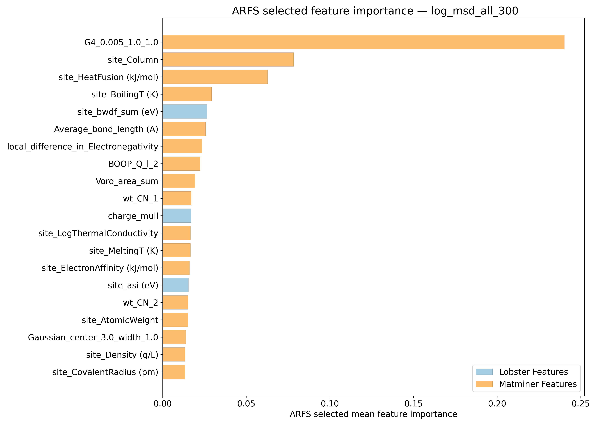
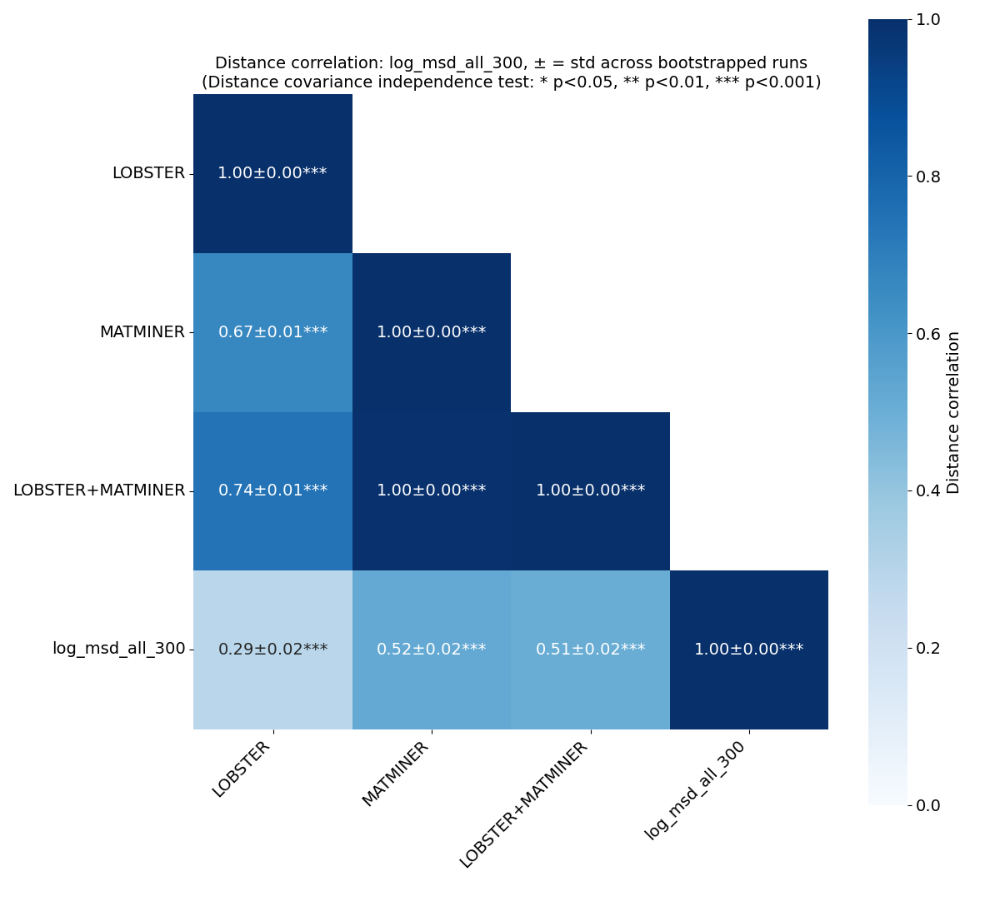
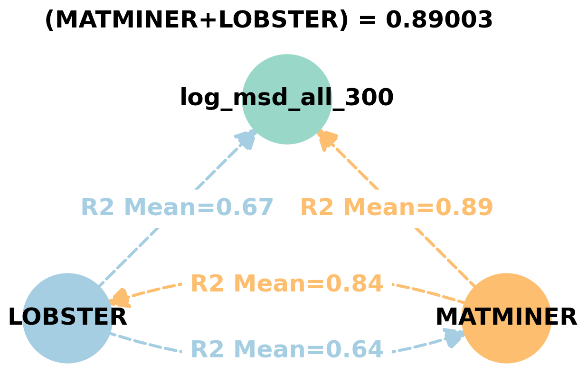
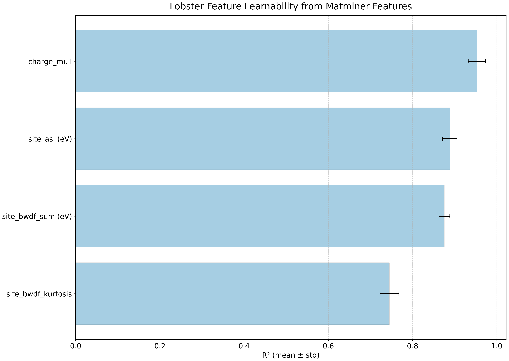
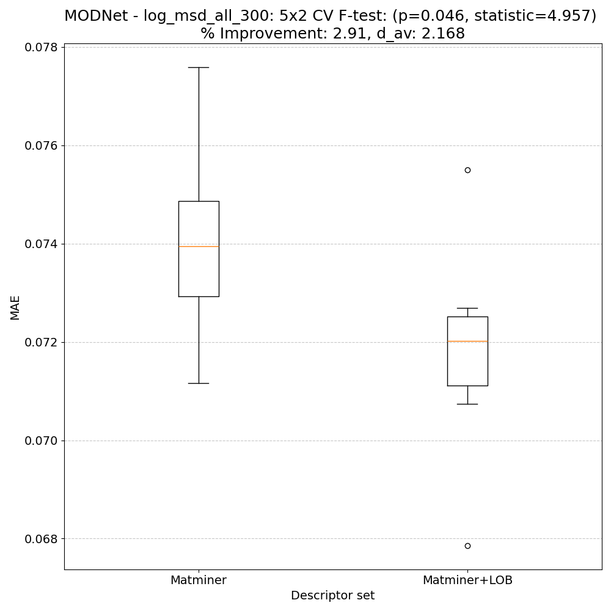
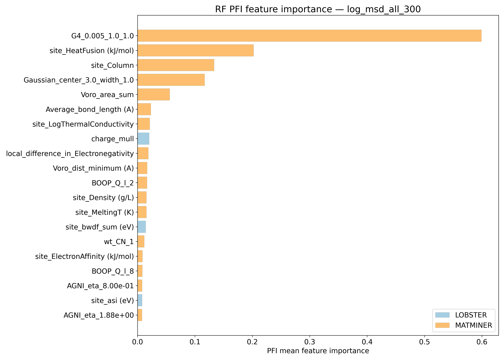
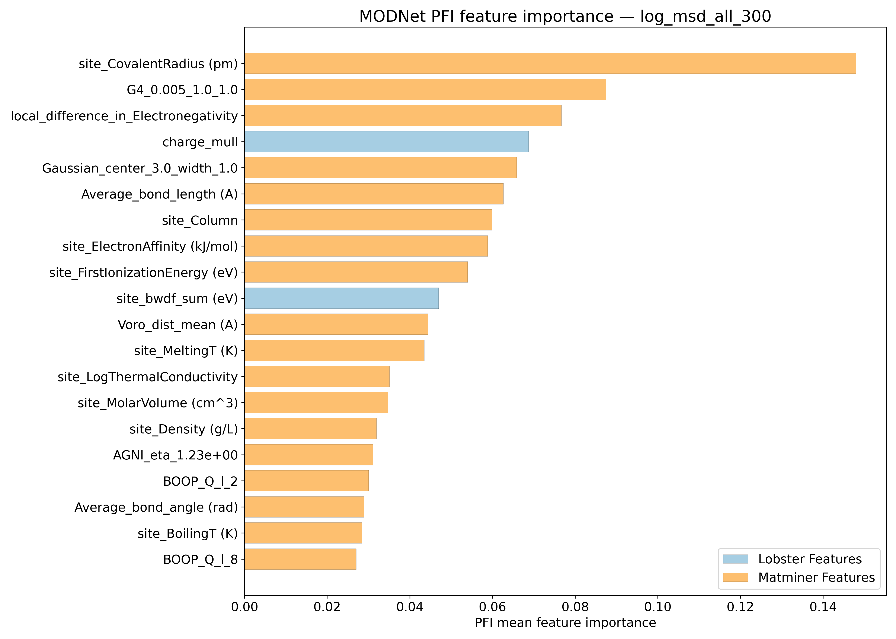
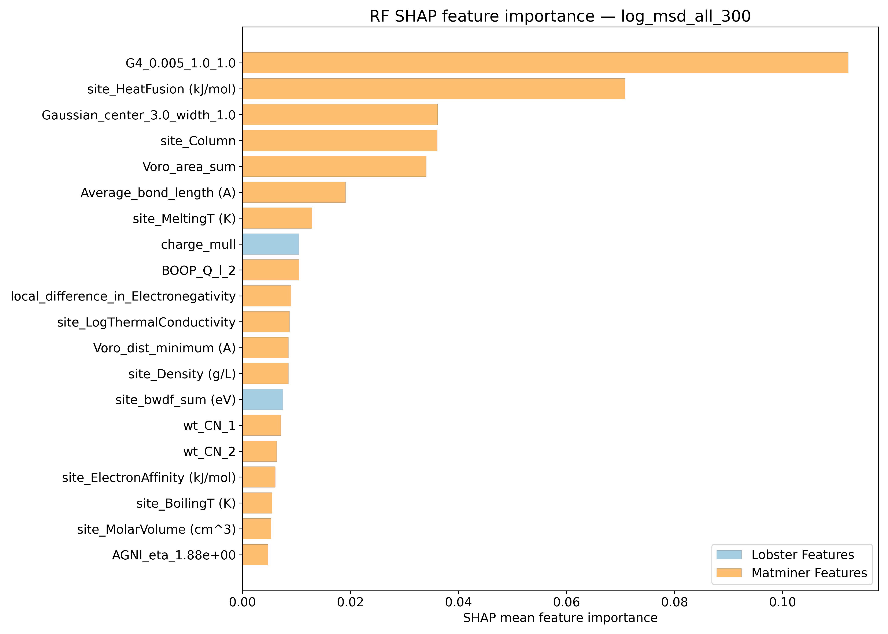
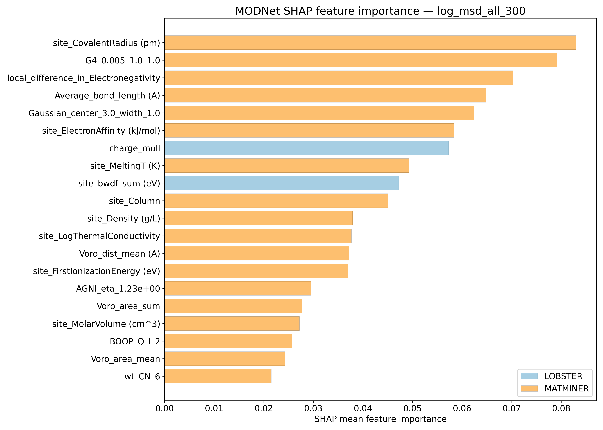

# Log10 (All unique sites mean squared displacements @ 300K - Ų) - log_msd_all_300

## ARFS Top features

### ARFS selected descriptors

---

## Correlation analysis

### Distance correlation

### Dependency graphs

### Feature learnability

---

## Model performance

### 5-Fold CV Metrics overview

**RF - MATMINER**

|      |   train_rmse |   test_rmse |   train_errors |   test_errors |    train_r2 |    test_r2 |
|:-----|-------------:|------------:|---------------:|--------------:|------------:|-----------:|
| mean |   0.03926    |  0.10432    |    0.02832     |   0.07562     | 0.9841      | 0.8875     |
| min  |   0.0388     |  0.0999     |    0.0281      |   0.0748      | 0.9837      | 0.8737     |
| max  |   0.0396     |  0.1094     |    0.0286      |   0.0769      | 0.9846      | 0.9006     |
| std  |   0.00026533 |  0.00393517 |    0.000203961 |   0.000724983 | 0.000289828 | 0.00901887 |

**RF - MATMINER+LOBSTER**

|      |   train_rmse |   test_rmse |   train_errors |   test_errors |    train_r2 |    test_r2 |
|:-----|-------------:|------------:|---------------:|--------------:|------------:|-----------:|
| mean |  0.03856     |  0.10306    |    0.0278      |    0.0747     | 0.98468     | 0.8902     |
| min  |  0.038       |  0.098      |    0.0275      |    0.0728     | 0.9844      | 0.8758     |
| max  |  0.0391      |  0.1089     |    0.0282      |    0.077      | 0.9852      | 0.9015     |
| std  |  0.000361109 |  0.00464052 |    0.000289828 |    0.00146697 | 0.000318748 | 0.00958374 |

**MODNet - MATMINER**

|      |   train_rmse |   test_rmse |   train_errors |   test_errors |   train_r2 |    test_r2 |
|:-----|-------------:|------------:|---------------:|--------------:|-----------:|-----------:|
| mean |   0.0393     |  0.08646    |     0.0251     |    0.05858    | 0.98392    | 0.92268    |
| min  |   0.0358     |  0.0816     |     0.0231     |    0.0572     | 0.9773     | 0.9167     |
| max  |   0.0471     |  0.0891     |     0.0305     |    0.0603     | 0.9867     | 0.9336     |
| std  |   0.00408363 |  0.00294252 |     0.00275318 |    0.00114263 | 0.00346318 | 0.00616876 |

**MODNet - MATMINER+LOBSTER**

|      |   train_rmse |   test_rmse |   train_errors |   test_errors |   train_r2 |    test_r2 |
|:-----|-------------:|------------:|---------------:|--------------:|-----------:|-----------:|
| mean |   0.04068    |  0.08644    |     0.02634    |    0.0592     | 0.98262    | 0.92286    |
| min  |   0.0342     |  0.0823     |     0.0222     |    0.0557     | 0.9774     | 0.9172     |
| max  |   0.047      |  0.0901     |     0.0304     |    0.0632     | 0.988      | 0.9284     |
| std  |   0.00534318 |  0.00298101 |     0.00351659 |    0.00300267 | 0.00447946 | 0.00402423 |

### Paired 5x2 CV F-test

**RF F-tests metrics comparsion**

**MODNet F-tests metrics comparsion**

**Summary**
|        |   F-statistic |   p-value |    d_av |   % Relative MAE improvement | Improved folds   |
|:-------|--------------:|----------:|--------:|-----------------------------:|:-----------------|
| RF     |       6.99387 | 0.0222208 | 2.73619 |                      1.86087 | 10/10            |
| MODNet |       4.95725 | 0.0455936 | 2.16786 |                      2.91017 | 10/10            |

---

## Model Explainer

### PFI

### SHAP

---

## Misc

### ARFS n-iter convergence checks

