# Log10 (Max of mean squared displacements @ 300K - Ų) - log_msd_max_300

## ARFS Top features

### ARFS selected descriptors

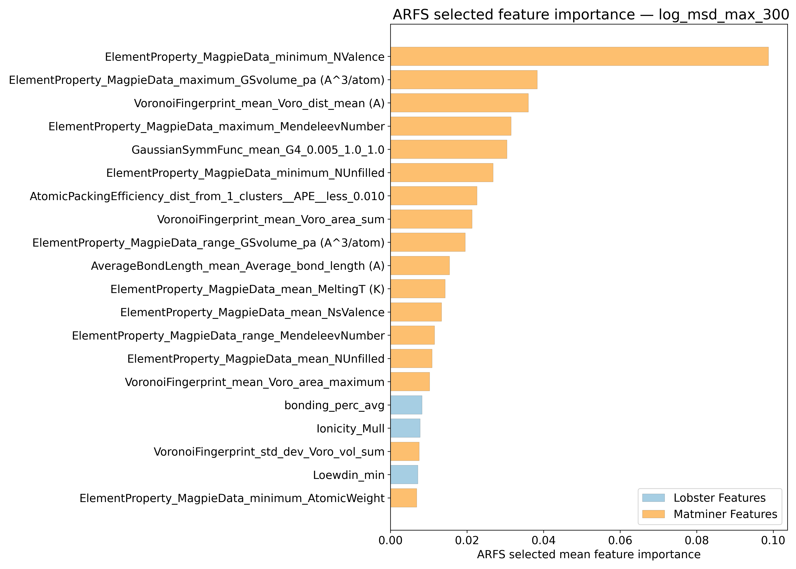

---

## Correlation analysis

### Distance correlation

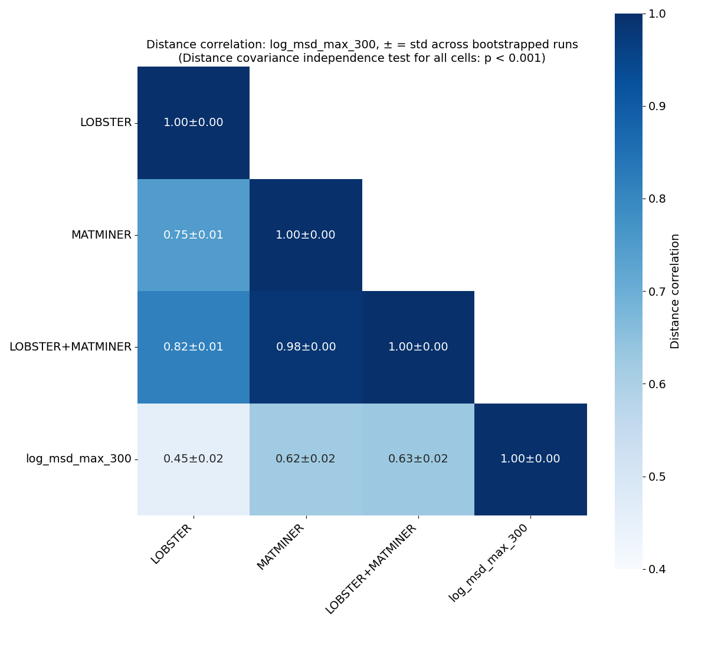

### Dependency graphs

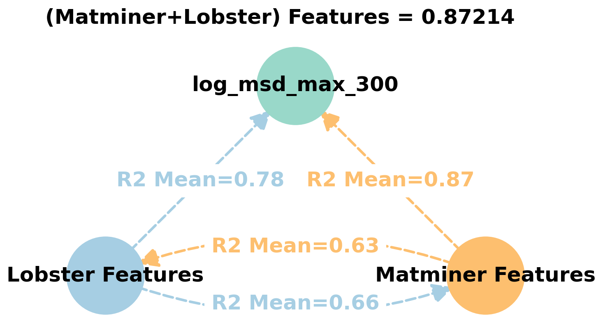

### Feature learnability

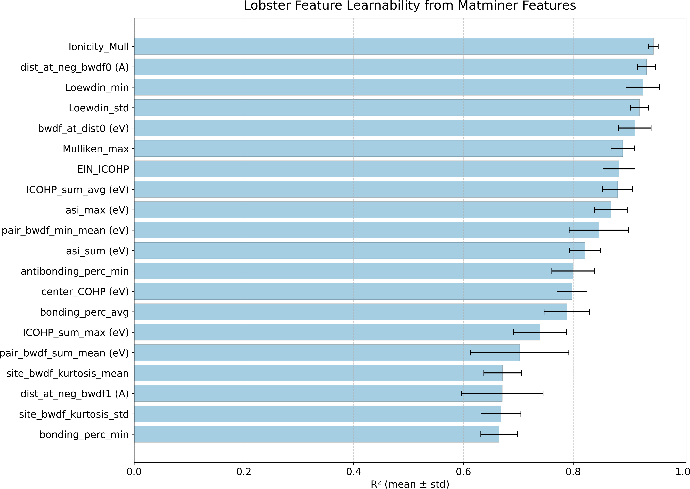

---

## Model performance

### 5-Fold CV Metrics overview

**RF - MATMINER**

|      |   train_rmse |   test_rmse |   train_errors |   test_errors |    train_r2 |   test_r2 |
|:-----|-------------:|------------:|---------------:|--------------:|------------:|----------:|
| mean |  0.04176     |  0.11586    |    0.03008     |    0.08362    | 0.98226     | 0.86192   |
| min  |  0.0412      |  0.1026     |    0.0296      |    0.0783     | 0.9811      | 0.8349    |
| max  |  0.0429      |  0.1296     |    0.0306      |    0.0901     | 0.9828      | 0.8962    |
| std  |  0.000608605 |  0.00937691 |    0.000411825 |    0.00391479 | 0.000601997 | 0.0200716 |

**RF - MATMINER+LOBSTER**

|      |   train_rmse |   test_rmse |   train_errors |   test_errors |    train_r2 |   test_r2 |
|:-----|-------------:|------------:|---------------:|--------------:|------------:|----------:|
| mean |  0.04198     |  0.1156     |    0.0302      |    0.08328    | 0.98208     | 0.8628    |
| min  |  0.041       |  0.1056     |    0.0298      |    0.0799     | 0.9814      | 0.8362    |
| max  |  0.0426      |  0.1291     |    0.0305      |    0.0894     | 0.9828      | 0.8901    |
| std  |  0.000601332 |  0.00849612 |    0.000289828 |    0.00338609 | 0.000448999 | 0.0174557 |

**MODNet - MATMINER**

|      |   train_rmse |   test_rmse |   train_errors |   test_errors |   train_r2 |   test_r2 |
|:-----|-------------:|------------:|---------------:|--------------:|-----------:|----------:|
| mean |   0.04064    |  0.09852    |     0.02614    |    0.06868    | 0.98306    | 0.9005    |
| min  |   0.0349     |  0.0842     |     0.0241     |    0.0634     | 0.9796     | 0.8818    |
| max  |   0.0445     |  0.1067     |     0.0287     |    0.074      | 0.9875     | 0.9199    |
| std  |   0.00372752 |  0.00779446 |     0.00178281 |    0.00360189 | 0.00297765 | 0.0126056 |

**MODNet - MATMINER+LOBSTER**

|      |   train_rmse |   test_rmse |   train_errors |   test_errors |   train_r2 |   test_r2 |
|:-----|-------------:|------------:|---------------:|--------------:|-----------:|----------:|
| mean |   0.05012    |   0.10126   |     0.0329     |     0.0713    | 0.97384    |  0.89448  |
| min  |   0.041      |   0.0838    |     0.0263     |     0.0614    | 0.9621     |  0.8674   |
| max  |   0.0611     |   0.113     |     0.0414     |     0.08      | 0.9827     |  0.9206   |
| std  |   0.00776696 |   0.0103463 |     0.00522915 |     0.0059154 | 0.00800565 |  0.018694 |

### Corrected resampled t-test on 10-fold CV 

**Summary**
|        |     t_stat |   p_value | significance_stars   |        d_av |   rel_improvement |   percent_folds_improved |
|:-------|-----------:|----------:|:---------------------|------------:|------------------:|-------------------------:|
| RF     | -0.60132   |  0.718768 |                      | -0.0607798  |        -0.738075  |                       50 |
| MODNet | -0.0193823 |  0.50752  |                      | -0.00312063 |        -0.0453477 |                       60 |

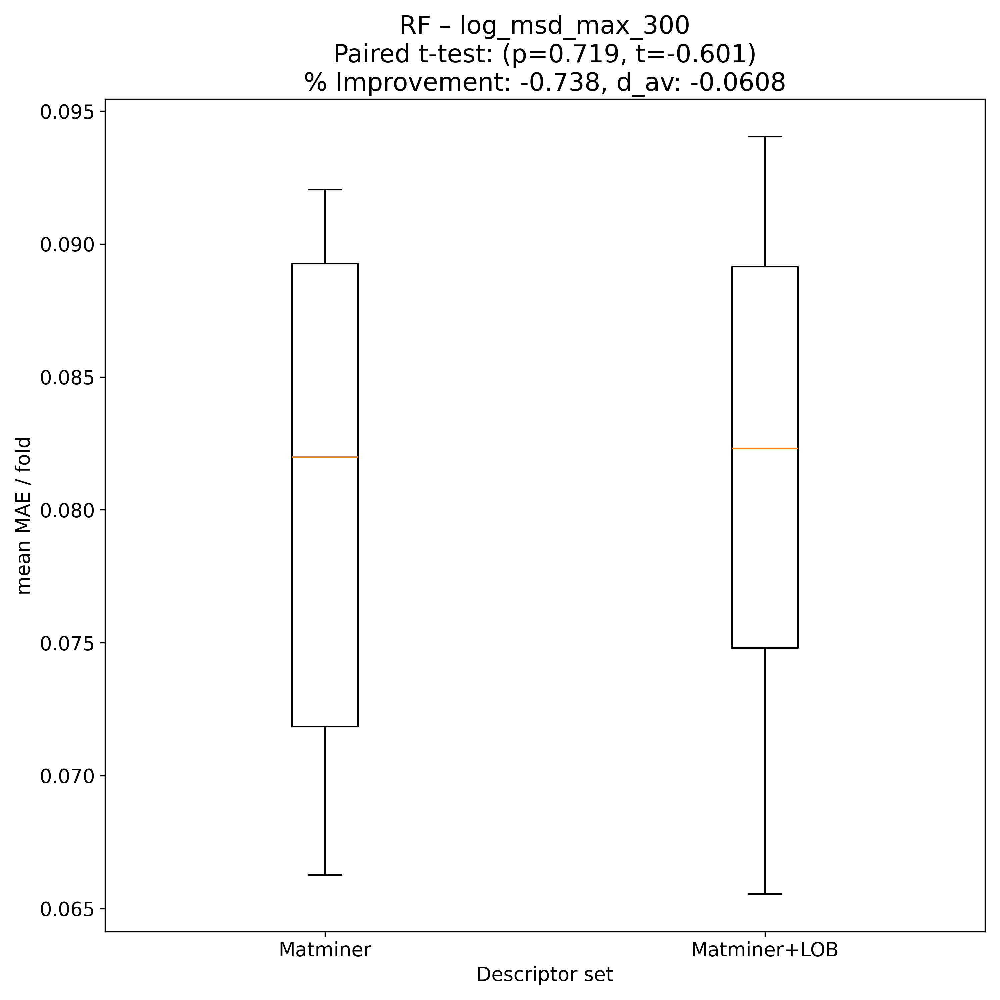

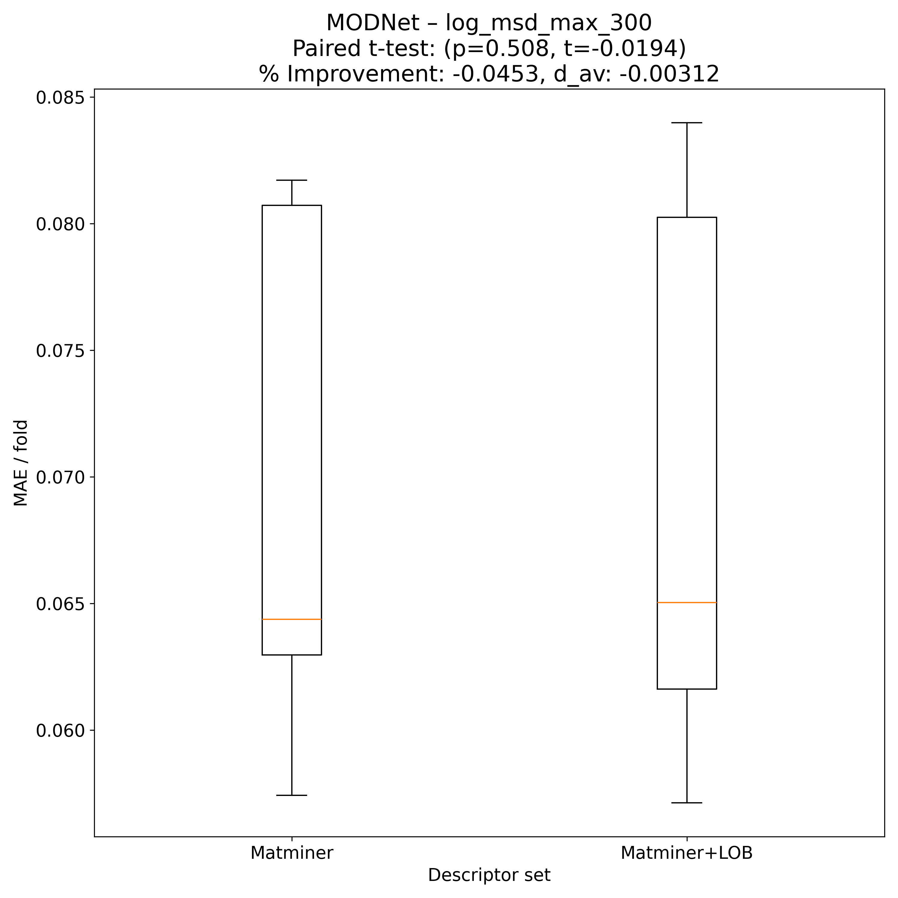

---

## Model Explainer

### PFI
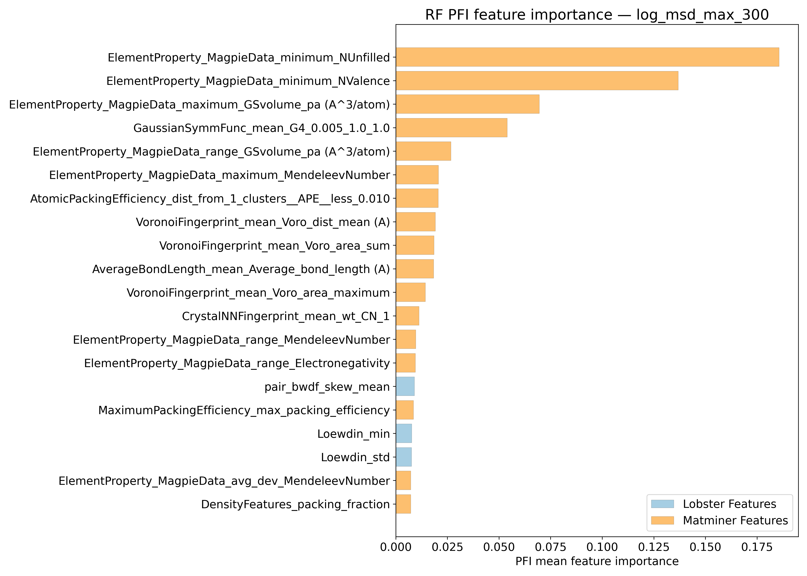
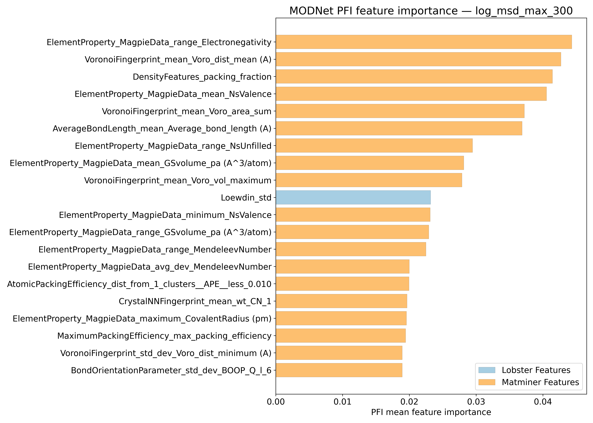

### SHAP
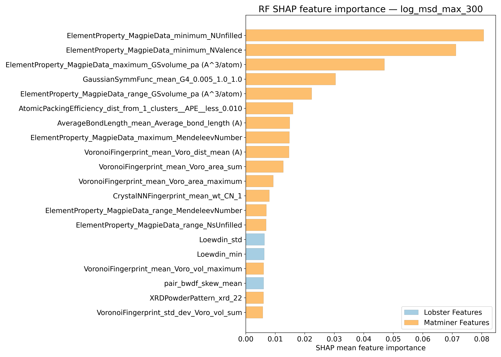
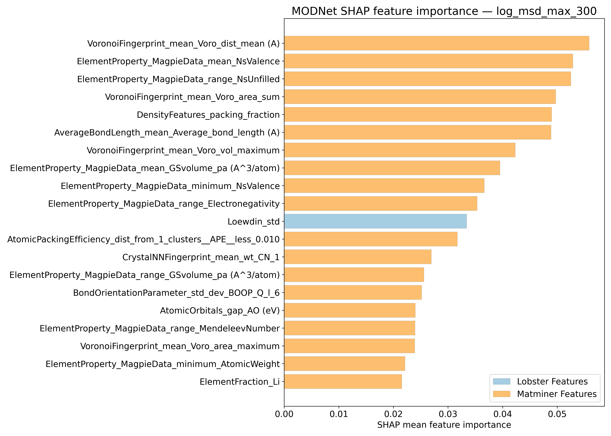

---

## Misc

### ARFS n-iter convergence checks

### MAE/ fold from 10-fold CV

Alternative visual summary of input data for t-test 

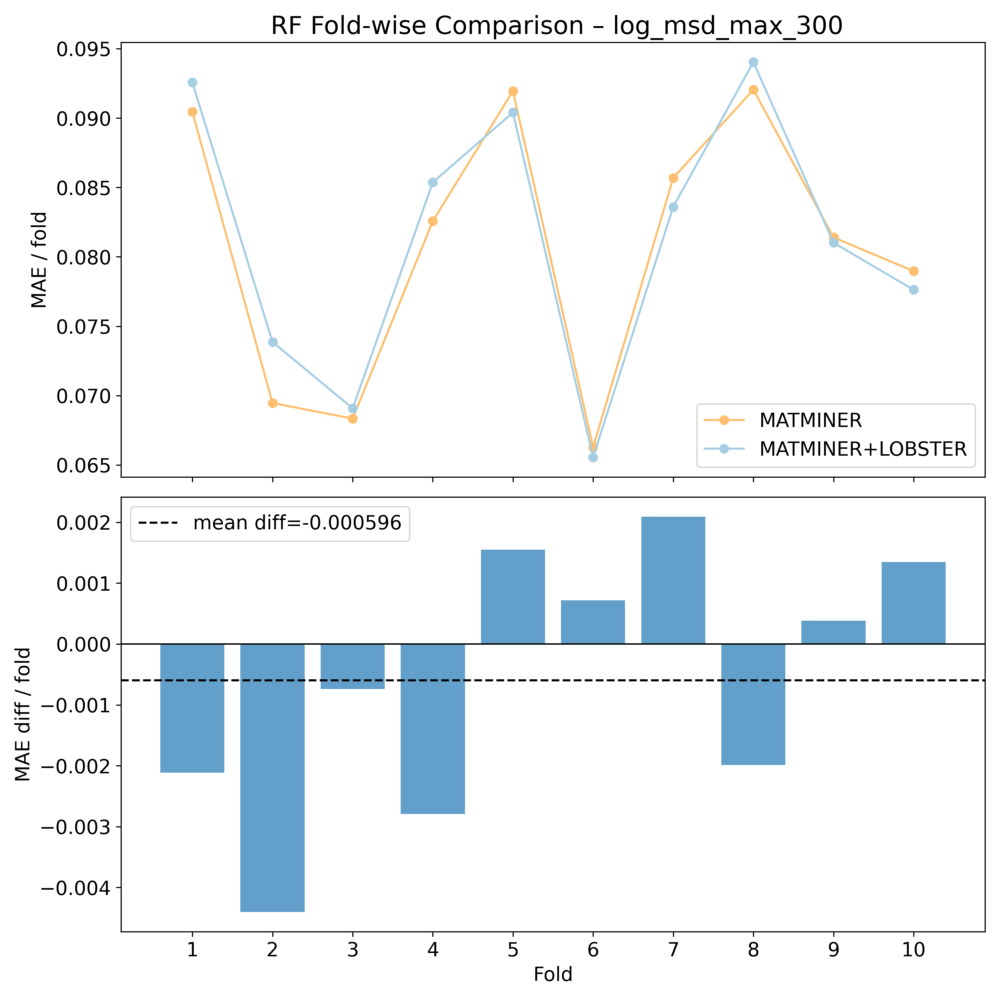

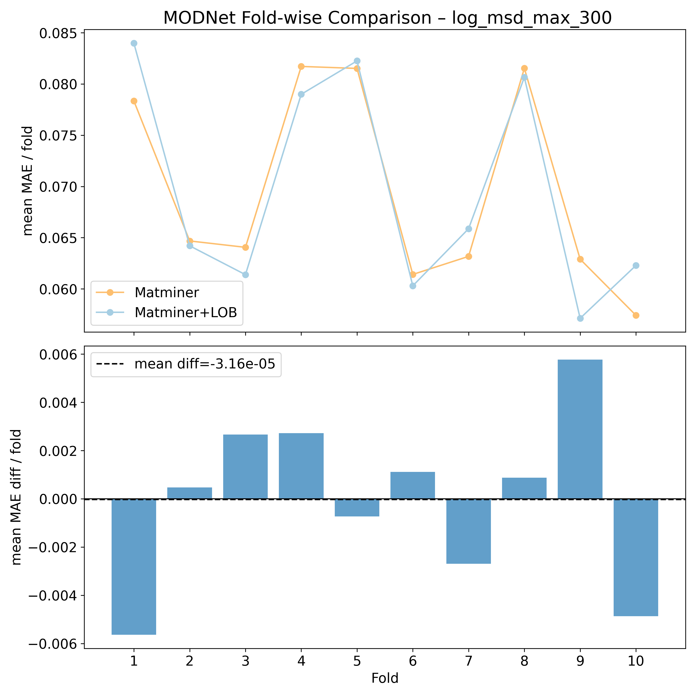

