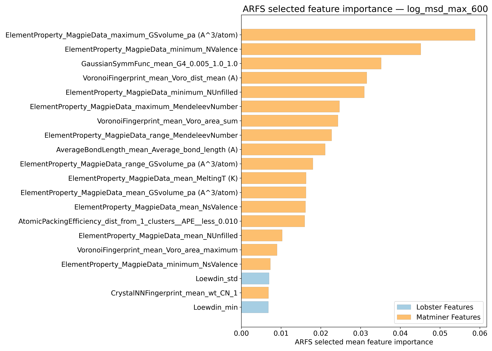
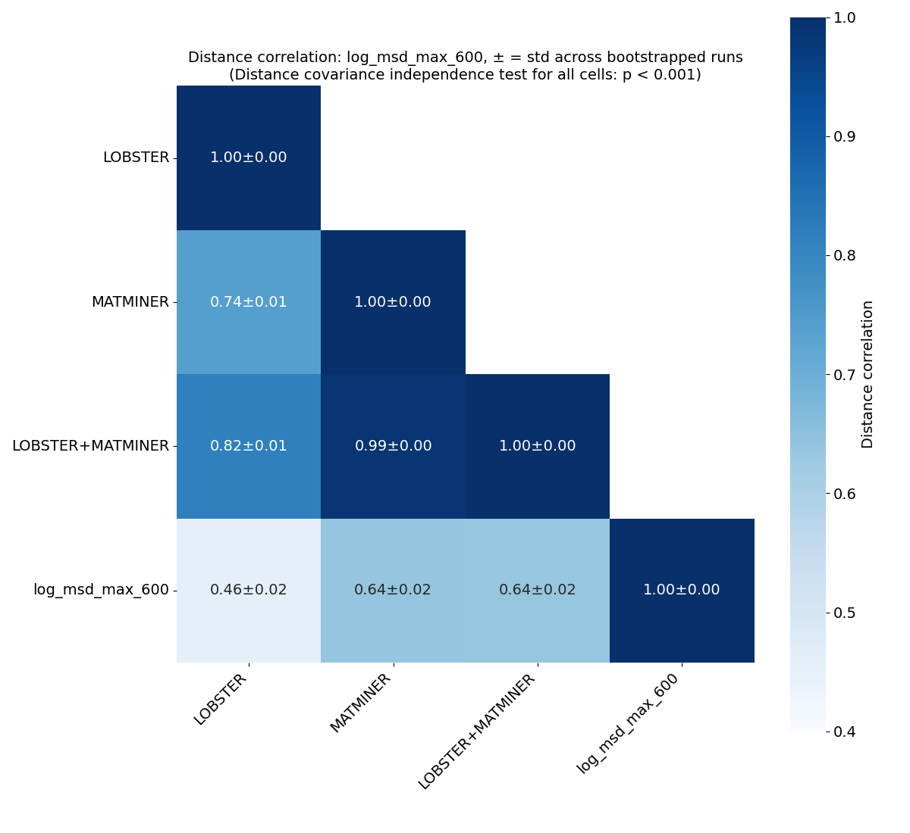
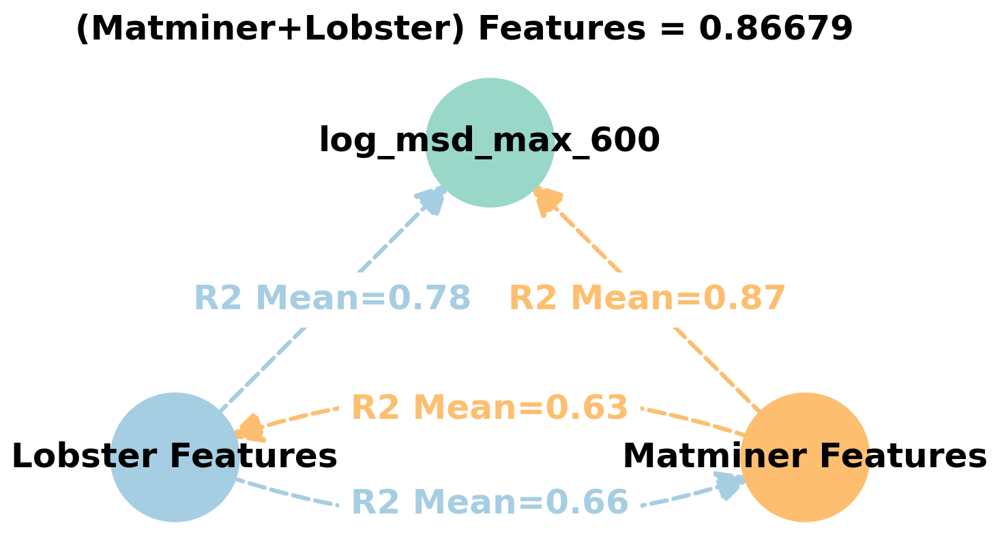
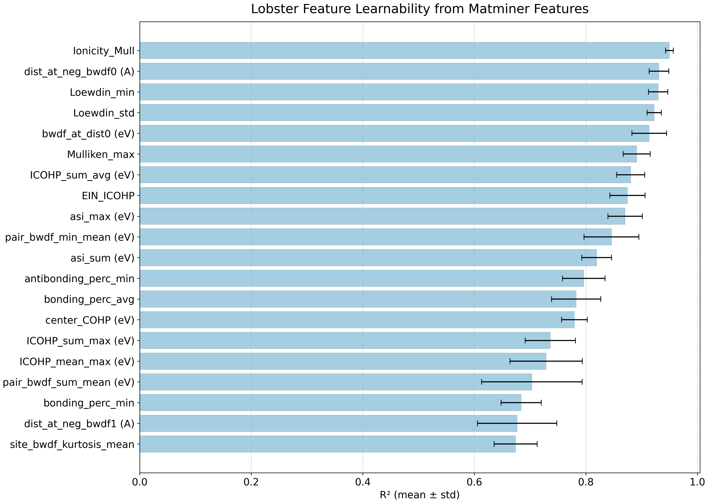
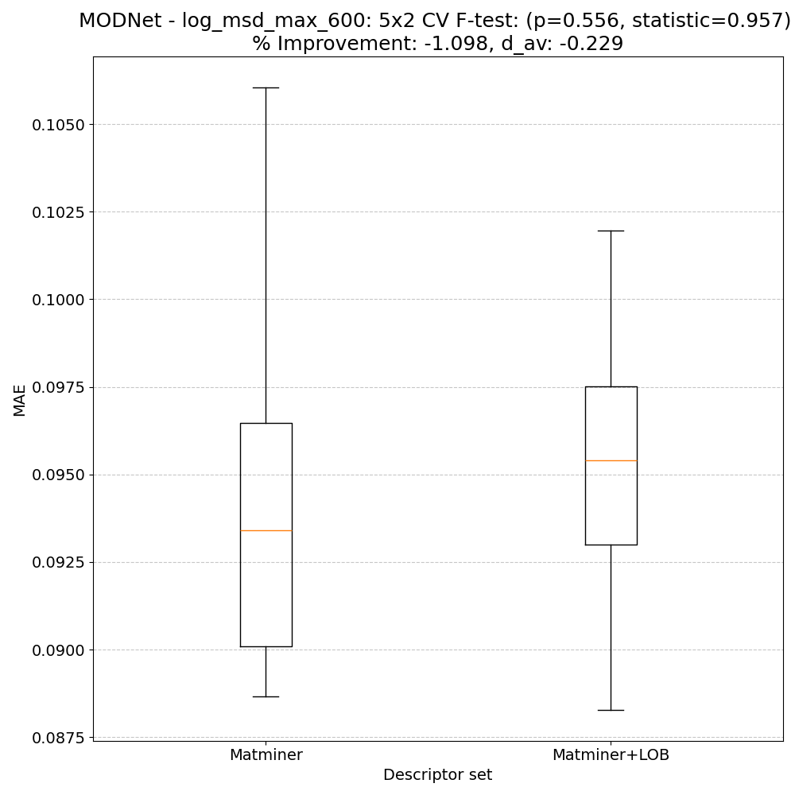
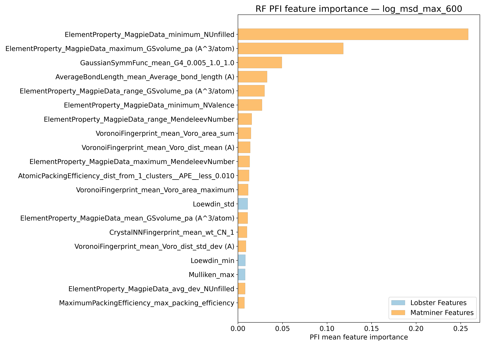
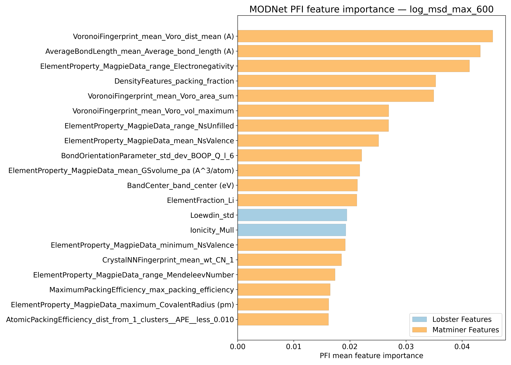
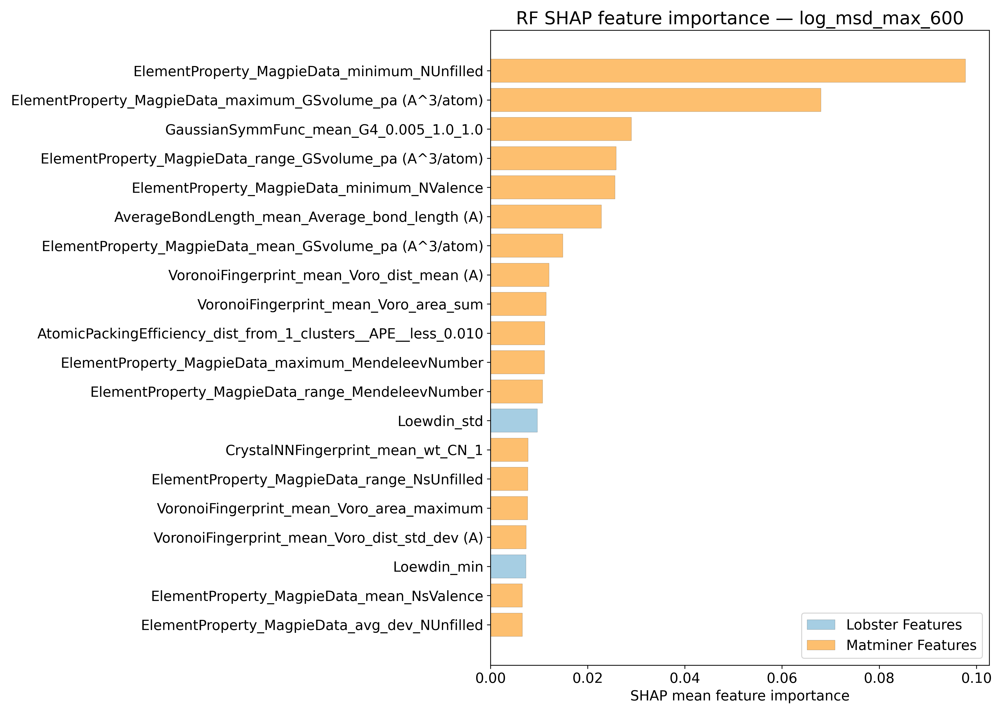

# Log10 (Max of mean Squared displacements @ 600K - Ų) - log_msd_max_600

## ARFS Top features

### ARFS selected descriptors

---

## Correlation analysis

### Distance correlation

### Dependency graphs

### Feature learnability

---

## Model performance

### 5-Fold CV Metrics overview

**RF - MATMINER**

|      |   train_rmse |   test_rmse |   train_errors |   test_errors |    train_r2 |   test_r2 |
|:-----|-------------:|------------:|---------------:|--------------:|------------:|----------:|
| mean |  0.04376     |  0.1195     |    0.0314      |    0.08616    | 0.98168     | 0.86228   |
| min  |  0.0431      |  0.1085     |    0.0309      |    0.0823     | 0.9809      | 0.8429    |
| max  |  0.0445      |  0.1309     |    0.0317      |    0.0909     | 0.9822      | 0.891     |
| std  |  0.000488262 |  0.00763702 |    0.000275681 |    0.00300905 | 0.000526878 | 0.0157951 |

**RF - MATMINER+LOBSTER**

|      |   train_rmse |   test_rmse |   train_errors |   test_errors |    train_r2 |   test_r2 |
|:-----|-------------:|------------:|---------------:|--------------:|------------:|----------:|
| mean |  0.04386     |  0.1193     |     0.0315     |     0.08612   | 0.98158     | 0.86272   |
| min  |  0.0431      |  0.1092     |     0.0311     |     0.0833    | 0.9805      | 0.8423    |
| max  |  0.0449      |  0.1311     |     0.032      |     0.0909    | 0.9824      | 0.8895    |
| std  |  0.000615142 |  0.00777509 |     0.00034641 |     0.0027542 | 0.000643117 | 0.0157036 |

**MODNet - MATMINER**

|      |   train_rmse |   test_rmse |   train_errors |   test_errors |   train_r2 |   test_r2 |
|:-----|-------------:|------------:|---------------:|--------------:|-----------:|----------:|
| mean |   0.04008    |  0.10534    |     0.0266     |    0.0727     | 0.98444    | 0.89246   |
| min  |   0.0348     |  0.0934     |     0.0231     |    0.069      | 0.9812     | 0.8595    |
| max  |   0.0441     |  0.1184     |     0.0301     |    0.0781     | 0.9884     | 0.9127    |
| std  |   0.00428084 |  0.00951264 |     0.00282984 |    0.00329059 | 0.00321907 | 0.0197307 |

**MODNet - MATMINER+LOBSTER**

|      |   train_rmse |   test_rmse |   train_errors |   test_errors |   train_r2 |   test_r2 |
|:-----|-------------:|------------:|---------------:|--------------:|-----------:|----------:|
| mean |    0.0451    |  0.1049     |     0.0292     |    0.07308    |  0.97944   | 0.89366   |
| min  |    0.035     |  0.0937     |     0.0235     |    0.0695     |  0.9603    | 0.8717    |
| max  |    0.0641    |  0.1168     |     0.0407     |    0.0764     |  0.9882    | 0.9109    |
| std  |    0.0105896 |  0.00877428 |     0.00652595 |    0.00251984 |  0.0102763 | 0.0168806 |

### Paired 5x2 CV F-test

**RF F-tests metrics comparsion**

**MODNet F-tests metrics comparsion**

**Summary**
|        |   F-statistic |   p-value |      d_av |   % Relative MAE improvement | Improved folds   |
|:-------|--------------:|----------:|----------:|-----------------------------:|:-----------------|
| RF     |      1.26863  |  0.418779 | -0.131777 |                    -0.225223 | 5/10             |
| MODNet |      0.957346 |  0.556467 | -0.228532 |                    -1.09779  | 4/10             |

---

## Model Explainer

### PFI

### SHAP

---

## Misc

### ARFS n-iter convergence checks

