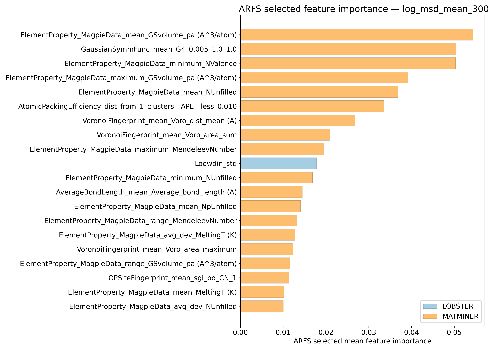
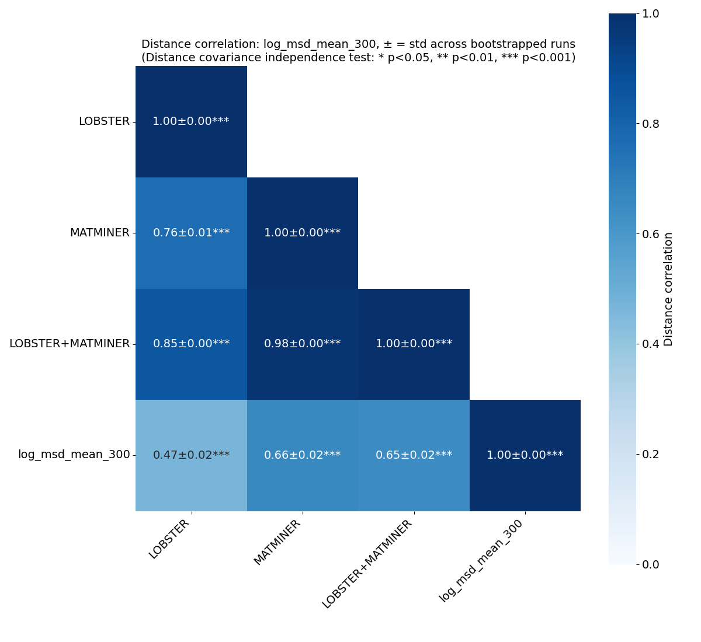
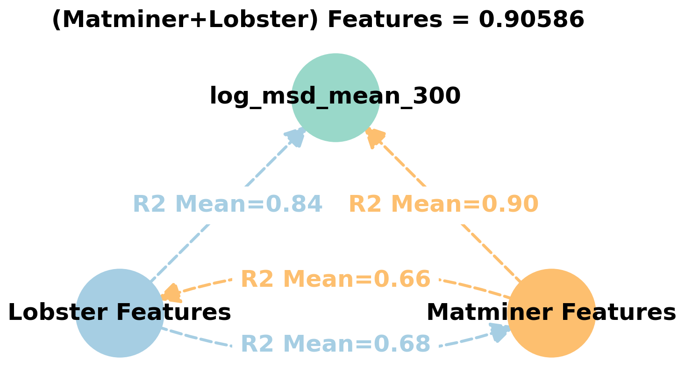
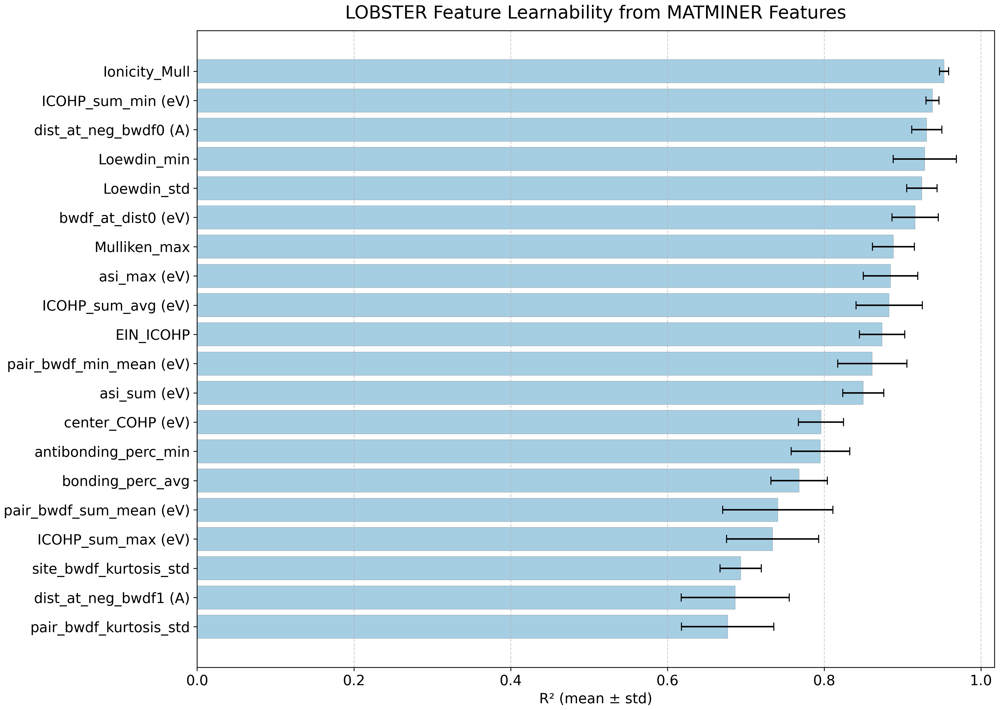
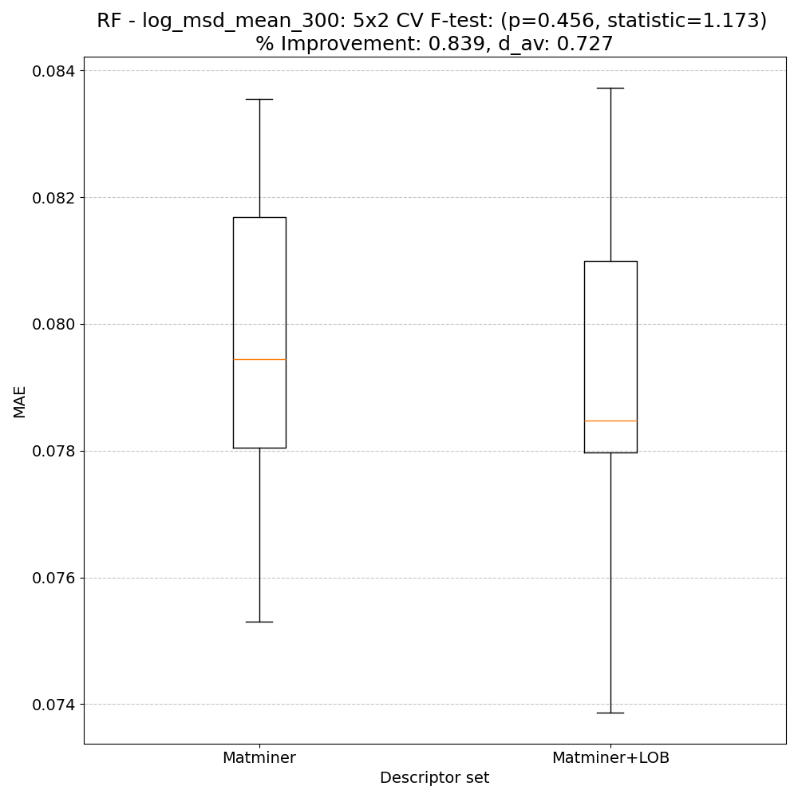
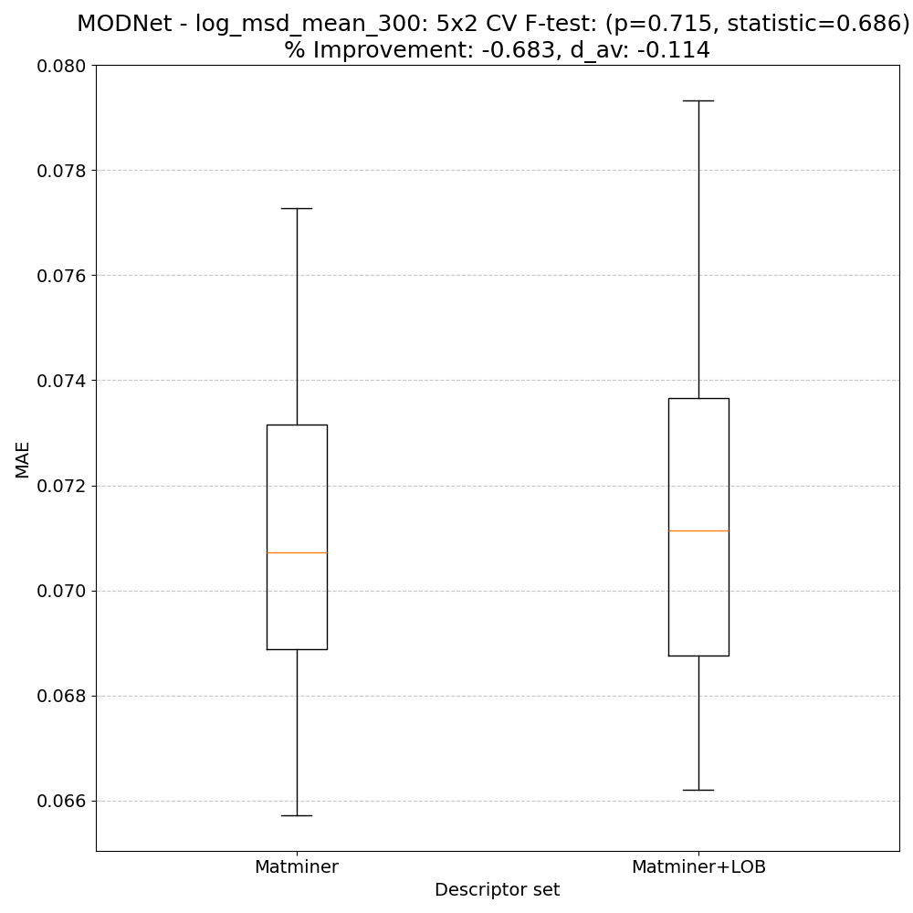
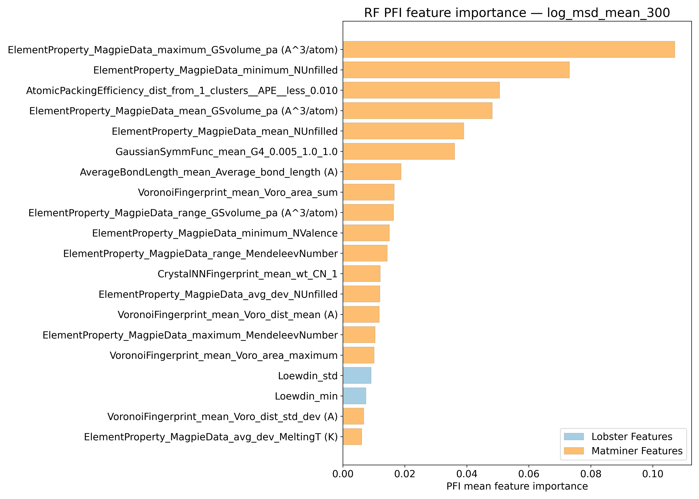
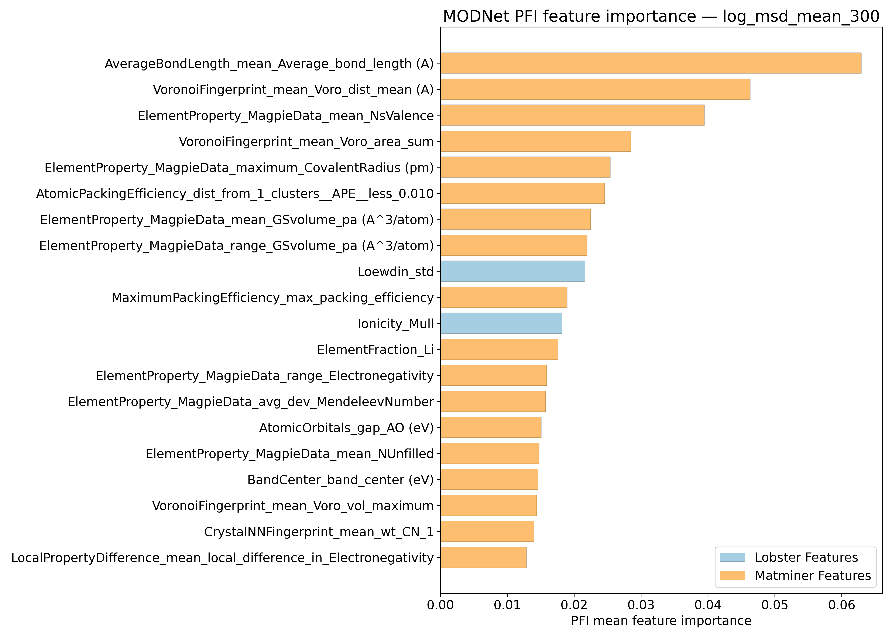
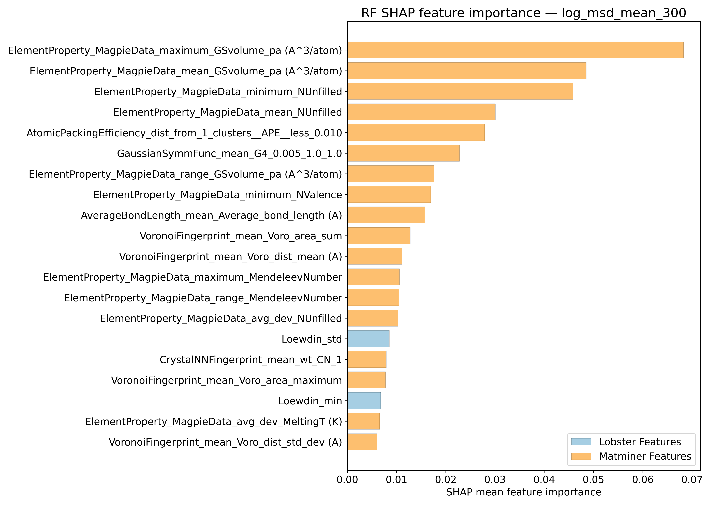
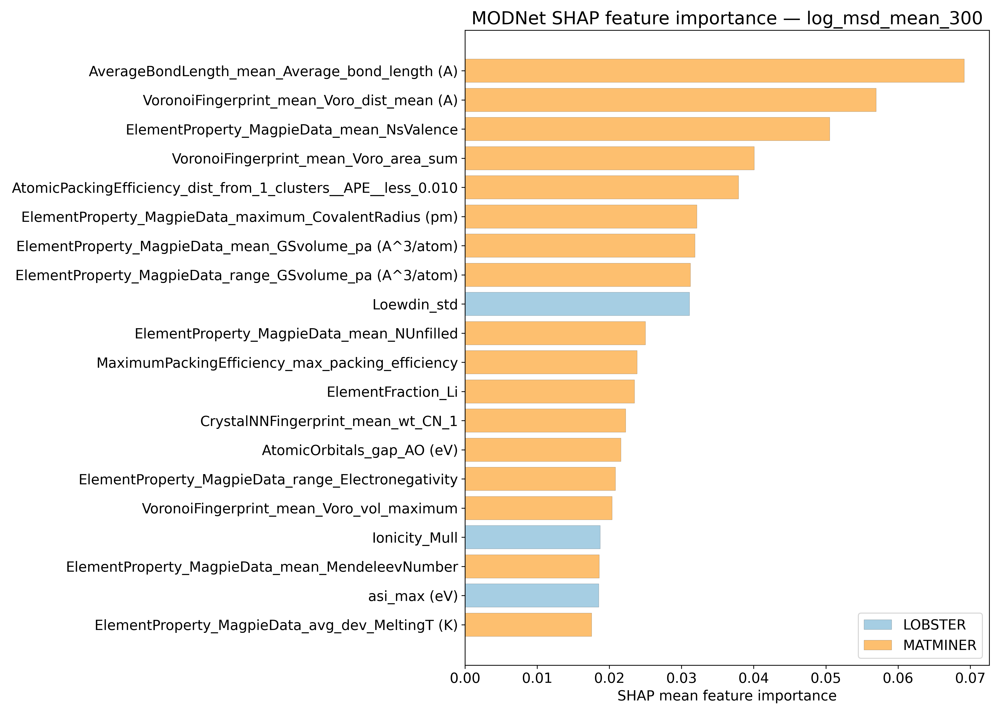

# Log10 (Mean of mean squared displacements @ 300K - Ų) - log_msd_mean_300

## ARFS Top features

### ARFS selected descriptors

---

## Correlation analysis

### Distance correlation

### Dependency graphs

### Feature learnability

---

## Model performance

### 5-Fold CV Metrics overview

**RF - MATMINER**

|      |   train_rmse |   test_rmse |   train_errors |   test_errors |    train_r2 |    test_r2 |
|:-----|-------------:|------------:|---------------:|--------------:|------------:|-----------:|
| mean |   0.03438    |  0.09482    |    0.02526     |    0.0691     | 0.98694     | 0.89996    |
| min  |   0.0336     |  0.0917     |    0.0249      |    0.0673     | 0.9863      | 0.8883     |
| max  |   0.0351     |  0.0976     |    0.0256      |    0.0707     | 0.9876      | 0.9102     |
| std  |   0.00059127 |  0.00243097 |    0.000272764 |    0.00128374 | 0.000504381 | 0.00750029 |

**RF - MATMINER+LOBSTER**

|      |   train_rmse |   test_rmse |   train_errors |   test_errors |    train_r2 |    test_r2 |
|:-----|-------------:|------------:|---------------:|--------------:|------------:|-----------:|
| mean |  0.03398     |  0.09252    |    0.02486     |    0.06722    | 0.98724     | 0.90478    |
| min  |  0.0335      |  0.0893     |    0.0246      |    0.0644     | 0.9867      | 0.8963     |
| max  |  0.0345      |  0.0948     |    0.0252      |    0.0694     | 0.9877      | 0.9116     |
| std  |  0.000386782 |  0.00189462 |    0.000215407 |    0.00208461 | 0.000349857 | 0.00535813 |

**MODNet - MATMINER**

|      |   train_rmse |   test_rmse |   train_errors |   test_errors |   train_r2 |   test_r2 |
|:-----|-------------:|------------:|---------------:|--------------:|-----------:|----------:|
| mean |   0.03542    |  0.0714     |     0.02422    |    0.05082    | 0.9858     |  0.943    |
| min  |   0.0268     |  0.0635     |     0.0182     |    0.0481     | 0.9791     |  0.9256   |
| max  |   0.0438     |  0.0808     |     0.0299     |    0.0547     | 0.9921     |  0.9527   |
| std  |   0.00565134 |  0.00595147 |     0.00390456 |    0.00239533 | 0.00432389 |  0.009571 |

**MODNet - MATMINER+LOBSTER**

|      |   train_rmse |   test_rmse |   train_errors |   test_errors |   train_r2 |    test_r2 |
|:-----|-------------:|------------:|---------------:|--------------:|-----------:|-----------:|
| mean |   0.04188    |  0.0739     |       0.02816  |    0.05338    | 0.9798     | 0.93904    |
| min  |   0.0322     |  0.066      |       0.0223   |    0.0476     | 0.9699     | 0.9256     |
| max  |   0.0525     |  0.0809     |       0.0357   |    0.0582     | 0.9884     | 0.9517     |
| std  |   0.00870021 |  0.00646003 |       0.005372 |    0.00424189 | 0.00822776 | 0.00970517 |

### Paired 5x2 CV F-test

**RF F-tests metrics comparsion**

**MODNet F-tests metrics comparsion**

**Summary**
|        |   F-statistic |   p-value |      d_av |   % Relative MAE improvement | Improved folds   |
|:-------|--------------:|----------:|----------:|-----------------------------:|:-----------------|
| RF     |      1.17322  |  0.456277 |  0.727147 |                     0.839289 | 7/10             |
| MODNet |      0.685544 |  0.714598 | -0.113917 |                    -0.682587 | 3/10             |

---

## Model Explainer

### PFI

### SHAP

---

## Misc

### ARFS n-iter convergence checks

