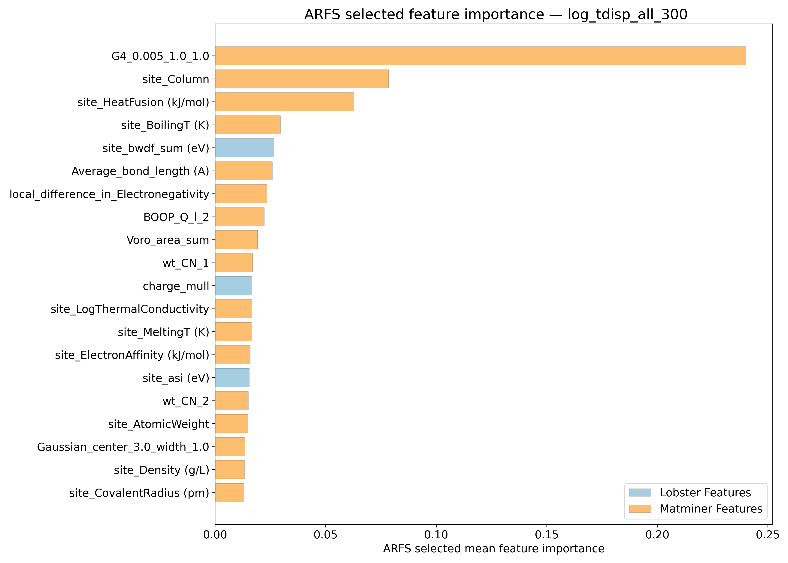
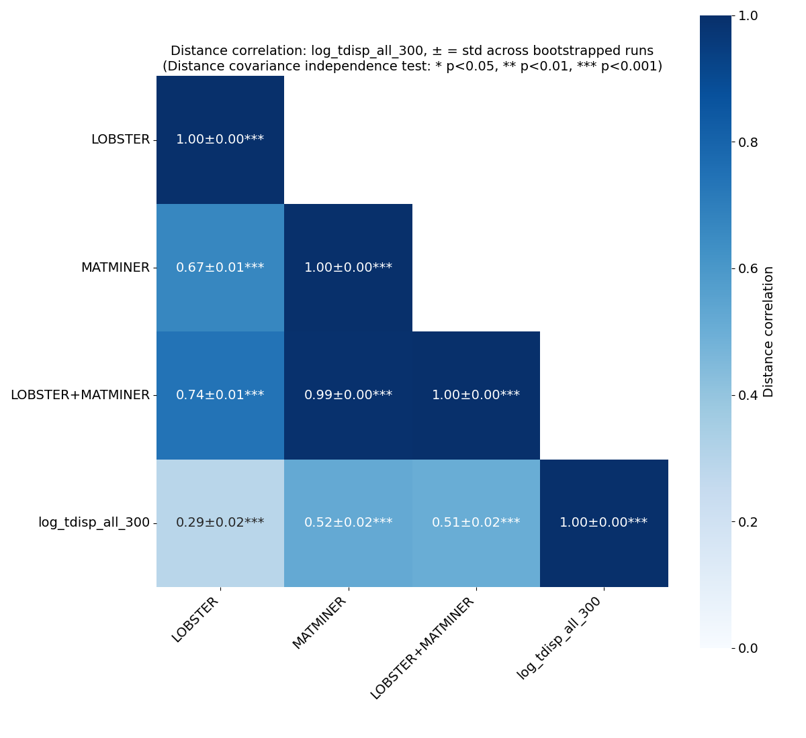
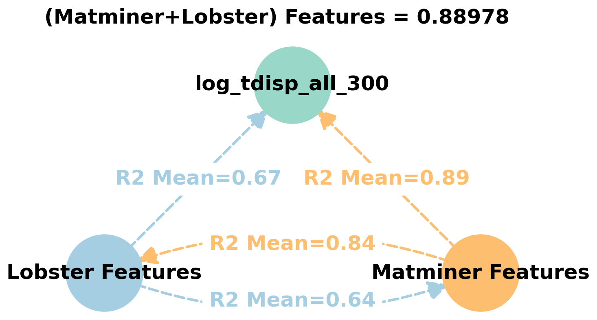
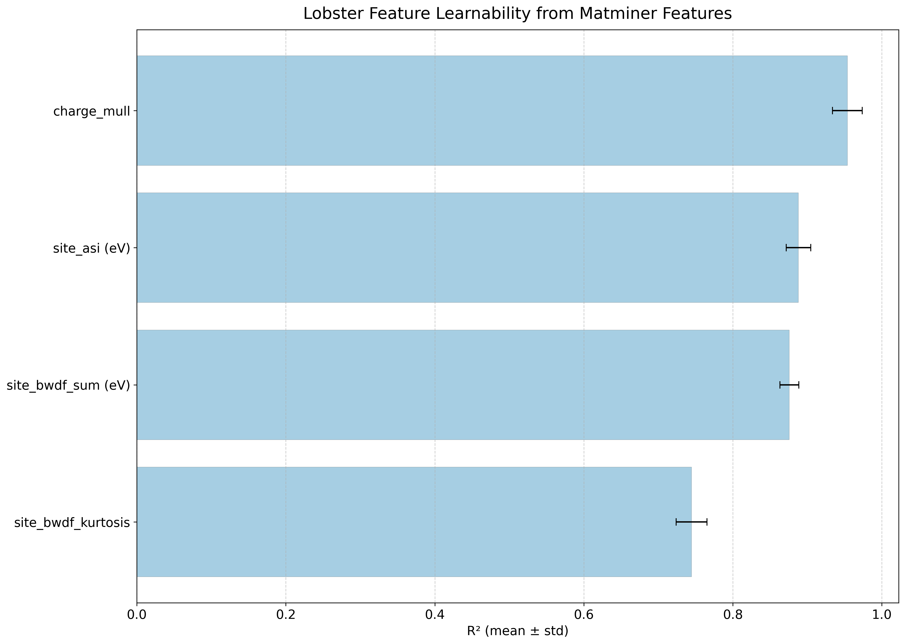
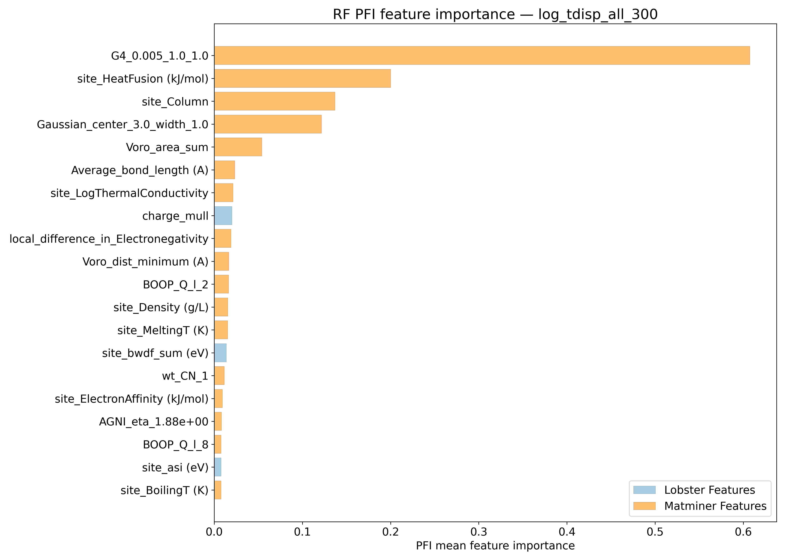
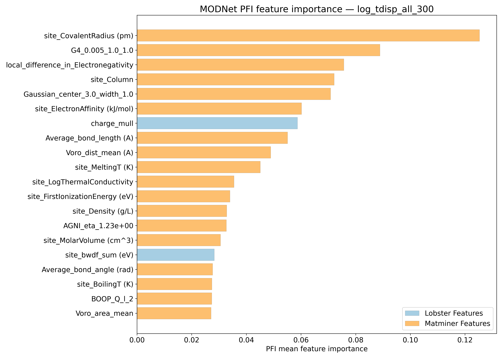
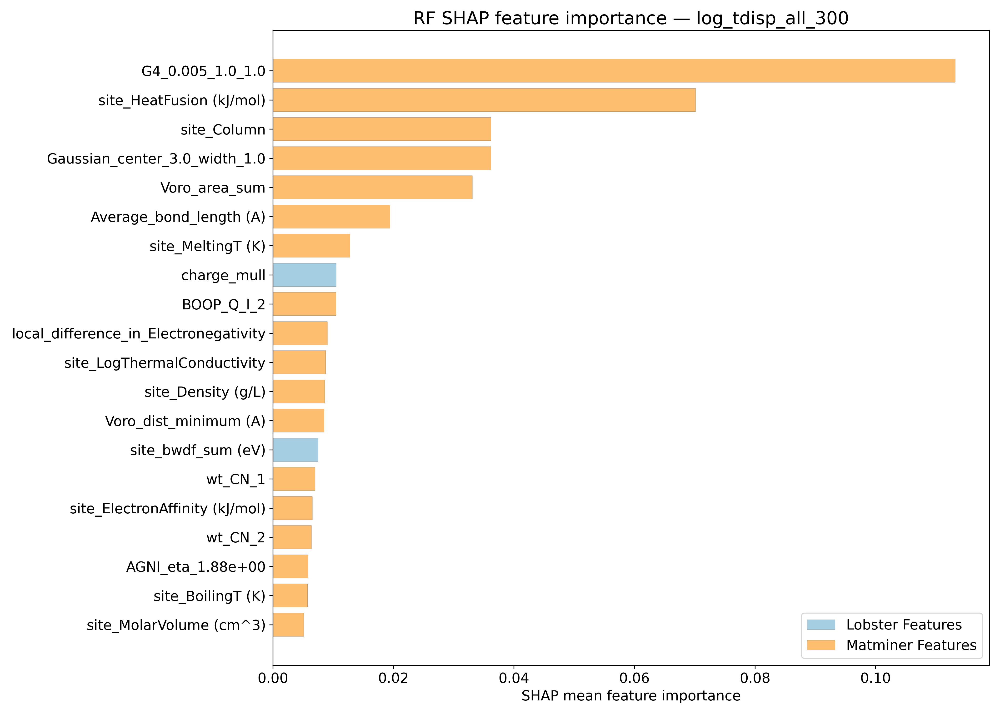
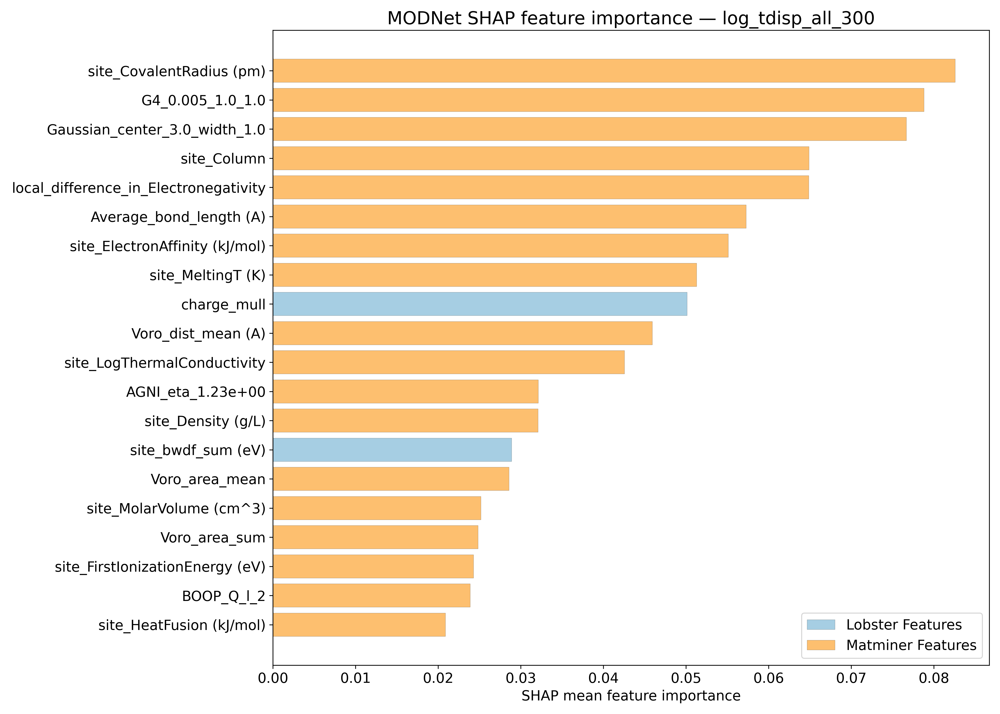
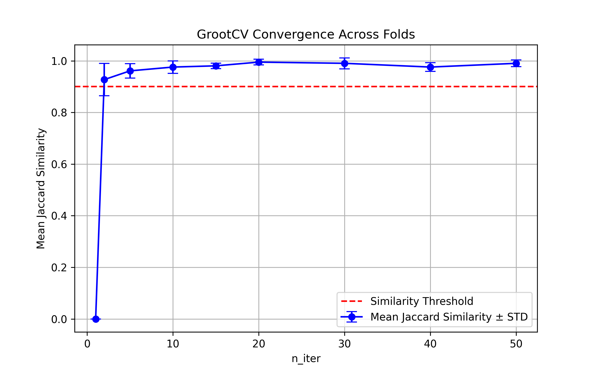

# Log10 (Mean squared displacements @ 300K - Ų) - log_tdisp_all_300

## ARFS Top features

### ARFS selected descriptors

---

## Correlation analysis

### Distance correlation

### Dependency graphs

### Feature learnability

---

## Model performance

### Metrics overview

RF - MATMINER

|      |   train_rmse |   test_rmse |   train_errors |   test_errors |    train_r2 |    test_r2 |
|:-----|-------------:|------------:|---------------:|--------------:|------------:|-----------:|
| mean |  0.0392      |   0.1047    |    0.02828     |   0.0758      | 0.98416     | 0.8867     |
| min  |  0.0387      |   0.1005    |    0.0281      |   0.0749      | 0.9838      | 0.8736     |
| max  |  0.0395      |   0.1094    |    0.0285      |   0.0766      | 0.9846      | 0.8983     |
| std  |  0.000275681 |   0.0039436 |    0.000183303 |   0.000663325 | 0.000272764 | 0.00860093 |

RF - MATMINER+LOBSTER

|      |   train_rmse |   test_rmse |   train_errors |   test_errors |    train_r2 |    test_r2 |
|:-----|-------------:|------------:|---------------:|--------------:|------------:|-----------:|
| mean |   0.03856    |  0.10278    |    0.02774     |     0.0745    | 0.98466     | 0.89086    |
| min  |   0.0381     |  0.0982     |    0.0275      |     0.0726    | 0.9845      | 0.878      |
| max  |   0.0389     |  0.1089     |    0.028       |     0.0761    | 0.9851      | 0.9012     |
| std  |   0.00026533 |  0.00447902 |    0.000185472 |     0.0012474 | 0.000233238 | 0.00893702 |

MODNet - MATMINER

|      |   train_rmse |   test_rmse |   train_errors |   test_errors |   train_r2 |    test_r2 |
|:-----|-------------:|------------:|---------------:|--------------:|-----------:|-----------:|
| mean |   0.0442     |  0.08764    |       0.02846  |    0.05978    |  0.9794    | 0.92056    |
| min  |   0.037      |  0.0818     |       0.0237   |    0.0576     |  0.9689    | 0.9124     |
| max  |   0.0547     |  0.0939     |       0.035    |    0.064      |  0.986     | 0.9333     |
| std  |   0.00655286 |  0.00423537 |       0.004294 |    0.00249912 |  0.0062919 | 0.00767192 |

MODNet - MATMINER+LOBSTER

|      |   train_rmse |   test_rmse |   train_errors |   test_errors |   train_r2 |    test_r2 |
|:-----|-------------:|------------:|---------------:|--------------:|-----------:|-----------:|
| mean |   0.03956    |  0.08474    |     0.02586    |    0.05774    | 0.98358    | 0.92576    |
| min  |   0.0318     |  0.0809     |     0.0208     |    0.0561     | 0.9764     | 0.9186     |
| max  |   0.048      |  0.0875     |     0.0318     |    0.059      | 0.9895     | 0.9336     |
| std  |   0.00558591 |  0.00288901 |     0.00392815 |    0.00113947 | 0.00448616 | 0.00561662 |

---

## Model Explainer

### PFI

### SHAP

---

## Misc

### ARFS n-iter convergence checks

