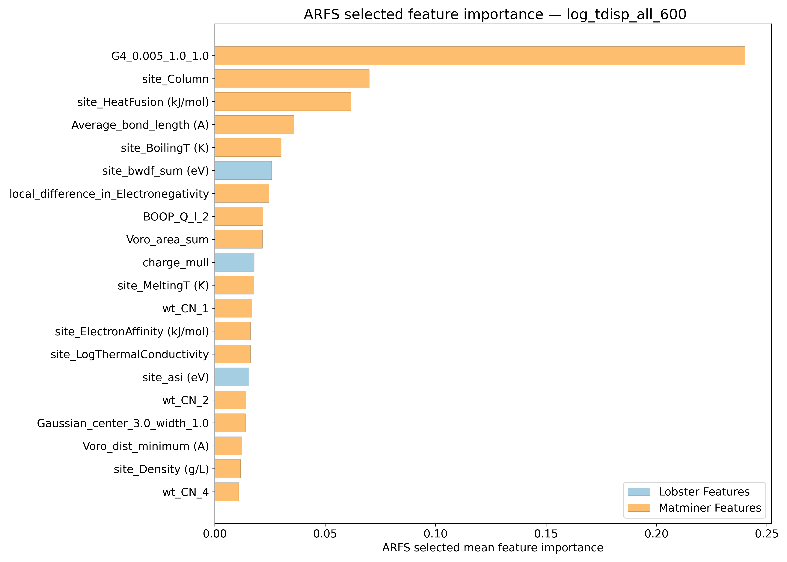
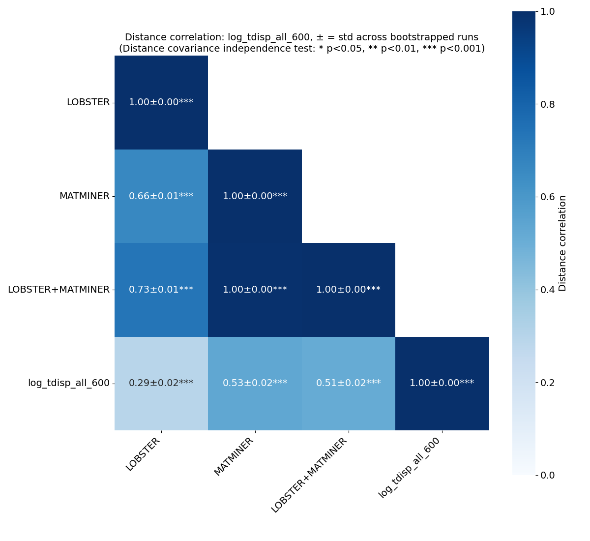
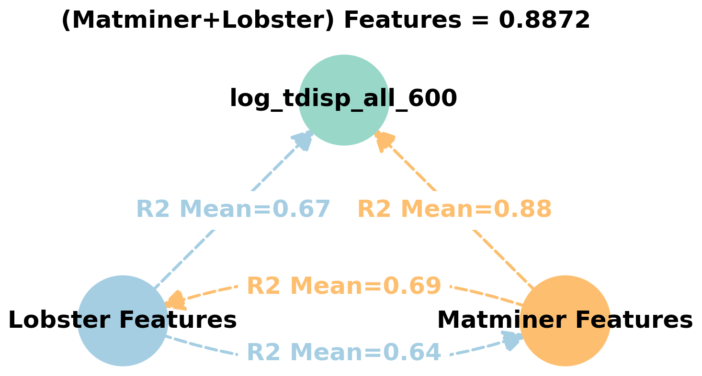
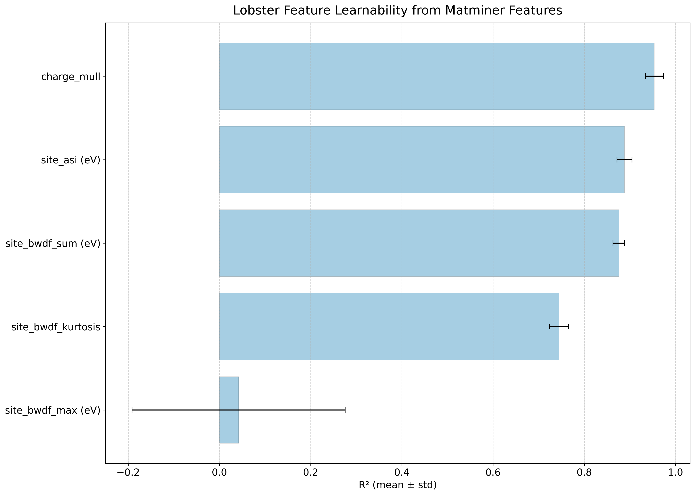
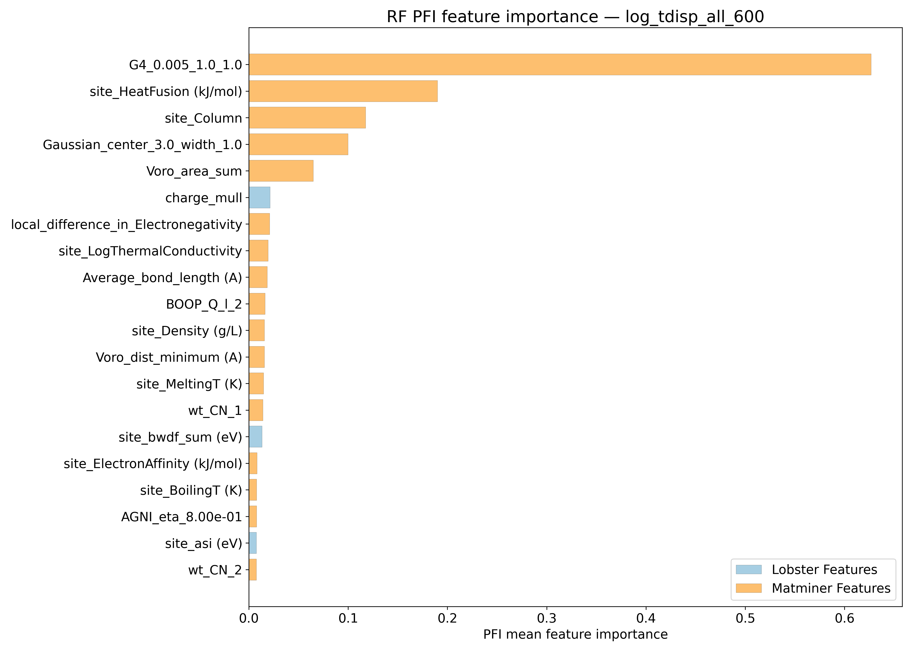
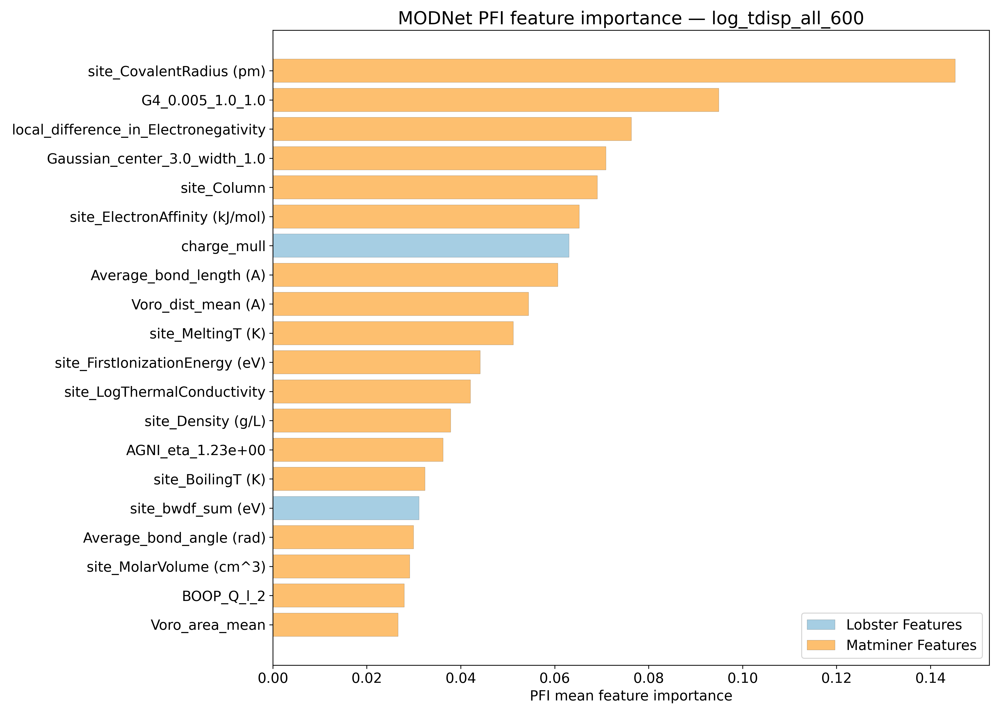
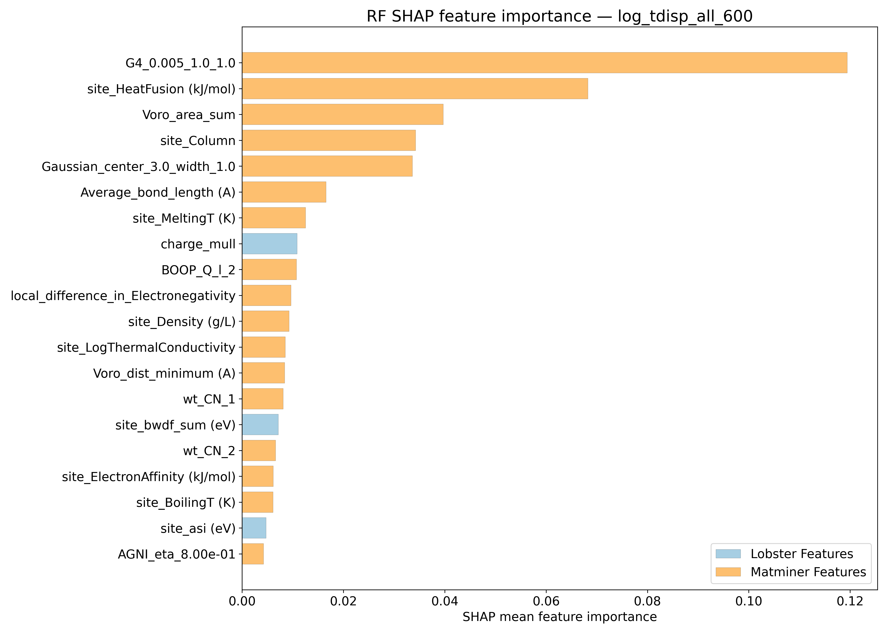
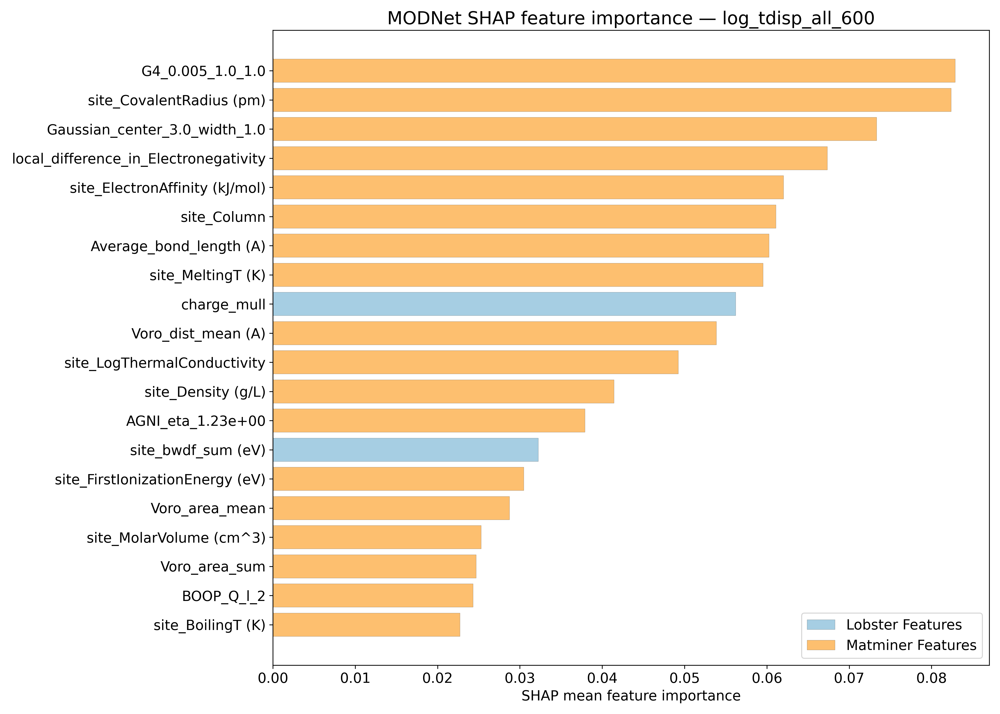
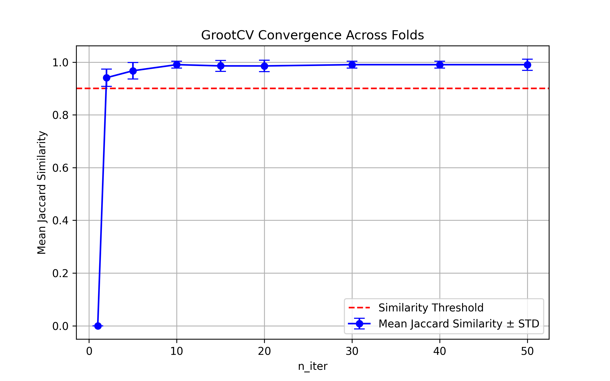

# Log10 (Mean Squared displacements @ 600K - Ų) - log_tdisp_all_600

## ARFS Top features

### ARFS selected descriptors

---

## Correlation analysis

### Distance correlation

### Dependency graphs

### Feature learnability

---

## Model performance

### Metrics overview

RF - MATMINER

|      |   train_rmse |   test_rmse |   train_errors |   test_errors |   train_r2 |    test_r2 |
|:-----|-------------:|------------:|---------------:|--------------:|-----------:|-----------:|
| mean |  0.04068     |  0.1094     |    0.0294      |   0.07912     |  0.98384   | 0.88286    |
| min  |  0.0402      |  0.1046     |    0.0292      |   0.0782      |  0.9836    | 0.8683     |
| max  |  0.041       |  0.1148     |    0.0297      |   0.0806      |  0.9843    | 0.8961     |
| std  |  0.000263818 |  0.00433082 |    0.000178885 |   0.000851822 |  0.0002498 | 0.00965766 |

RF - MATMINER+LOBSTER

|      |   train_rmse |   test_rmse |   train_errors |   test_errors |    train_r2 |    test_r2 |
|:-----|-------------:|------------:|---------------:|--------------:|------------:|-----------:|
| mean |  0.03996     |  0.10752    |    0.02882     |    0.07778    | 0.9844      | 0.88686    |
| min  |  0.0394      |  0.1021     |    0.0285      |    0.076      | 0.9839      | 0.8716     |
| max  |  0.0404      |  0.1134     |    0.0292      |    0.0798     | 0.9849      | 0.8982     |
| std  |  0.000344093 |  0.00473768 |    0.000231517 |    0.00136147 | 0.000316228 | 0.00964626 |

MODNet - MATMINER

|      |   train_rmse |   test_rmse |   train_errors |   test_errors |   train_r2 |    test_r2 |
|:-----|-------------:|------------:|---------------:|--------------:|-----------:|-----------:|
| mean |   0.0482     |  0.0915     |      0.03114   |    0.06256    | 0.9769     | 0.91816    |
| min  |   0.0378     |  0.0879     |      0.024     |    0.0594     | 0.9683     | 0.9122     |
| max  |   0.0567     |  0.0946     |      0.0366    |    0.0648     | 0.9862     | 0.9236     |
| std  |   0.00643211 |  0.00229695 |      0.0042772 |    0.00192104 | 0.00610835 | 0.00431815 |

MODNet - MATMINER+LOBSTER

|      |   train_rmse |   test_rmse |   train_errors |   test_errors |   train_r2 |    test_r2 |
|:-----|-------------:|------------:|---------------:|--------------:|-----------:|-----------:|
| mean |     0.0428   |  0.0877     |     0.02782    |    0.06026    | 0.98184    | 0.92482    |
| min  |     0.0371   |  0.084      |     0.0237     |    0.0584     | 0.974      | 0.9174     |
| max  |     0.0519   |  0.092      |     0.0342     |    0.062      | 0.9866     | 0.9313     |
| std  |     0.005571 |  0.00294686 |     0.00384156 |    0.00129861 | 0.00469067 | 0.00508228 |

---

## Model Explainer

### PFI

### SHAP

---

## Misc

### ARFS n-iter convergence checks

