# Max projected force constant - eV/Ų - max_pfc

## ARFS Top features

### ARFS selected descriptors

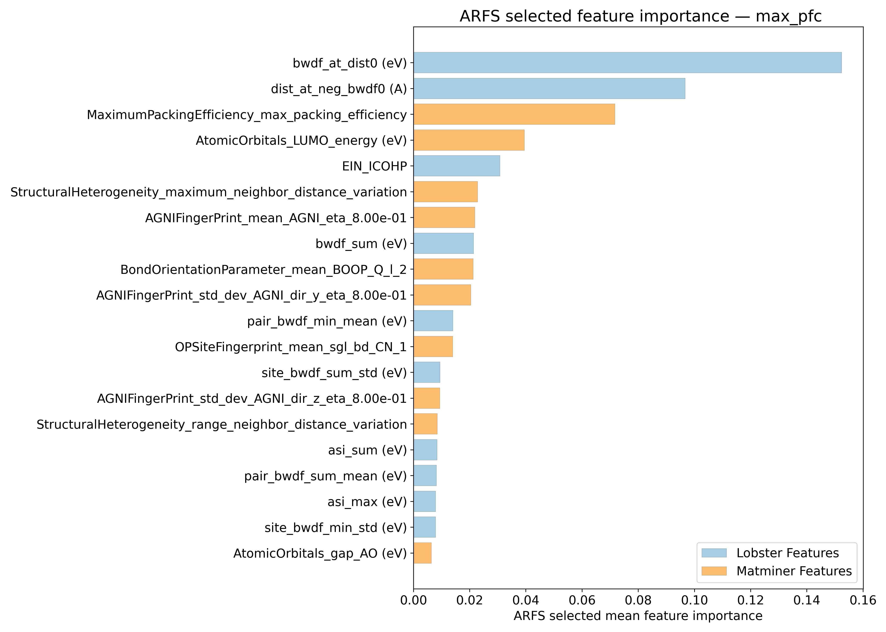

---

## Correlation analysis

### Distance correlation

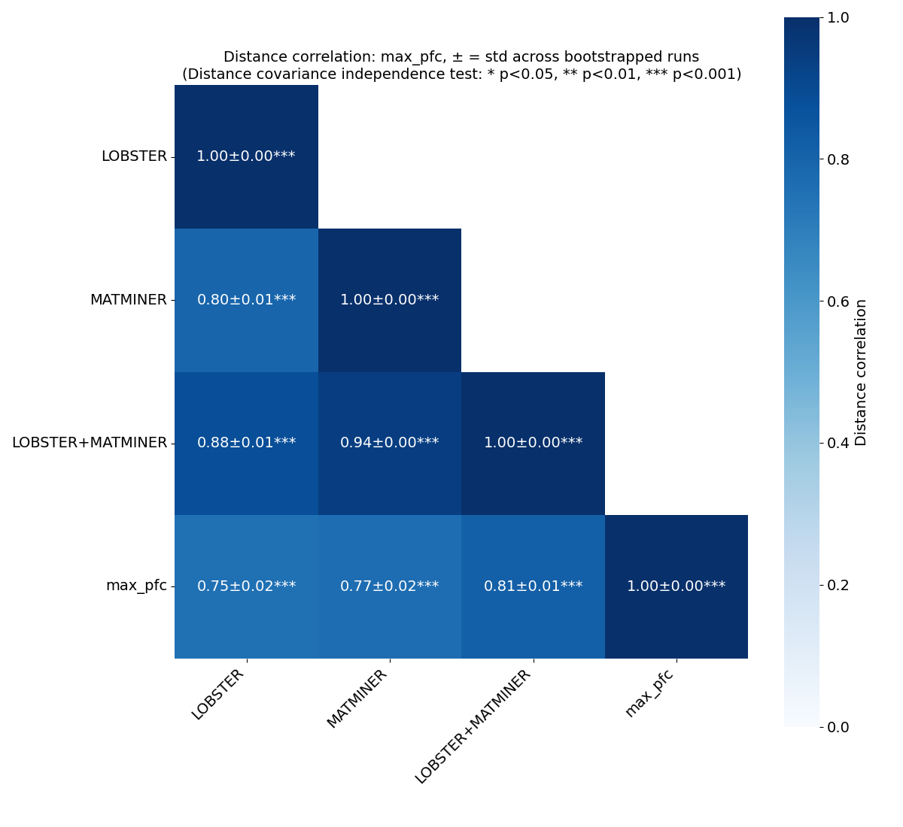

### Dependency graphs

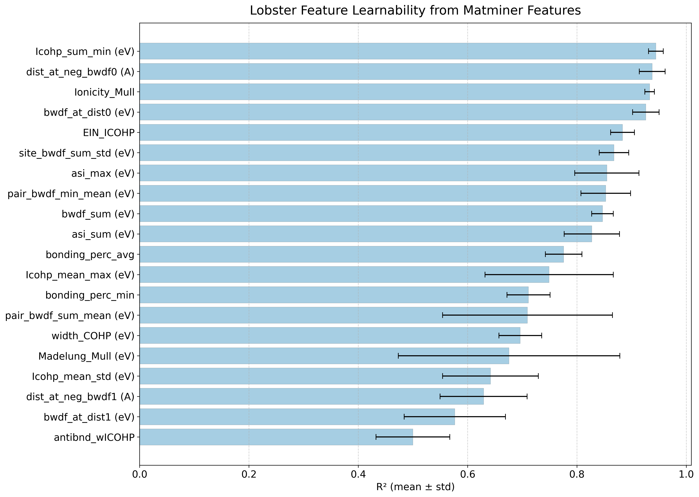

### Feature learnability

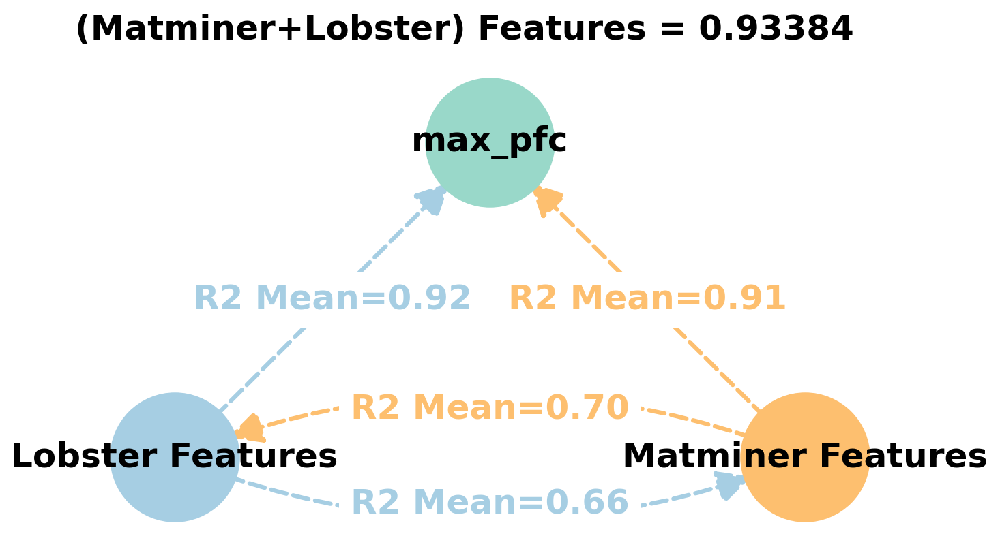

---

## Model performance

### 5-Fold CV Metrics overview

**RF - MATMINER**

|      |   train_rmse |   test_rmse |   train_errors |   test_errors |    train_r2 |   test_r2 |
|:-----|-------------:|------------:|---------------:|--------------:|------------:|----------:|
| mean |    1.26746   |    3.2235   |      0.60954   |      1.5819   | 0.98748     | 0.91782   |
| min  |    1.2147    |    2.5683   |      0.5769    |      1.3875   | 0.9863      | 0.8895    |
| max  |    1.3115    |    3.8209   |      0.6353    |      1.8937   | 0.9888      | 0.9398    |
| std  |    0.0341855 |    0.448041 |      0.0211138 |      0.177118 | 0.000823165 | 0.0177324 |

**RF - MATMINER+LOBSTER**

|      |   train_rmse |   test_rmse |   train_errors |   test_errors |    train_r2 |   test_r2 |
|:-----|-------------:|------------:|---------------:|--------------:|------------:|----------:|
| mean |    1.04222   |    2.81932  |      0.517     |      1.38458  | 0.99152     | 0.93766   |
| min  |    1.0028    |    2.1238   |      0.4945    |      1.1337   | 0.9898      | 0.9102    |
| max  |    1.0993    |    3.8678   |      0.5415    |      1.6556   | 0.9924      | 0.9589    |
| std  |    0.0365495 |    0.610617 |      0.0176691 |      0.186017 | 0.000919565 | 0.0176187 |

**MODNet - MATMINER**

|      |   train_rmse |   test_rmse |   train_errors |   test_errors |   train_r2 |   test_r2 |
|:-----|-------------:|------------:|---------------:|--------------:|-----------:|----------:|
| mean |     0.83262  |    2.77926  |       0.39168  |      1.24292  | 0.99446    | 0.93942   |
| min  |     0.6971   |    2.0483   |       0.3352   |      0.9425   | 0.9924     | 0.9259    |
| max  |     0.9503   |    3.411    |       0.4439   |      1.4445   | 0.9963     | 0.9617    |
| std  |     0.098408 |    0.469912 |       0.035818 |      0.184412 | 0.00149613 | 0.0124796 |

**MODNet - MATMINER+LOBSTER**

|      |   train_rmse |   test_rmse |   train_errors |   test_errors |   train_r2 |   test_r2 |
|:-----|-------------:|------------:|---------------:|--------------:|-----------:|----------:|
| mean |    0.67196   |    2.35222  |      0.35394   |      1.05676  | 0.99644    | 0.95566   |
| min  |    0.5659    |    1.4829   |      0.3105    |      0.7896   | 0.9953     | 0.935     |
| max  |    0.7489    |    3.1745   |      0.4012    |      1.2709   | 0.9976     | 0.9799    |
| std  |    0.0676659 |    0.610906 |      0.0328327 |      0.188289 | 0.00081388 | 0.0171926 |

### Corrected resampled t-test on 10-fold CV 

**Summary**
|        |   t_stat |    p_value | significance_stars   |     d_av |   rel_improvement |   percent_folds_improved |
|:-------|---------:|-----------:|:---------------------|---------:|------------------:|-------------------------:|
| RF     |  1.82629 | 0.0505445  |                      | 0.809559 |           13.3466 |                       80 |
| MODNet |  3.23538 | 0.00511702 | **                   | 1.06413  |           19.4461 |                      100 |

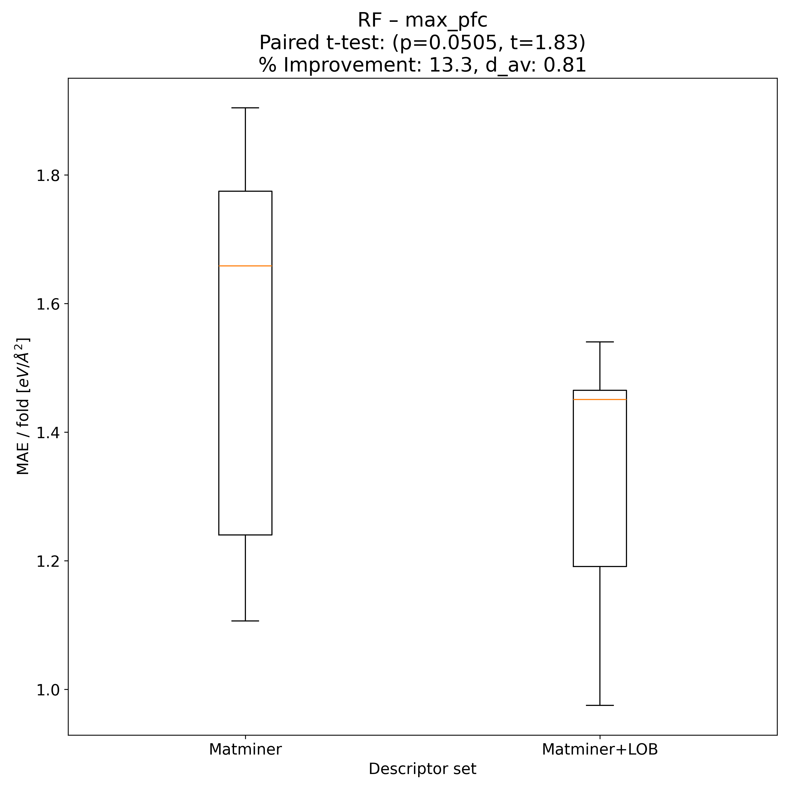

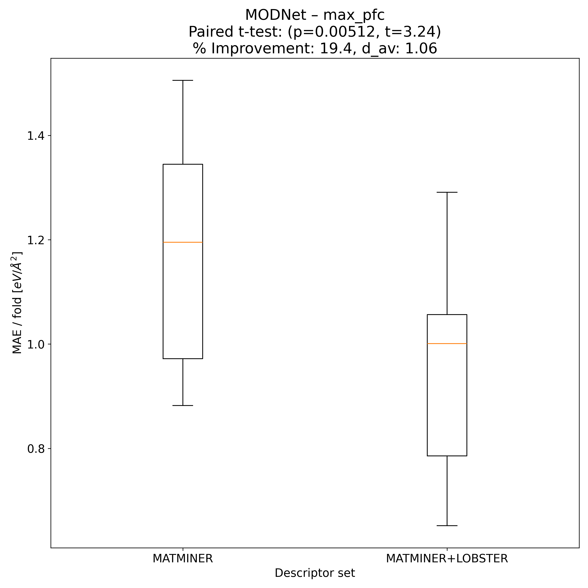

---

## Model Explainer

### PFI
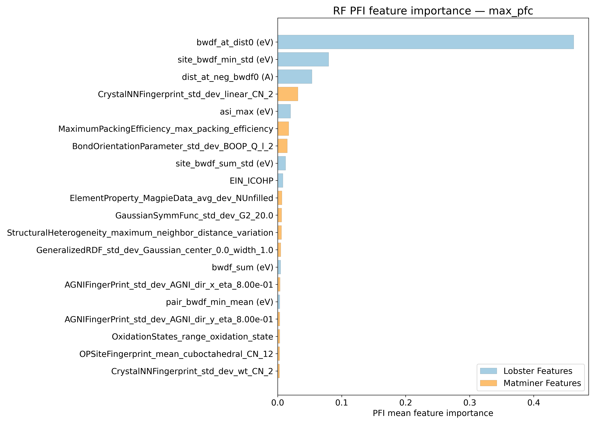
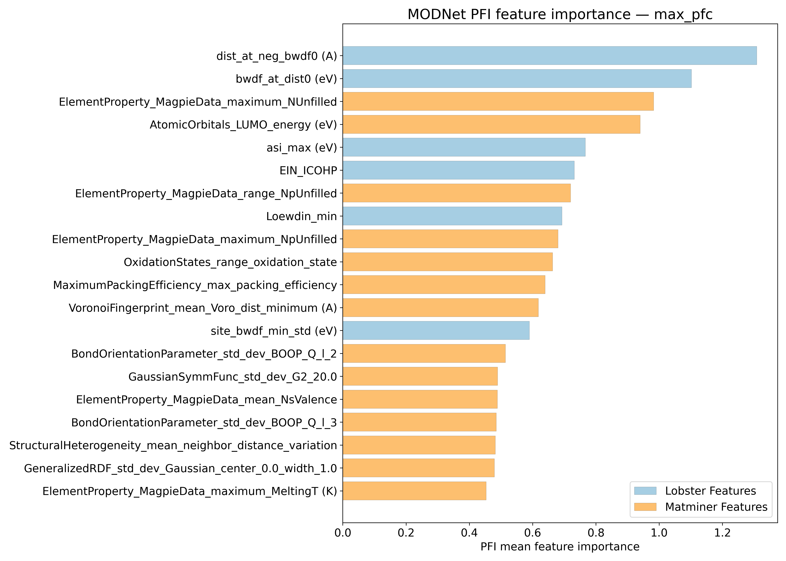

### SHAP
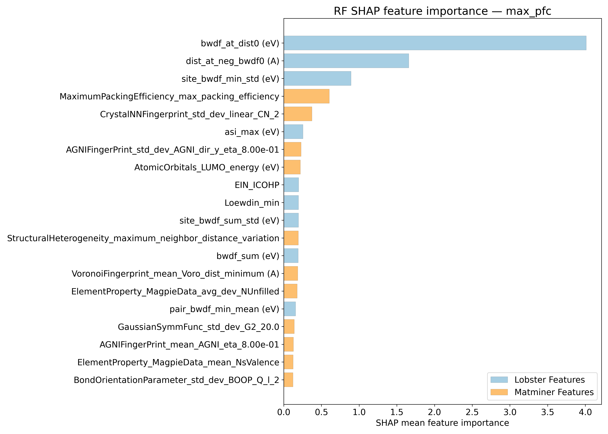
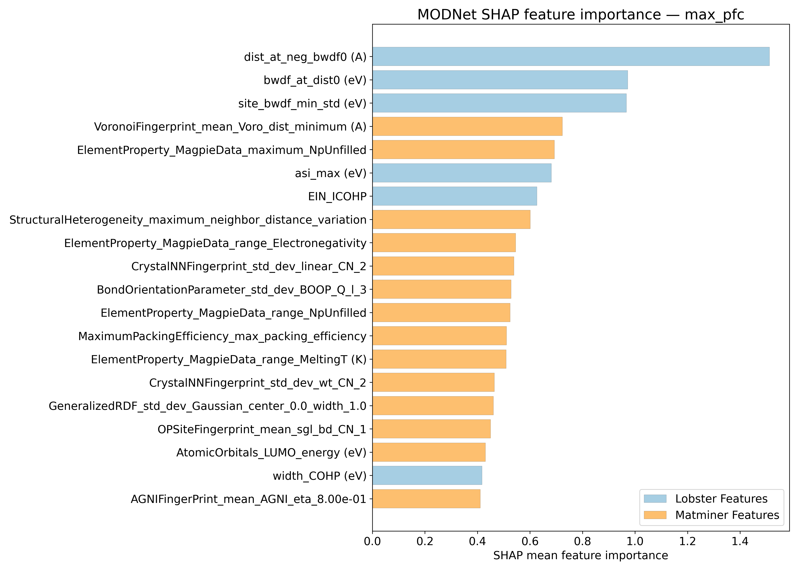

---

## Misc

### ARFS n-iter convergence checks

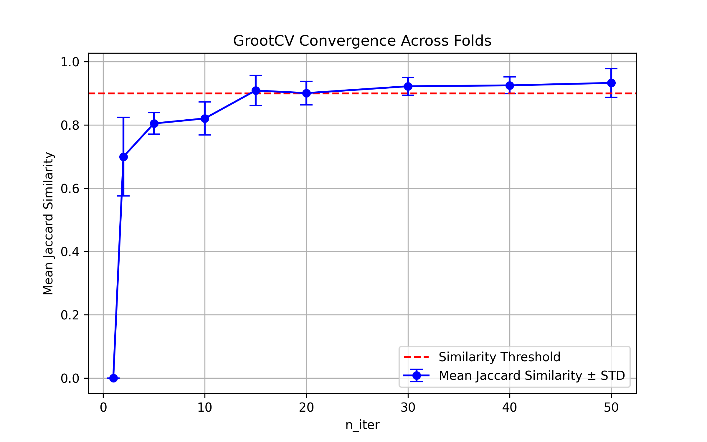

### MAE/ fold from 10-fold CV

Alternative visual summary of input data for t-test 

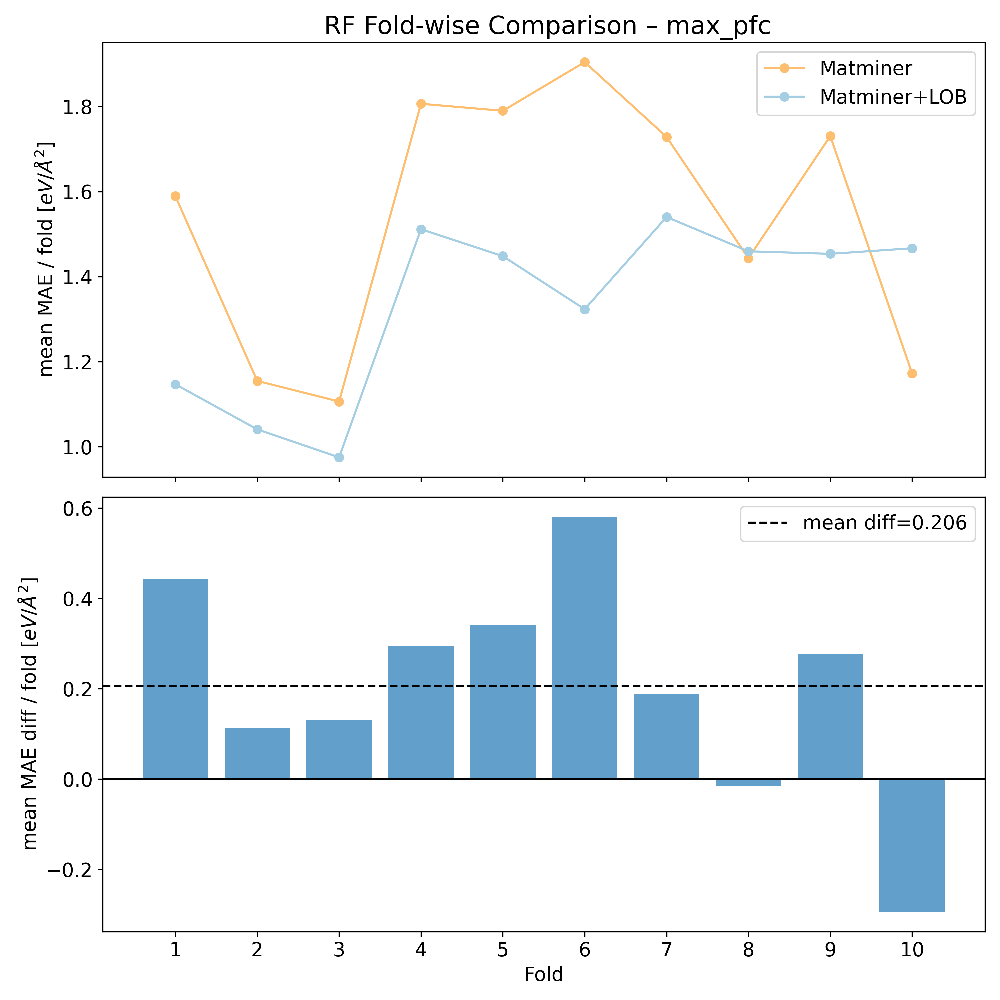

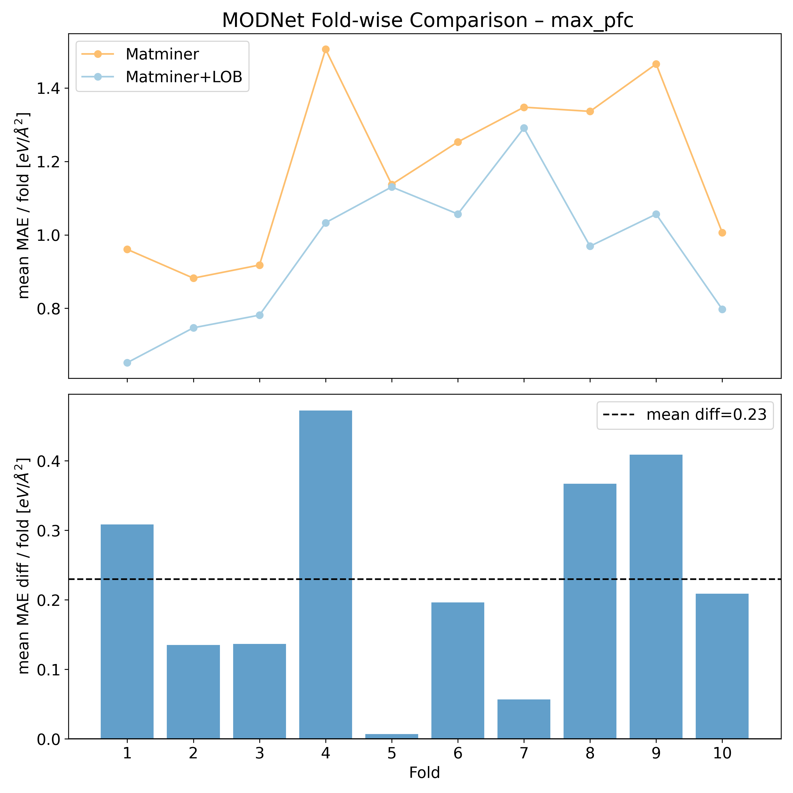

